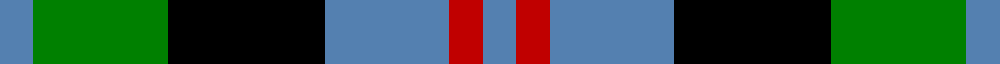

In pattern [BGKBRB](/stripes/bgkbrb/).

This was sourced from weddslist.  It is a [6 stripe tartan](/stripes/stripes6/).

Original link http://www.weddslist.com/cgi-bin/tartans/pg.pl?source=sts

## Also known as

This cloth is also recorded under:

- Wellington, or Waterloo

## Thread count
B/6 G24 K28 B22 R6 B/6

## Palette
Each colour and the base-6 reference it is a variant of.

| Colour | Shade | Base |
|---|---|---|
| B | <code style="background-color:#5480B0;">#5480B0</code> `oklch(58.8% 0.089 251.5)` <small>#5480B0</small> | B <code style="background-color:#2A418A;">#2A418A</code> |
| G | <code style="background-color:#008000;">#008000</code> `oklch(52.0% 0.177 142.5)` <small>#008000</small> | G <code style="background-color:#006100;">#006100</code> |
| K | <code style="background-color:#000000;">#000000</code> `oklch(0.0% 0.000 0.0)` <small>#000000</small> | K <code style="background-color:#000000;">#000000</code> |
| R | <code style="background-color:#C00000;">#C00000</code> `oklch(50.7% 0.208 29.2)` <small>#C00000</small> | R <code style="background-color:#CC0000;">#CC0000</code> |

# Sample pattern

## Nearest tartans

The nearest existing variants by ΔTartan distance.

1. [Wellington, or Waterloo](/setts/s6/t3g6k6t4r1t1~x2/) — ΔT 0.46
1. [Lennie](/setts/s6/k2g10t2k9p8g2~x2/) — ΔT 0.73
1. [Campbell, The White Stripe](/setts/s6/db2k2db12k11g12w2~x2/) — ΔT 0.78
1. [Murray](/setts/s6/db2k2db12k8g11r2~x2/) — ΔT 0.82
1. [Unnamed, No 26](/setts/s6/w4db4g22k20db20w3/) — ΔT 0.88
1. [Melville](/setts/s6/k4w2g13k13t12k2~x2/) — ΔT 0.92
1. [Herd/Hurd](/setts/s6/db3g12k13w2db13w3~x2/) — ΔT 0.95
1. [Fletcher #2](/setts/s7/b10k3b10k14r2g14k4~x2/) — ΔT 0.96
1. [MacKay](/setts/s6/g1db5g1k5g6ly1~x2/) — ΔT 0.97
1. [Morrison](/setts/s6/k3g14k14g2db14r3~x2/) — ΔT 1.00

## Neighbour map

Every grey dot is one of 14299 variants placed by the first two principal components of the ΔTartan feature space (44% of its variance). Red is this tartan; blue dots are its nearest — click one to open its page.

<svg viewBox="0 0 640 380" role="img" style="max-width:100%;height:auto;border:1px solid #e0e0e0;border-radius:4px;display:block" xmlns="http://www.w3.org/2000/svg"><image href="/nn/cloud.v1.png" width="640" height="380"/><a href="/setts/s6/t3g6k6t4r1t1~x2/"><circle cx="128.6" cy="243.8" r="4" fill="#3465a4"><title>Wellington, or Waterloo</title></circle></a><a href="/setts/s6/k2g10t2k9p8g2~x2/"><circle cx="127.0" cy="244.2" r="4" fill="#3465a4"><title>Lennie</title></circle></a><a href="/setts/s6/db2k2db12k11g12w2~x2/"><circle cx="129.7" cy="236.0" r="4" fill="#3465a4"><title>Campbell, The White Stripe</title></circle></a><a href="/setts/s6/db2k2db12k8g11r2~x2/"><circle cx="152.4" cy="240.0" r="4" fill="#3465a4"><title>Murray</title></circle></a><a href="/setts/s6/w4db4g22k20db20w3/"><circle cx="118.2" cy="224.4" r="4" fill="#3465a4"><title>Unnamed, No 26</title></circle></a><a href="/setts/s6/k4w2g13k13t12k2~x2/"><circle cx="166.6" cy="238.0" r="4" fill="#3465a4"><title>Melville</title></circle></a><a href="/setts/s6/db3g12k13w2db13w3~x2/"><circle cx="126.3" cy="236.3" r="4" fill="#3465a4"><title>Herd/Hurd</title></circle></a><a href="/setts/s7/b10k3b10k14r2g14k4~x2/"><circle cx="131.8" cy="238.3" r="4" fill="#3465a4"><title>Fletcher #2</title></circle></a><a href="/setts/s6/g1db5g1k5g6ly1~x2/"><circle cx="157.1" cy="237.7" r="4" fill="#3465a4"><title>MacKay</title></circle></a><a href="/setts/s6/k3g14k14g2db14r3~x2/"><circle cx="137.1" cy="235.4" r="4" fill="#3465a4"><title>Morrison</title></circle></a><circle cx="115.7" cy="248.1" r="5" fill="#c00000"/></svg>

ID: /setts/s6/t3g12k14t11r3t3~x2/
