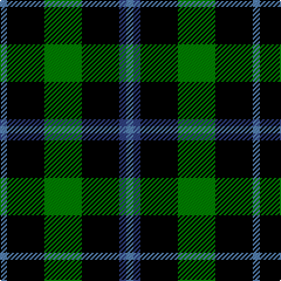

In pattern [BBKGKB](/stripes/bbkgkb/).

This was sourced from weddslist.  It is a [6 stripe tartan](/stripes/stripes6/).

Original link http://www.weddslist.com/cgi-bin/tartans/pg.pl?source=sts

## Thread count
Ba/6 K32 G32 K32 B6 Ba/6

## Palette
Each colour and the base-6 reference it is a variant of.

| Colour | Shade | Base |
|---|---|---|
| B | <code style="background-color:#304080;">#304080</code> `oklch(39.4% 0.109 270.2)` <small>#304080</small> | B <code style="background-color:#2A418A;">#2A418A</code> |
| Ba | <code style="background-color:#5480B0;">#5480B0</code> `oklch(58.8% 0.089 251.5)` <small>#5480B0</small> | B <code style="background-color:#2A418A;">#2A418A</code> |
| G | <code style="background-color:#008000;">#008000</code> `oklch(52.0% 0.177 142.5)` <small>#008000</small> | G <code style="background-color:#006100;">#006100</code> |
| K | <code style="background-color:#000000;">#000000</code> `oklch(0.0% 0.000 0.0)` <small>#000000</small> | K <code style="background-color:#000000;">#000000</code> |

# Sample pattern

## Nearest tartans

The nearest existing variants by ΔTartan distance.

1. [Douglas, (Black)](/setts/s5/k12db3g23k23r3~x2/) — ΔT 0.85
1. [Forbes Ancient](/setts/s7/db1k6db6k6g6k1w1~x2/) — ΔT 1.05
1. [Wilson's, No 167](/setts/s6/k20t2k6g16p4k9~x2/) — ΔT 1.22
1. [Unidentified Dance](/setts/s6/db1k4r1k4dg5lr1~x4/) — ΔT 1.25
1. [Sinclair, hunting](/setts/s7/g6r2g13k6w2k16r3~x2/) — ΔT 1.39
1. [Keith McCormick (Personal)](/setts/s8/k1db5k4g3k1g3k6g1~x4/) — ΔT 1.39
1. [Douglas, Black](/setts/s5/k8b5g44k40r6/) — ΔT 1.42
1. [Wallace Hunting](/setts/s6/g8k8ly1k8g8k1~x4/) — ΔT 1.52
1. [Forbes LC](/setts/s7/db1k6db6k6dg6k1lb1/) — ΔT 1.58
1. [Wilson's, No 108](/setts/s8/k7g7k1g7k7t1p7k1~x4/) — ΔT 1.59

## Neighbour map

Every grey dot is one of 14299 variants placed by the first two principal components of the ΔTartan feature space (44% of its variance). Red is this tartan; blue dots are its nearest — click one to open its page.

<svg viewBox="0 0 640 380" role="img" style="max-width:100%;height:auto;border:1px solid #e0e0e0;border-radius:4px;display:block" xmlns="http://www.w3.org/2000/svg"><image href="/nn/cloud.v1.png" width="640" height="380"/><a href="/setts/s5/k12db3g23k23r3~x2/"><circle cx="258.9" cy="244.6" r="4" fill="#3465a4"><title>Douglas, (Black)</title></circle></a><a href="/setts/s7/db1k6db6k6g6k1w1~x2/"><circle cx="184.4" cy="240.8" r="4" fill="#3465a4"><title>Forbes Ancient</title></circle></a><a href="/setts/s6/k20t2k6g16p4k9~x2/"><circle cx="299.2" cy="232.1" r="4" fill="#3465a4"><title>Wilson's, No 167</title></circle></a><a href="/setts/s6/db1k4r1k4dg5lr1~x4/"><circle cx="187.2" cy="245.7" r="4" fill="#3465a4"><title>Unidentified Dance</title></circle></a><a href="/setts/s7/g6r2g13k6w2k16r3~x2/"><circle cx="203.3" cy="215.8" r="4" fill="#3465a4"><title>Sinclair, hunting</title></circle></a><a href="/setts/s8/k1db5k4g3k1g3k6g1~x4/"><circle cx="226.3" cy="263.8" r="4" fill="#3465a4"><title>Keith McCormick (Personal)</title></circle></a><a href="/setts/s5/k8b5g44k40r6/"><circle cx="237.8" cy="222.7" r="4" fill="#3465a4"><title>Douglas, Black</title></circle></a><a href="/setts/s6/g8k8ly1k8g8k1~x4/"><circle cx="265.3" cy="268.1" r="4" fill="#3465a4"><title>Wallace Hunting</title></circle></a><a href="/setts/s7/db1k6db6k6dg6k1lb1/"><circle cx="212.6" cy="258.9" r="4" fill="#3465a4"><title>Forbes LC</title></circle></a><a href="/setts/s8/k7g7k1g7k7t1p7k1~x4/"><circle cx="163.8" cy="228.5" r="4" fill="#3465a4"><title>Wilson's, No 108</title></circle></a><circle cx="234.4" cy="250.9" r="5" fill="#c00000"/></svg>

ID: /setts/s6/t3k16g16k16db3t3~x2/
