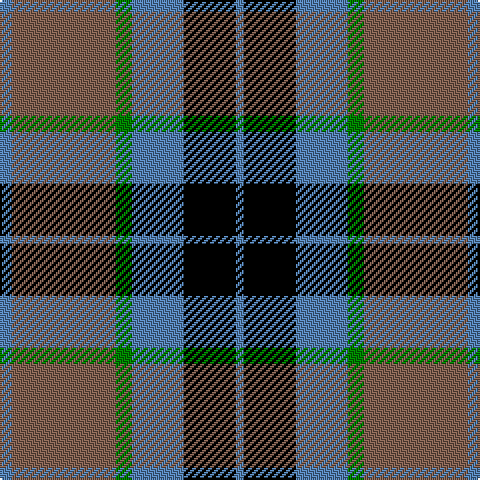

In pattern [BKBGRB](/stripes/bkbgrb/).

This was sourced from weddslist.  It is a [6 stripe tartan](/stripes/stripes6/).

Original link http://www.weddslist.com/cgi-bin/tartans/pg.pl?source=sts

## Thread count
B/6 LT52 G8 B26 K26 B/4

## Palette
Each colour and the base-6 reference it is a variant of.

| Colour | Shade | Base |
|---|---|---|
| B | <code style="background-color:#5480B0;">#5480B0</code> `oklch(58.8% 0.089 251.5)` <small>#5480B0</small> | B <code style="background-color:#2A418A;">#2A418A</code> |
| G | <code style="background-color:#008000;">#008000</code> `oklch(52.0% 0.177 142.5)` <small>#008000</small> | G <code style="background-color:#006100;">#006100</code> |
| K | <code style="background-color:#000000;">#000000</code> `oklch(0.0% 0.000 0.0)` <small>#000000</small> | K <code style="background-color:#000000;">#000000</code> |
| LT | <code style="background-color:#806050;">#806050</code> `oklch(51.7% 0.049 47.8)` <small>#806050</small> | R <code style="background-color:#CC0000;">#CC0000</code> |

# Sample pattern

## Nearest tartans

The nearest existing variants by ΔTartan distance.

1. [MacTavish / Thom(p)son, hunting](/setts/s6/t4o28g6t12k12t3~x2/) — ΔT 0.58
1. [Scottish Ballet](/setts/s6/ly5g22dp15dp11dp5g2~x2/) — ΔT 0.83
1. [MacKean (Personal)](/setts/s7/r8k18r6k18b27k2w3~x2/) — ΔT 0.95
1. [Afternoon Tea / Darjeeling](/setts/s6/w15y98db72r25db8ly15/) — ΔT 0.97
1. [Oceanic (Corporate?)](/setts/s7/ly8k4o39k37dt36k6dt7/) — ΔT 1.00
1. [Highland Spring Dress (2004) (Corp)](/setts/s5/w4db30g10r25w2~x2/) — ΔT 1.02
1. [Afternoon Tea / Black Tea](/setts/s6/m15dt8y25dt72n98w15/) — ΔT 1.05
1. [Ardmore (Fashion)](/setts/s8/k21o2k8w2o16n6k2n8~x2/) — ΔT 1.07
1. [Afternoon Tea / Darjeeling](/setts/s6/w15dg98dt72r25dt8ly15/) — ΔT 1.07
1. [Burberry Hunting](/setts/s5/k3w3k3y10r1~x6/) — ΔT 1.09

## Neighbour map

Every grey dot is one of 14299 variants placed by the first two principal components of the ΔTartan feature space (44% of its variance). Red is this tartan; blue dots are its nearest — click one to open its page.

<svg viewBox="0 0 640 380" role="img" style="max-width:100%;height:auto;border:1px solid #e0e0e0;border-radius:4px;display:block" xmlns="http://www.w3.org/2000/svg"><image href="/nn/cloud.v1.png" width="640" height="380"/><a href="/setts/s6/t4o28g6t12k12t3~x2/"><circle cx="202.5" cy="212.7" r="4" fill="#3465a4"><title>MacTavish / Thom(p)son, hunting</title></circle></a><a href="/setts/s6/ly5g22dp15dp11dp5g2~x2/"><circle cx="194.9" cy="212.8" r="4" fill="#3465a4"><title>Scottish Ballet</title></circle></a><a href="/setts/s7/r8k18r6k18b27k2w3~x2/"><circle cx="230.3" cy="194.5" r="4" fill="#3465a4"><title>MacKean (Personal)</title></circle></a><a href="/setts/s6/w15y98db72r25db8ly15/"><circle cx="203.2" cy="180.3" r="4" fill="#3465a4"><title>Afternoon Tea / Darjeeling</title></circle></a><a href="/setts/s7/ly8k4o39k37dt36k6dt7/"><circle cx="173.1" cy="209.2" r="4" fill="#3465a4"><title>Oceanic (Corporate?)</title></circle></a><a href="/setts/s5/w4db30g10r25w2~x2/"><circle cx="227.8" cy="194.2" r="4" fill="#3465a4"><title>Highland Spring Dress (2004) (Corp)</title></circle></a><a href="/setts/s6/m15dt8y25dt72n98w15/"><circle cx="211.7" cy="182.8" r="4" fill="#3465a4"><title>Afternoon Tea / Black Tea</title></circle></a><a href="/setts/s8/k21o2k8w2o16n6k2n8~x2/"><circle cx="239.6" cy="197.5" r="4" fill="#3465a4"><title>Ardmore (Fashion)</title></circle></a><a href="/setts/s6/w15dg98dt72r25dt8ly15/"><circle cx="206.2" cy="187.6" r="4" fill="#3465a4"><title>Afternoon Tea / Darjeeling</title></circle></a><a href="/setts/s5/k3w3k3y10r1~x6/"><circle cx="232.2" cy="210.5" r="4" fill="#3465a4"><title>Burberry Hunting</title></circle></a><circle cx="215.2" cy="195.4" r="5" fill="#c00000"/></svg>

ID: /setts/s6/t3o26g4t13k13t2~x2/
