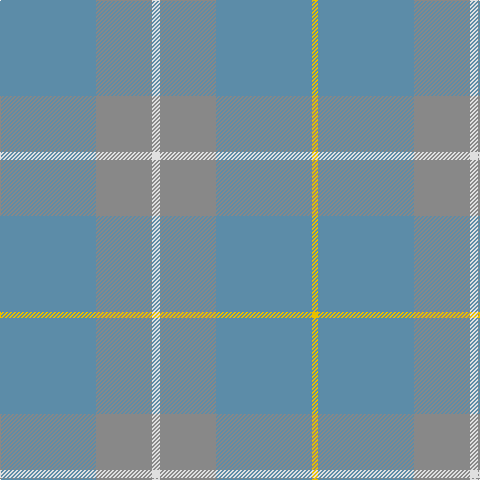

**Bands:** [YBRWRB](/stripes/ybrwrb/) · **Stripes:** [LY T O W O T](/stripes/stripes6/) LY T O W O T

This was sourced from register-of-tartans.  It is a [6 band tartan](/bands/bands6/).

Original link https://www.tartanregister.gov.uk/tartanDetails.aspx?ref=2890

## Register references

External register numbers recorded for this tartan.

- Scottish Register of Tartans: [2890](https://www.tartanregister.gov.uk/tartanDetails.aspx?ref=2890)
- Scottish Tartans Authority (ITI): 6041

## Thread count
B/96 N56 LN8 N56 B96 Y/6

## Palette
Each colour and its ΔE from the base-6 reference it is a variant of.

| Colour | Shade | Base | ΔE (OKLab) |
|---|---|---|---|
| B | <code style="background-color:#5C8CA8;">#5C8CA8</code> `#5C8CA8` | B <code style="background-color:#2A418A;">#2A418A</code> | 0.23 |
| LN | <code style="background-color:#E0E0E0;">#E0E0E0</code> `#E0E0E0` | W <code style="background-color:#F7F7F7;">#F7F7F7</code> | 0.07 |
| N | <code style="background-color:#888888;">#888888</code> `#888888` | R <code style="background-color:#CC0000;">#CC0000</code> | 0.24 |
| R | <code style="background-color:#C8002C;">#C8002C</code> `#C8002C` | R <code style="background-color:#CC0000;">#CC0000</code> | 0.03 |
| Y | <code style="background-color:#E8C000;">#E8C000</code> `#E8C000` | Y <code style="background-color:#F2BF00;">#F2BF00</code> | 0.02 |

# Sample pattern

## Nearest tartans

The nearest existing variants by ΔTartan distance.

1. [London Regiment (Military)](/setts/s6/y34n27r3n27y34w3~x2/) — ΔT 1.82
1. [Bute Heather, Ancient Wth'd (Fashion](/setts/s11/lo5n2y8n1y8n4y4n6y18lr1lo5~x2/) — ΔT 1.92
1. [Harmony 13](/setts/s6/t10y1t1y10t18y5~x2/) — ΔT 2.38
1. [McKerrell of Hillhouse Dress (Clan)](/setts/s4/w4o28t48ly3~x2/) — ΔT 2.46
1. [Wicklow Irish County Tartan Tartan Number: 2265. Earliest known date: 1995 One of a series of Irish District tartans designed by Polly Wittering of the House of Edgar, with colours reminiscent of the Country with soft warm colours dominating. See products available Copyright © Blair Urquhart, Comrie, 2015](/setts/s10/dy2n4y12n3dy6t2n24dy2n2y2~x2/) — ΔT 2.55
1. [Loch Garth](/setts/s4/o12o6o2ly1~x4/) — ΔT 2.76
1. [Outlander #3](/setts/s4/y14n7lo6n2~x8/) — ΔT 2.87
1. [Weathered Cyclist (Corporate)](/setts/s7/o32w2o9ly2o12lo21r1~x2/) — ΔT 2.91
1. [Harmony, 12](/setts/s6/o6y2o29y29o2y6~x2/) — ΔT 2.98
1. [Outlander #3](/setts/s4/o14n7lo7n2~x8/) — ΔT 3.30

## Neighbour map

Every grey dot is one of 14299 variants placed by the first two principal components of the ΔTartan feature space (44% of its variance). Red is this tartan; blue dots are its nearest — click one to open its page.

<svg viewBox="0 0 640 380" role="img" style="max-width:100%;height:auto;border:1px solid #e0e0e0;border-radius:4px;display:block" xmlns="http://www.w3.org/2000/svg"><image href="/nn/cloud.v1.png" width="640" height="380"/><a href="/setts/s6/y34n27r3n27y34w3~x2/"><circle cx="468.2" cy="328.3" r="4" fill="#3465a4"><title>London Regiment (Military)</title></circle></a><a href="/setts/s11/lo5n2y8n1y8n4y4n6y18lr1lo5~x2/"><circle cx="559.6" cy="292.7" r="4" fill="#3465a4"><title>Bute Heather, Ancient Wth'd (Fashion</title></circle></a><a href="/setts/s6/t10y1t1y10t18y5~x2/"><circle cx="626.0" cy="366.0" r="4" fill="#3465a4"><title>Harmony 13</title></circle></a><a href="/setts/s4/w4o28t48ly3~x2/"><circle cx="501.6" cy="294.2" r="4" fill="#3465a4"><title>McKerrell of Hillhouse Dress (Clan)</title></circle></a><a href="/setts/s10/dy2n4y12n3dy6t2n24dy2n2y2~x2/"><circle cx="551.6" cy="299.3" r="4" fill="#3465a4"><title>Wicklow Irish County Tartan Tartan Number: 2265. Earliest known date: 1995 One of a series of Irish District tartans designed by Polly Wittering of the House of Edgar, with colours reminiscent of the Country with soft warm colours dominating. See products available Copyright © Blair Urquhart, Comrie, 2015</title></circle></a><a href="/setts/s4/o12o6o2ly1~x4/"><circle cx="619.8" cy="354.9" r="4" fill="#3465a4"><title>Loch Garth</title></circle></a><a href="/setts/s4/y14n7lo6n2~x8/"><circle cx="436.9" cy="366.0" r="4" fill="#3465a4"><title>Outlander #3</title></circle></a><a href="/setts/s7/o32w2o9ly2o12lo21r1~x2/"><circle cx="609.5" cy="249.5" r="4" fill="#3465a4"><title>Weathered Cyclist (Corporate)</title></circle></a><a href="/setts/s6/o6y2o29y29o2y6~x2/"><circle cx="626.0" cy="360.1" r="4" fill="#3465a4"><title>Harmony, 12</title></circle></a><a href="/setts/s4/o14n7lo7n2~x8/"><circle cx="407.0" cy="366.0" r="4" fill="#3465a4"><title>Outlander #3</title></circle></a><circle cx="550.5" cy="329.2" r="5" fill="#c00000"/></svg>

ID: /setts/s6/t48o28w4o28t48ly3~x2/
