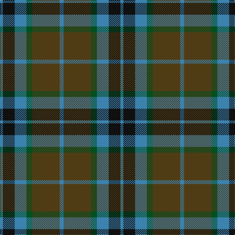

**Bands:** [BGGBKB](/stripes/bggbkb/) · **Stripes:** [T DY DG T K T](/stripes/stripes6/) T DY DG T K T

This was sourced from register-of-tartans.  It is a [6 band tartan](/bands/bands6/).

Original link https://www.tartanregister.gov.uk/tartanDetails.aspx?ref=4118

## Register references

External register numbers recorded for this tartan.

- Scottish Register of Tartans: [4118](https://www.tartanregister.gov.uk/tartanDetails.aspx?ref=4118)
- Scottish Tartans World Register: 2093

## Thread count
B/6 K24 B24 G12 T56 B/8

## Palette
Each colour and its ΔE from the base-6 reference it is a variant of.

| Colour | Shade | Base | ΔE (OKLab) |
|---|---|---|---|
| B | <code style="background-color:#3C82AF;">#3C82AF</code> `#3C82AF` | B <code style="background-color:#2A418A;">#2A418A</code> | 0.19 |
| G | <code style="background-color:#005020;">#005020</code> `#005020` | G <code style="background-color:#006100;">#006100</code> | 0.07 |
| K | <code style="background-color:#101010;">#101010</code> `#101010` | K <code style="background-color:#000000;">#000000</code> | 0.17 |
| T | <code style="background-color:#503C14;">#503C14</code> `#503C14` | G <code style="background-color:#006100;">#006100</code> | 0.14 |

# Sample pattern

## Nearest tartans

The nearest existing variants by ΔTartan distance.

1. [MacTavish Hunting](/setts/s6/t4dy28g6t12k12t3~x2/) — ΔT 0.70
1. [Flower of Scotland Commemorative Tartan Tartan Number: 2059. Earliest known date: September 1990 Designed as a tribute to Roy Williamson, writer of the words and music of 'The Flower of Scotland'. Roy wore the Gunn tartan which has been used as the framework of the new tartan. Cornflower blue and Zephyr green have been used to suggest the bluebell and the thistle. Worn by the Seafield and District pipe band, Strathallan Games, 1994 (UK Reg. Design No.600421) See products available Copyright © Blair Urquhart, Comrie, 2015](/setts/s6/b1g7b1k4b7o1~x4/) — ΔT 0.87
1. [Flower of Scotland MINI Tartan Tartan Number: 20599. Earliest known date: Dupion Silk. Generated only for display purposes. reduced copy of the original 2059 Flower of Scotland. See products available Copyright © Blair Urquhart, Comrie, 2015](/setts/s6/b1g7b1k4b7o1~x2/) — ΔT 0.87
1. [Strange of Balcaskie (Clan)](/setts/s7/g32dy7g7dy16db32ly3dy8~x2/) — ΔT 0.88
1. [MacArthur of Milton (Clan)](/setts/s6/g7db1g1k4dp4k1~x4/) — ΔT 0.89
1. [MacTavish Hunting Clan Tartan Tartan Number: 232. Earliest known date: pre 2003 See Lord Thomson See products available Copyright © Blair Urquhart, Comrie, 2015](/setts/s6/t3dy26g4t13k13t2~x2/) — ΔT 0.89
1. [Coburg](/setts/s6/g18t2g4k14dp12k3~x2/) — ΔT 0.93
1. [Graham of Montrose](/setts/s6/dg4db15w2k16dg19k4~x2/) — ΔT 0.93
1. [Graham of Menteith (Clan)](/setts/s6/g8t1g1k6db6k1~x4/) — ΔT 0.94
1. [Lyle and Scott](/setts/s6/dg5b2dg9dt19r9ly2~x2/) — ΔT 0.98

## Neighbour map

Every grey dot is one of 14313 variants placed by the first two principal components of the ΔTartan feature space (44% of its variance). Red is this tartan; blue dots are its nearest — click one to open its page.

<svg viewBox="0 0 640 380" role="img" style="max-width:100%;height:auto;border:1px solid #e0e0e0;border-radius:4px;display:block" xmlns="http://www.w3.org/2000/svg"><image href="/nn/cloud.v1.png" width="640" height="380"/><a href="/setts/s6/t4dy28g6t12k12t3~x2/"><circle cx="237.9" cy="230.6" r="4" fill="#3465a4"><title>MacTavish Hunting</title></circle></a><a href="/setts/s6/b1g7b1k4b7o1~x4/"><circle cx="238.6" cy="252.6" r="4" fill="#3465a4"><title>Flower of Scotland Commemorative Tartan Tartan Number: 2059. Earliest known date: September 1990 Designed as a tribute to Roy Williamson, writer of the words and music of 'The Flower of Scotland'. Roy wore the Gunn tartan which has been used as the framework of the new tartan. Cornflower blue and Zephyr green have been used to suggest the bluebell and the thistle. Worn by the Seafield and District pipe band, Strathallan Games, 1994 (UK Reg. Design No.600421) See products available Copyright © Blair Urquhart, Comrie, 2015</title></circle></a><a href="/setts/s6/b1g7b1k4b7o1~x2/"><circle cx="238.6" cy="252.6" r="4" fill="#3465a4"><title>Flower of Scotland MINI Tartan Tartan Number: 20599. Earliest known date: Dupion Silk. Generated only for display purposes. reduced copy of the original 2059 Flower of Scotland. See products available Copyright © Blair Urquhart, Comrie, 2015</title></circle></a><a href="/setts/s7/g32dy7g7dy16db32ly3dy8~x2/"><circle cx="243.8" cy="240.4" r="4" fill="#3465a4"><title>Strange of Balcaskie (Clan)</title></circle></a><a href="/setts/s6/g7db1g1k4dp4k1~x4/"><circle cx="233.2" cy="248.6" r="4" fill="#3465a4"><title>MacArthur of Milton (Clan)</title></circle></a><a href="/setts/s6/t3dy26g4t13k13t2~x2/"><circle cx="251.9" cy="214.7" r="4" fill="#3465a4"><title>MacTavish Hunting Clan Tartan Tartan Number: 232. Earliest known date: pre 2003 See Lord Thomson See products available Copyright © Blair Urquhart, Comrie, 2015</title></circle></a><a href="/setts/s6/g18t2g4k14dp12k3~x2/"><circle cx="229.4" cy="248.4" r="4" fill="#3465a4"><title>Coburg</title></circle></a><a href="/setts/s6/dg4db15w2k16dg19k4~x2/"><circle cx="222.7" cy="254.1" r="4" fill="#3465a4"><title>Graham of Montrose</title></circle></a><a href="/setts/s6/g8t1g1k6db6k1~x4/"><circle cx="217.8" cy="248.8" r="4" fill="#3465a4"><title>Graham of Menteith (Clan)</title></circle></a><a href="/setts/s6/dg5b2dg9dt19r9ly2~x2/"><circle cx="220.3" cy="225.4" r="4" fill="#3465a4"><title>Lyle and Scott</title></circle></a><circle cx="249.9" cy="241.4" r="5" fill="#c00000"/></svg>

ID: /setts/s6/t4dy28dg6t12k12t3~x2/
