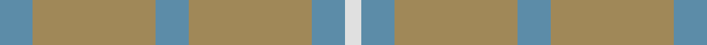

**Bands:** [BYBYBW](/stripes/bybybw/) · **Stripes:** [T LO T LO T W](/stripes/stripes6/) T LO T LO T W

This was sourced from register-of-tartans.  It is a [6 band tartan](/bands/bands6/).

Original link https://www.tartanregister.gov.uk/tartanDetails.aspx?ref=4066

## Register references

External register numbers recorded for this tartan.

- Scottish Register of Tartans: [4066](https://www.tartanregister.gov.uk/tartanDetails.aspx?ref=4066)
- Scottish Tartans Authority (ITI): 5775

## Thread count
B/8 LT30 B8 LT30 B8 LN/4

## Palette
Each colour and its ΔE from the base-6 reference it is a variant of.

| Colour | Shade | Base | ΔE (OKLab) |
|---|---|---|---|
| B | <code style="background-color:#5C8CA8;">#5C8CA8</code> `#5C8CA8` | B <code style="background-color:#2A418A;">#2A418A</code> | 0.23 |
| LN | <code style="background-color:#E0E0E0;">#E0E0E0</code> `#E0E0E0` | W <code style="background-color:#F7F7F7;">#F7F7F7</code> | 0.07 |
| LT | <code style="background-color:#A08858;">#A08858</code> `#A08858` | Y <code style="background-color:#F2BF00;">#F2BF00</code> | 0.21 |

# Sample pattern

## Nearest tartans

The nearest existing variants by ΔTartan distance.

1. [Cairns, David (Personal)](/setts/s5/n11o1n4o8r1~x8/) — ΔT 1.60
1. [Laurel Park](/setts/s4/t48g25t13ly5~x2/) — ΔT 1.85
1. [Barbie's Moss Plaid (Yellow & Green)](/setts/s6/y3lo3y20lo20y20lo3~x2/) — ΔT 2.44
1. [Glen Boig Trade Tartan Tartan Number: 915. Earliest known date: Modern Many new designs have been given district names to promote their Scottish connections. However, these names should not be confused with the District tartans which have earned their title through 'use and wont' and not a little history. See products available Copyright © Blair Urquhart, Comrie, 2015](/setts/s5/y37dy9y3do9dy3~x2/) — ΔT 2.44
1. [Blue Ridge](/setts/s10/g6t8o2t2ly2t16g18t4g4t3~x2/) — ΔT 2.62
1. [Blue Ridge (District)](/setts/s10/g6t8o2t2ly2t16g18t4g4t3~x4/) — ΔT 2.62
1. [Spring Morning](/setts/s6/y9g9lo1g9y9g1~x4/) — ΔT 2.66
1. [Daks, (Muted Skye)](/setts/s8/db5y15o4y4o24y4o4db5/) — ΔT 2.70
1. [McGuigan, Julia (St Monans, Fife) (Personal)](/setts/s4/y9y52dy15ly4~x2/) — ΔT 2.74
1. [Cairns, David (Personal)](/setts/s5/do11n1do4n8r1~x8/) — ΔT 2.87

## Neighbour map

Every grey dot is one of 14299 variants placed by the first two principal components of the ΔTartan feature space (44% of its variance). Red is this tartan; blue dots are its nearest — click one to open its page.

<svg viewBox="0 0 640 380" role="img" style="max-width:100%;height:auto;border:1px solid #e0e0e0;border-radius:4px;display:block" xmlns="http://www.w3.org/2000/svg"><image href="/nn/cloud.v1.png" width="640" height="380"/><a href="/setts/s5/n11o1n4o8r1~x8/"><circle cx="504.7" cy="311.4" r="4" fill="#3465a4"><title>Cairns, David (Personal)</title></circle></a><a href="/setts/s4/t48g25t13ly5~x2/"><circle cx="514.9" cy="334.1" r="4" fill="#3465a4"><title>Laurel Park</title></circle></a><a href="/setts/s6/y3lo3y20lo20y20lo3~x2/"><circle cx="477.1" cy="317.2" r="4" fill="#3465a4"><title>Barbie's Moss Plaid (Yellow &amp; Green)</title></circle></a><a href="/setts/s5/y37dy9y3do9dy3~x2/"><circle cx="554.6" cy="298.1" r="4" fill="#3465a4"><title>Glen Boig Trade Tartan Tartan Number: 915. Earliest known date: Modern Many new designs have been given district names to promote their Scottish connections. However, these names should not be confused with the District tartans which have earned their title through 'use and wont' and not a little history. See products available Copyright © Blair Urquhart, Comrie, 2015</title></circle></a><a href="/setts/s10/g6t8o2t2ly2t16g18t4g4t3~x2/"><circle cx="416.8" cy="273.3" r="4" fill="#3465a4"><title>Blue Ridge</title></circle></a><a href="/setts/s10/g6t8o2t2ly2t16g18t4g4t3~x4/"><circle cx="416.8" cy="273.3" r="4" fill="#3465a4"><title>Blue Ridge (District)</title></circle></a><a href="/setts/s6/y9g9lo1g9y9g1~x4/"><circle cx="402.3" cy="322.2" r="4" fill="#3465a4"><title>Spring Morning</title></circle></a><a href="/setts/s8/db5y15o4y4o24y4o4db5/"><circle cx="414.8" cy="309.3" r="4" fill="#3465a4"><title>Daks, (Muted Skye)</title></circle></a><a href="/setts/s4/y9y52dy15ly4~x2/"><circle cx="537.8" cy="304.1" r="4" fill="#3465a4"><title>McGuigan, Julia (St Monans, Fife) (Personal)</title></circle></a><a href="/setts/s5/do11n1do4n8r1~x8/"><circle cx="545.1" cy="340.1" r="4" fill="#3465a4"><title>Cairns, David (Personal)</title></circle></a><circle cx="521.4" cy="315.0" r="5" fill="#c00000"/></svg>

ID: /setts/s6/t4lo15t4lo15t4w2~x2/
