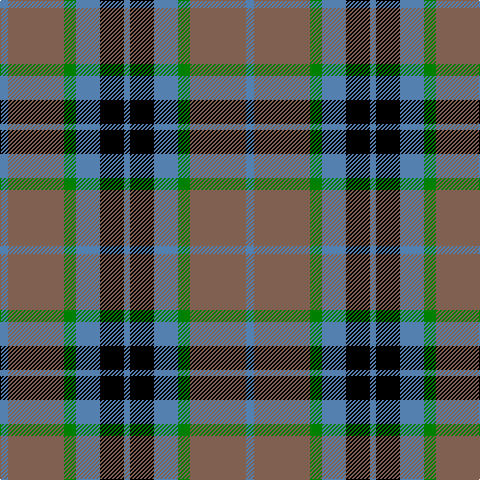

This page is one **sett** — a single exact thread-count. It belongs to the [tartan](/tartans/t4o28g6t12k12t3/)
(the same proportion at any scale), whose colour order is pattern [BKBGRB](/stripes/bkbgrb/).

Sourced from weddslist.  It is a [6 stripe tartan](/stripes/stripes6/).

Original link http://www.weddslist.com/cgi-bin/tartans/pg.pl?source=sts

## Also known as

This cloth is also recorded under:

- MacTavish / Thomson, hunting

2 attestations — the source records this cloth was collapsed from (oldest owns this page)

<ul>
<li>undated — MacTavish / Thom(p)son, hunting (weddslist, <a href="http://www.weddslist.com/cgi-bin/tartans/pg.pl?source=sts">record</a>)</li>
<li>undated — Thom(p)son, Lord (hunting) (weddslist, <a href="http://www.weddslist.com/cgi-bin/tartans/pg.pl?source=sts">record</a>)</li>
</ul>

## Thread count
B/8 LT56 G12 B24 K24 B/6

## Palette

Palette: <strong>Ingles Buchan</strong> <small style="color:#888">(1 of 4 colours)</small>
<table><thead><tr><th>Colour</th><th>Threads</th><th>Shade</th><th>Base</th><th>OKLCh</th></tr></thead><tbody><tr><td>B/</td><td style="text-align:right;font-variant-numeric:tabular-nums">8</td><td><code style="background-color:#5480B0;">#5480B0</code> <small style="color:#888">#5480B0</small></td><td>B <code style="background-color:#2A418A;">#2A418A</code></td><td><small style="color:#888">oklch(58.8% 0.089 251.5)</small></td></tr><tr><td>LT</td><td style="text-align:right;font-variant-numeric:tabular-nums">56</td><td><code style="background-color:#806050;">#806050</code> <small style="color:#888">#806050</small></td><td>R <code style="background-color:#CC0000;">#CC0000</code></td><td><small style="color:#888">oklch(51.7% 0.049 47.8)</small></td></tr><tr><td>G</td><td style="text-align:right;font-variant-numeric:tabular-nums">12</td><td><code style="background-color:#008000;">#008000</code> <small style="color:#888">#008000</small></td><td>G <code style="background-color:#006100;">#006100</code></td><td><small style="color:#888">oklch(52.0% 0.177 142.5)</small></td></tr><tr><td>B</td><td style="text-align:right;font-variant-numeric:tabular-nums">24</td><td><code style="background-color:#5480B0;">#5480B0</code> <small style="color:#888">#5480B0</small></td><td>B <code style="background-color:#2A418A;">#2A418A</code></td><td><small style="color:#888">oklch(58.8% 0.089 251.5)</small></td></tr><tr><td>K</td><td style="text-align:right;font-variant-numeric:tabular-nums">24</td><td><code style="background-color:#000000;">#000000</code> <small style="color:#888">#000000</small></td><td>K <code style="background-color:#000000;">#000000</code></td><td><small style="color:#888">oklch(0.0% 0.000 0.0)</small></td></tr><tr><td>B/</td><td style="text-align:right;font-variant-numeric:tabular-nums">6</td><td><code style="background-color:#5480B0;">#5480B0</code> <small style="color:#888">#5480B0</small></td><td>B <code style="background-color:#2A418A;">#2A418A</code></td><td><small style="color:#888">oklch(58.8% 0.089 251.5)</small></td></tr></tbody></table>

# Sample pattern

## Nearest tartans

The nearest existing variants by ΔTartan distance, with this tartan at the top so the swatches line up against it.

ΔTartan

Tartan

Sett

—

<a href="/ttd/edit/#slug=t4o28g6t12k12t3~x2">MacTavish / Thom(p)son, hunting</a> <a class="nn-out" href="/setts/s6/t4o28g6t12k12t3~x2/" title="open its dictionary page">↗</a>

0.58

<a href="/ttd/edit/#slug=t3o26g4t13k13t2~x2">MacTavish / Thom(p)son, hunting</a> <a class="nn-out" href="/setts/s6/t3o26g4t13k13t2~x2/" title="open its dictionary page">↗</a>

0.74

<a href="/ttd/edit/#slug=ly5g22dp15dpi11dp5g2~x2">Scottish Ballet</a> <a class="nn-out" href="/setts/s6/ly5g22dp15dpi11dp5g2~x2/" title="open its dictionary page">↗</a>

0.94

<a href="/ttd/edit/#slug=r1g8k8r1k8t8r1~x4">Triad Highland Games Proposed</a> <a class="nn-out" href="/setts/s7/r1g8k8r1k8t8r1~x4/" title="open its dictionary page">↗</a>

0.94

<a href="/ttd/edit/#slug=k3g25o3k15lr24g3~x2">Un-named (D C Dalgliesh) #3</a> <a class="nn-out" href="/setts/s6/k3g25o3k15lr24g3~x2/" title="open its dictionary page">↗</a>

0.95

<a href="/ttd/edit/#slug=ly8k4o39k37dt36k6dt7">Oceanic (Corporate?)</a> <a class="nn-out" href="/setts/s7/ly8k4o39k37dt36k6dt7/" title="open its dictionary page">↗</a>

0.95

<a href="/ttd/edit/#slug=k4w2g13k13t12k2~x2">Melville</a> <a class="nn-out" href="/setts/s6/k4w2g13k13t12k2~x2/" title="open its dictionary page">↗</a>

0.99

<a href="/ttd/edit/#slug=r3y27k6lo13k14r3~x2">Thompson/Thomson/MacTavish special grey</a> <a class="nn-out" href="/setts/s6/r3y27k6lo13k14r3~x2/" title="open its dictionary page">↗</a>

0.99

<a href="/ttd/edit/#slug=r5db25w5db3dg25db3~x2">Thayer USA</a> <a class="nn-out" href="/setts/s6/r5db25w5db3dg25db3~x2/" title="open its dictionary page">↗</a>

1.04

<a href="/ttd/edit/#slug=r2g12db2g8db18w3r2w2~x2">Albuquerque, City of</a> <a class="nn-out" href="/setts/s8/r2g12db2g8db18w3r2w2~x2/" title="open its dictionary page">↗</a>

1.05

<a href="/ttd/edit/#slug=k3w3k3y10r1~x6">Burberry Hunting</a> <a class="nn-out" href="/setts/s5/k3w3k3y10r1~x6/" title="open its dictionary page">↗</a>

## Neighbour map

Every grey dot is one of 14359 variants placed by the first two principal components of the ΔTartan feature space (44% of its variance). Red is this tartan; blue dots are its nearest — click one to open its page.

<svg viewBox="0 0 640 380" role="img" style="max-width:100%;height:auto;border:1px solid #e0e0e0;border-radius:4px;display:block" xmlns="http://www.w3.org/2000/svg"><image href="/nn/cloud.v1.png" width="640" height="380"/><a href="/setts/s6/t3o26g4t13k13t2~x2/"><circle cx="214.8" cy="196.5" r="4" fill="#3465a4"><title>MacTavish / Thom(p)son, hunting</title></circle></a><a href="/setts/s6/ly5g22dp15dpi11dp5g2~x2/"><circle cx="194.5" cy="214.0" r="4" fill="#3465a4"><title>Scottish Ballet</title></circle></a><a href="/setts/s7/r1g8k8r1k8t8r1~x4/"><circle cx="194.8" cy="226.7" r="4" fill="#3465a4"><title>Triad Highland Games Proposed</title></circle></a><a href="/setts/s6/k3g25o3k15lr24g3~x2/"><circle cx="179.5" cy="207.0" r="4" fill="#3465a4"><title>Un-named (D C Dalgliesh) #3</title></circle></a><a href="/setts/s7/ly8k4o39k37dt36k6dt7/"><circle cx="173.0" cy="210.4" r="4" fill="#3465a4"><title>Oceanic (Corporate?)</title></circle></a><a href="/setts/s6/k4w2g13k13t12k2~x2/"><circle cx="166.4" cy="239.4" r="4" fill="#3465a4"><title>Melville</title></circle></a><a href="/setts/s6/r3y27k6lo13k14r3~x2/"><circle cx="191.8" cy="207.8" r="4" fill="#3465a4"><title>Thompson/Thomson/MacTavish special grey</title></circle></a><a href="/setts/s6/r5db25w5db3dg25db3~x2/"><circle cx="250.0" cy="216.7" r="4" fill="#3465a4"><title>Thayer USA</title></circle></a><a href="/setts/s8/r2g12db2g8db18w3r2w2~x2/"><circle cx="206.4" cy="191.4" r="4" fill="#3465a4"><title>Albuquerque, City of</title></circle></a><a href="/setts/s5/k3w3k3y10r1~x6/"><circle cx="231.5" cy="211.6" r="4" fill="#3465a4"><title>Burberry Hunting</title></circle></a><circle cx="202.1" cy="213.8" r="5" fill="#c00000"/></svg>

ID: /setts/s6/t4o28g6t12k12t3~x2/
