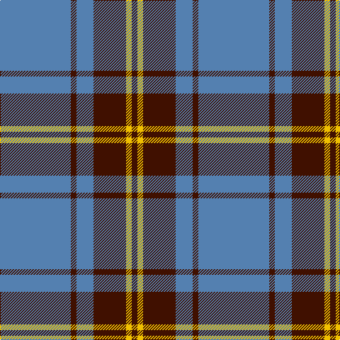

In pattern [BBBBYB](/stripes/bbbbyb/).

This was sourced from weddslist.  It is a [6 stripe tartan](/stripes/stripes6/).

Original link http://www.weddslist.com/cgi-bin/tartans/pg.pl?source=sts

## Thread count
B/100 DR8 B24 DR46 Y8 DR/8

## Palette
Each colour and the base-6 reference it is a variant of.

| Colour | Shade | Base |
|---|---|---|
| B | <code style="background-color:#5480B0;">#5480B0</code> `oklch(58.8% 0.089 251.5)` <small>#5480B0</small> | B <code style="background-color:#2A418A;">#2A418A</code> |
| DR | <code style="background-color:#401000;">#401000</code> `oklch(25.3% 0.079 39.9)` <small>#401000</small> | B <code style="background-color:#2A418A;">#2A418A</code> |
| Y | <code style="background-color:#F0C000;">#F0C000</code> `oklch(82.7% 0.169 90.5)` <small>#F0C000</small> | Y <code style="background-color:#F2BF00;">#F2BF00</code> |

# Sample pattern

## Nearest tartans

The nearest existing variants by ΔTartan distance.

1. [Rea](/setts/s6/t12ly2t1k5t4k2~x4/) — ΔT 1.35
1. [Perkins (2015)](/setts/s7/k3t10lo5t29k10r6k2~x2/) — ΔT 1.36
1. [South Australian Pipes & Drums (Corp](/setts/s6/db60ly6db11r25~x2/) — ΔT 1.40
1. [Carlisle Ancient](/setts/s5/b11lo2r1lo2r1~x4/) — ΔT 1.40
1. [Kinding (Personal)](/setts/s7/k10t30g3t3g3t3r6~x2/) — ΔT 1.40
1. [MacQueen variant](/setts/s6/db2r7db2r7db22ly2~x2/) — ΔT 1.41
1. [Sligo Irish County Tartan Tartan Number: 2256. Earliest known date: 1995 One of a series of Irish District tartans designed by Polly Wittering of the House of Edgar, with colours reminiscent of the Country with soft warm colours dominating. See products available Copyright © Blair Urquhart, Comrie, 2015](/setts/s6/t50k4t12k23lo4k4~x2/) — ΔT 1.41
1. [Sanix Large Muted](/setts/s4/db3lo30db40r3~x2/) — ΔT 1.45
1. [Mackay (Blue)](/setts/s6/n1k3n1k3n8r1~x8/) — ΔT 1.46
1. [Loch Lomond](/setts/s5/t37w9t3db9w3~x2/) — ΔT 1.46

## Neighbour map

Every grey dot is one of 14299 variants placed by the first two principal components of the ΔTartan feature space (44% of its variance). Red is this tartan; blue dots are its nearest — click one to open its page.

<svg viewBox="0 0 640 380" role="img" style="max-width:100%;height:auto;border:1px solid #e0e0e0;border-radius:4px;display:block" xmlns="http://www.w3.org/2000/svg"><image href="/nn/cloud.v1.png" width="640" height="380"/><a href="/setts/s6/t12ly2t1k5t4k2~x4/"><circle cx="364.1" cy="218.3" r="4" fill="#3465a4"><title>Rea</title></circle></a><a href="/setts/s7/k3t10lo5t29k10r6k2~x2/"><circle cx="333.7" cy="182.5" r="4" fill="#3465a4"><title>Perkins (2015)</title></circle></a><a href="/setts/s6/db60ly6db11r25~x2/"><circle cx="410.4" cy="214.8" r="4" fill="#3465a4"><title>South Australian Pipes &amp; Drums (Corp</title></circle></a><a href="/setts/s5/b11lo2r1lo2r1~x4/"><circle cx="396.5" cy="209.3" r="4" fill="#3465a4"><title>Carlisle Ancient</title></circle></a><a href="/setts/s7/k10t30g3t3g3t3r6~x2/"><circle cx="340.0" cy="185.4" r="4" fill="#3465a4"><title>Kinding (Personal)</title></circle></a><a href="/setts/s6/db2r7db2r7db22ly2~x2/"><circle cx="394.4" cy="206.7" r="4" fill="#3465a4"><title>MacQueen variant</title></circle></a><a href="/setts/s6/t50k4t12k23lo4k4~x2/"><circle cx="370.0" cy="197.4" r="4" fill="#3465a4"><title>Sligo Irish County Tartan Tartan Number: 2256. Earliest known date: 1995 One of a series of Irish District tartans designed by Polly Wittering of the House of Edgar, with colours reminiscent of the Country with soft warm colours dominating. See products available Copyright © Blair Urquhart, Comrie, 2015</title></circle></a><a href="/setts/s4/db3lo30db40r3~x2/"><circle cx="371.7" cy="229.7" r="4" fill="#3465a4"><title>Sanix Large Muted</title></circle></a><a href="/setts/s6/n1k3n1k3n8r1~x8/"><circle cx="362.2" cy="246.5" r="4" fill="#3465a4"><title>Mackay (Blue)</title></circle></a><a href="/setts/s5/t37w9t3db9w3~x2/"><circle cx="382.6" cy="206.0" r="4" fill="#3465a4"><title>Loch Lomond</title></circle></a><circle cx="400.5" cy="206.8" r="5" fill="#c00000"/></svg>

ID: /setts/s6/t50dr4t12dr23ly4dr4~x2/
