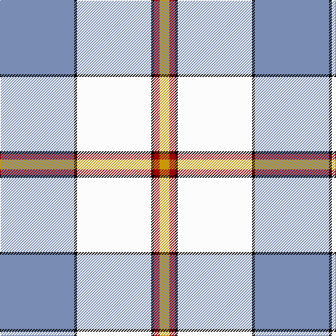

**Bands:** [BKWKRY](/stripes/bkwkry/) · **Stripes:** [T K W K R LY](/stripes/stripes6/) T K W K R LY

This was sourced from register-of-tartans.  It is a [6 band tartan](/bands/bands6/).

Original link https://www.tartanregister.gov.uk/tartanDetails.aspx?ref=1298

## Attestations

This cloth appears in 2 source records; the oldest owns this page.

- 01/01/1990 — Galicia (register-of-tartans, [record](https://www.tartanregister.gov.uk/tartanDetails.aspx?ref=1298))
- 1990 — Galicia (District) (tartans-authority, [record](http://www.tartansauthority.com/tartan-ferret/display/4946/))

## Register references

External register numbers recorded for this tartan.

- Scottish Register of Tartans: [1298](https://www.tartanregister.gov.uk/tartanDetails.aspx?ref=1298)
- Scottish Tartans Authority (ITI): 4946

## Thread count
B/106 K4 W106 K4 DR8 DY/14

## Palette
Each colour and its ΔE from the base-6 reference it is a variant of.

| Colour | Shade | Base | ΔE (OKLab) |
|---|---|---|---|
| B | <code style="background-color:#788CB4;">#788CB4</code> `#788CB4` | B <code style="background-color:#2A418A;">#2A418A</code> | 0.25 |
| DR | <code style="background-color:#9C0000;">#9C0000</code> `#9C0000` | R <code style="background-color:#CC0000;">#CC0000</code> | 0.10 |
| DY | <code style="background-color:#C89800;">#C89800</code> `#C89800` | Y <code style="background-color:#F2BF00;">#F2BF00</code> | 0.12 |
| K | <code style="background-color:#000000;">#000000</code> `#000000` | K <code style="background-color:#000000;">#000000</code> | 0.00 |
| W | <code style="background-color:#FCFCFC;">#FCFCFC</code> `#FCFCFC` | W <code style="background-color:#F7F7F7;">#F7F7F7</code> | 0.01 |

# Sample pattern

## Nearest tartans

The nearest existing variants by ΔTartan distance.

1. [Kinloch of Loch Awe (Personal)](/setts/s5/w18o29t2dp3k1~x2/) — ΔT 1.20
1. [Cornish, National Day](/setts/s5/k5w2ly36b47r3~x2/) — ΔT 1.28
1. [Galloway (Dance)](/setts/s6/g3r2b35w35b2r3~x2/) — ΔT 1.35
1. [Musselburgh Dress (Dance)](/setts/s9/t14db1n3g1n3db1n4w24r1~x4/) — ΔT 1.43
1. [Shiel, Purple V2 (Dance)](/setts/s7/w8g5dp10t24w30g2lp2~x2/) — ΔT 1.48
1. [Oliver Dress Pink](/setts/s5/k5w2ly36t47r3~x2/) — ΔT 1.49
1. [Manitoba Dress (1958) (District)](/setts/s8/db4w1db2w18g3w1r9ly4~x4/) — ΔT 1.58
1. [Ch. Supt. Everett and Mrs Julene Sum](/setts/s7/r9w27k7w45lb60dg4lo5/) — ΔT 1.58
1. [St. John's (Corporate)](/setts/s7/w2db1w15t12w1ly3db1~x6/) — ΔT 1.59
1. [Rikaco Eve](/setts/s10/g4y4g2w36y14w2lt4g7m5w3~x2/) — ΔT 1.60

## Neighbour map

Every grey dot is one of 14313 variants placed by the first two principal components of the ΔTartan feature space (44% of its variance). Red is this tartan; blue dots are its nearest — click one to open its page.

<svg viewBox="0 0 640 380" role="img" style="max-width:100%;height:auto;border:1px solid #e0e0e0;border-radius:4px;display:block" xmlns="http://www.w3.org/2000/svg"><image href="/nn/cloud.v1.png" width="640" height="380"/><a href="/setts/s5/w18o29t2dp3k1~x2/"><circle cx="324.7" cy="131.6" r="4" fill="#3465a4"><title>Kinloch of Loch Awe (Personal)</title></circle></a><a href="/setts/s5/k5w2ly36b47r3~x2/"><circle cx="288.7" cy="134.4" r="4" fill="#3465a4"><title>Cornish, National Day</title></circle></a><a href="/setts/s6/g3r2b35w35b2r3~x2/"><circle cx="272.0" cy="144.3" r="4" fill="#3465a4"><title>Galloway (Dance)</title></circle></a><a href="/setts/s9/t14db1n3g1n3db1n4w24r1~x4/"><circle cx="226.8" cy="75.7" r="4" fill="#3465a4"><title>Musselburgh Dress (Dance)</title></circle></a><a href="/setts/s7/w8g5dp10t24w30g2lp2~x2/"><circle cx="209.0" cy="144.5" r="4" fill="#3465a4"><title>Shiel, Purple V2 (Dance)</title></circle></a><a href="/setts/s5/k5w2ly36t47r3~x2/"><circle cx="290.4" cy="144.1" r="4" fill="#3465a4"><title>Oliver Dress Pink</title></circle></a><a href="/setts/s8/db4w1db2w18g3w1r9ly4~x4/"><circle cx="213.1" cy="114.7" r="4" fill="#3465a4"><title>Manitoba Dress (1958) (District)</title></circle></a><a href="/setts/s7/r9w27k7w45lb60dg4lo5/"><circle cx="207.8" cy="125.2" r="4" fill="#3465a4"><title>Ch. Supt. Everett and Mrs Julene Sum</title></circle></a><a href="/setts/s7/w2db1w15t12w1ly3db1~x6/"><circle cx="287.7" cy="154.2" r="4" fill="#3465a4"><title>St. John's (Corporate)</title></circle></a><a href="/setts/s10/g4y4g2w36y14w2lt4g7m5w3~x2/"><circle cx="241.3" cy="96.6" r="4" fill="#3465a4"><title>Rikaco Eve</title></circle></a><circle cx="261.7" cy="110.4" r="5" fill="#c00000"/></svg>

ID: /setts/s6/t53k2w53k2r4ly7~x2/
