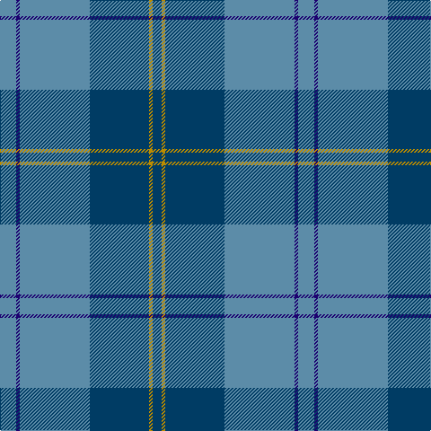

In pattern [BBBBYB](/stripes/bbbbyb/).

This was sourced from register-of-tartans.  It is a [6 stripe tartan](/stripes/stripes6/).

Original link https://www.tartanregister.gov.uk/tartanDetails.aspx?ref=3357

## Also known as

This cloth is also recorded under:

- Port Authority of NY & NJ (Corporate

## Attestations

This cloth appears in 3 source records; the oldest owns this page.

- 01/10/2005 — Port Authority of NY & NJ (register-of-tartans, [record](https://www.tartanregister.gov.uk/tartanDetails.aspx?ref=3357))
- 2005, October — Port Authority of NY & NJ (Corporate (tartans-authority, [record](http://www.tartansauthority.com/tartan-ferret/display/6793/))
- undated — Port Authority of NY & NJ American Corporate Tartan Tartan Number: 6793. Earliest known date: 2005, October Designed by Clair Hunter (ne Donaldson) of The House of Edgar for The Pipers Cove - a Highland dress shop in Kearney, New Jersey for use by the Pipers' Cove Pipe Band. See products available Copyright © Blair Urquhart, Comrie, 2015 (house-of-tartan, [record](http://www.house-of-tartan.scotland.net/house/TartanViewjs.asp?colr=Def&tnam=6793))

## Register references

External register numbers recorded for this tartan.

- Scottish Register of Tartans: [3357](https://www.tartanregister.gov.uk/tartanDetails.aspx?ref=3357)
- Scottish Tartans Authority (ITI): 6793

## Thread count
B/18 DB4 B78 DBa66 DY4 DBa/10

## Palette
Each colour and the base-6 reference it is a variant of.

| Colour | Shade | Base |
|---|---|---|
| B | <code style="background-color:#5C8CA8;">#5C8CA8</code> `oklch(61.7% 0.067 235.0)` <small>#5C8CA8</small> | B <code style="background-color:#2A418A;">#2A418A</code> |
| DB | <code style="background-color:#1C0070;">#1C0070</code> `oklch(26.3% 0.162 277.1)` <small>#1C0070</small> | B <code style="background-color:#2A418A;">#2A418A</code> |
| DBa | <code style="background-color:#003C64;">#003C64</code> `oklch(34.5% 0.089 246.0)` <small>#003C64</small> | B <code style="background-color:#2A418A;">#2A418A</code> |
| DY | <code style="background-color:#BC8C00;">#BC8C00</code> `oklch(66.8% 0.137 84.1)` <small>#BC8C00</small> | Y <code style="background-color:#F2BF00;">#F2BF00</code> |

# Sample pattern

## Nearest tartans

The nearest existing variants by ΔTartan distance.

1. [Corries](/setts/s6/t28dt15r2dt2w1dt6~x2/) — ΔT 0.71
1. [Roxburgh](/setts/s8/db16w1db1w1db8dg16r1db2~x2/) — ΔT 1.17
1. [Hector James](/setts/s5/r2g5db27g11o2~x2/) — ΔT 1.25
1. [Connecticut State Police PB (Cor.)](/setts/s6/n42db2n2db17lo8db4~x2/) — ΔT 1.25
1. [Thorburn (Lochcarron)](/setts/s6/dt3t14dt3o16dt34r3~x2/) — ΔT 1.27
1. [Ewell Castle School](/setts/s6/db4r1db18b18w1b4~x4/) — ΔT 1.31
1. [Greenlaw, American (Name)](/setts/s8/b46r2b3r2b14g38k3g4~x2/) — ΔT 1.37
1. [Bermuda Plaid (1947) (District)](/setts/s7/t33r8db12g12t8db2t8~x2/) — ΔT 1.37
1. [Melville (Two black lines)](/setts/s6/dg4w1dg26b26k2b4~x4/) — ΔT 1.39
1. [Leonard (Name)](/setts/s8/b36db6b5r3k2r3b5db18~x2/) — ΔT 1.42

## Neighbour map

Every grey dot is one of 14299 variants placed by the first two principal components of the ΔTartan feature space (44% of its variance). Red is this tartan; blue dots are its nearest — click one to open its page.

<svg viewBox="0 0 640 380" role="img" style="max-width:100%;height:auto;border:1px solid #e0e0e0;border-radius:4px;display:block" xmlns="http://www.w3.org/2000/svg"><image href="/nn/cloud.v1.png" width="640" height="380"/><a href="/setts/s6/t28dt15r2dt2w1dt6~x2/"><circle cx="381.9" cy="178.5" r="4" fill="#3465a4"><title>Corries</title></circle></a><a href="/setts/s8/db16w1db1w1db8dg16r1db2~x2/"><circle cx="399.0" cy="197.5" r="4" fill="#3465a4"><title>Roxburgh</title></circle></a><a href="/setts/s5/r2g5db27g11o2~x2/"><circle cx="379.1" cy="223.9" r="4" fill="#3465a4"><title>Hector James</title></circle></a><a href="/setts/s6/n42db2n2db17lo8db4~x2/"><circle cx="381.3" cy="179.2" r="4" fill="#3465a4"><title>Connecticut State Police PB (Cor.)</title></circle></a><a href="/setts/s6/dt3t14dt3o16dt34r3~x2/"><circle cx="333.0" cy="225.4" r="4" fill="#3465a4"><title>Thorburn (Lochcarron)</title></circle></a><a href="/setts/s6/db4r1db18b18w1b4~x4/"><circle cx="345.7" cy="204.3" r="4" fill="#3465a4"><title>Ewell Castle School</title></circle></a><a href="/setts/s8/b46r2b3r2b14g38k3g4~x2/"><circle cx="410.6" cy="183.1" r="4" fill="#3465a4"><title>Greenlaw, American (Name)</title></circle></a><a href="/setts/s7/t33r8db12g12t8db2t8~x2/"><circle cx="347.0" cy="210.5" r="4" fill="#3465a4"><title>Bermuda Plaid (1947) (District)</title></circle></a><a href="/setts/s6/dg4w1dg26b26k2b4~x4/"><circle cx="370.5" cy="193.3" r="4" fill="#3465a4"><title>Melville (Two black lines)</title></circle></a><a href="/setts/s8/b36db6b5r3k2r3b5db18~x2/"><circle cx="417.7" cy="197.7" r="4" fill="#3465a4"><title>Leonard (Name)</title></circle></a><circle cx="381.6" cy="202.7" r="5" fill="#c00000"/></svg>

ID: /setts/s6/t9db2t39dt33lo2dt5~x2/
