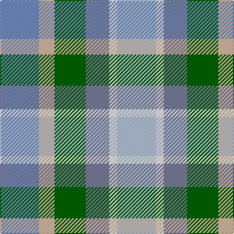

This page is one **sett** — a single exact thread-count. It belongs to the [tartan](/tartans/ti5lr2g4t3w1lb5/)
(the same proportion at any scale), whose colour order is pattern [BYGBWW](/stripes/bygbww/).

Sourced from register-of-tartans.  It is a [6 stripe tartan](/stripes/stripes6/).

Original link https://www.tartanregister.gov.uk/tartanDetails.aspx?ref=10431

## Register references

External register numbers recorded for this tartan.

- Scottish Register of Tartans: [10431](https://www.tartanregister.gov.uk/tartanDetails.aspx?ref=10431)

## Thread count
B/40 Na16 G32 N24 W8 LP/40

## Palette

Palette: <strong>Tartan Register</strong> <small style="color:#888">(2 of 6 colours)</small>
<table><thead><tr><th>Colour</th><th>Threads</th><th>Shade</th><th>Base</th><th>OKLCh</th></tr></thead><tbody><tr><td>B/</td><td style="text-align:right;font-variant-numeric:tabular-nums">40</td><td><code style="background-color:#708CC2;">#708CC2</code> <small style="color:#888">#708CC2</small></td><td>B <code style="background-color:#2A418A;">#2A418A</code></td><td><small style="color:#888">oklch(64.0% 0.088 263.0)</small></td></tr><tr><td>Na</td><td style="text-align:right;font-variant-numeric:tabular-nums">16</td><td><code style="background-color:#D4B8A0;">#D4B8A0</code> <small style="color:#888">#D4B8A0</small></td><td>Y <code style="background-color:#F2BF00;">#F2BF00</code></td><td><small style="color:#888">oklch(80.0% 0.046 62.7)</small></td></tr><tr><td>G</td><td style="text-align:right;font-variant-numeric:tabular-nums">32</td><td><code style="background-color:#006400;">#006400</code> <small style="color:#888">#006400</small></td><td>G <code style="background-color:#006100;">#006100</code></td><td><small style="color:#888">oklch(43.6% 0.148 142.5)</small></td></tr><tr><td>N</td><td style="text-align:right;font-variant-numeric:tabular-nums">24</td><td><code style="background-color:#797C9A;">#797C9A</code> <small style="color:#888">#797C9A</small></td><td>B <code style="background-color:#2A418A;">#2A418A</code></td><td><small style="color:#888">oklch(59.5% 0.046 280.4)</small></td></tr><tr><td>W</td><td style="text-align:right;font-variant-numeric:tabular-nums">8</td><td><code style="background-color:#FFFFFF;">#FFFFFF</code> <small style="color:#888">#FFFFFF</small></td><td>W <code style="background-color:#F7F7F7;">#F7F7F7</code></td><td><small style="color:#888">oklch(100.0% 0.000 89.9)</small></td></tr><tr><td>LP/</td><td style="text-align:right;font-variant-numeric:tabular-nums">40</td><td><code style="background-color:#B2C2E0;">#B2C2E0</code> <small style="color:#888">#B2C2E0</small></td><td>W <code style="background-color:#F7F7F7;">#F7F7F7</code></td><td><small style="color:#888">oklch(81.2% 0.046 263.0)</small></td></tr></tbody></table>

# Sample pattern

## Nearest tartans

The nearest existing variants by ΔTartan distance, with this tartan at the top so the swatches line up against it.

ΔTartan

Tartan

Sett

—

<a href="/ttd/edit/#slug=ti5lr2g4t3w1lb5~x8">Heriot Bay Local (Quadra Island, British Columbia)</a> <a class="nn-out" href="/setts/s6/ti5lr2g4t3w1lb5~x8/" title="open its dictionary page">↗</a>

1.77

<a href="/ttd/edit/#slug=y8o8lg7lr5lb2k2lb2k2lb2~x4">Somerset (District)</a> <a class="nn-out" href="/setts/s9/y8o8lg7lr5lb2k2lb2k2lb2~x4/" title="open its dictionary page">↗</a>

1.81

<a href="/ttd/edit/#slug=w18t22db15ly6g10lp5g6r5~x2">Queensland</a> <a class="nn-out" href="/setts/s8/w18t22db15ly6g10lp5g6r5~x2/" title="open its dictionary page">↗</a>

1.83

<a href="/ttd/edit/#slug=w3t4db3ly1g2lp1g1m1~x12">Queensland (District)</a> <a class="nn-out" href="/setts/s8/w3t4db3ly1g2lp1g1m1~x12/" title="open its dictionary page">↗</a>

1.84

<a href="/ttd/edit/#slug=dg2o13dg12w3lb10w3lb12g13r2~x2">Mounth The.. Corporate Tartan Tartan Number: 120. Earliest known date: 1988 Designed for Kincardine &amp; Deeside branch of the National Trust for Scotland. Blue is a muted sky blue. Green is a dark pine green. See products available Copyright © Blair Urquhart, Comrie, 2015</a> <a class="nn-out" href="/setts/s9/dg2o13dg12w3lb10w3lb12g13r2~x2/" title="open its dictionary page">↗</a>

1.94

<a href="/ttd/edit/#slug=t19lo12r4ly8o4gi6g16~x2">Aberdeenshire Home Colours</a> <a class="nn-out" href="/setts/s7/t19lo12r4ly8o4gi6g16~x2/" title="open its dictionary page">↗</a>

1.97

<a href="/ttd/edit/#slug=k1o3lr3oi3db3oi3g3k1~x4">Stewarton (Fashion)</a> <a class="nn-out" href="/setts/s8/k1o3lr3oi3db3oi3g3k1~x4/" title="open its dictionary page">↗</a>

1.99

<a href="/ttd/edit/#slug=r9b6dt13b21o18w4~x2">Fox-Eves Wedding (Personal)</a> <a class="nn-out" href="/setts/s6/r9b6dt13b21o18w4~x2/" title="open its dictionary page">↗</a>

2.01

<a href="/ttd/edit/#slug=b5dg9o2ly2db6t14w3~x4">Manx National</a> <a class="nn-out" href="/setts/s7/b5dg9o2ly2db6t14w3~x4/" title="open its dictionary page">↗</a>

2.10

<a href="/ttd/edit/#slug=g5db3t3g5w4ly2t1ly2db1r1~x6">Northern College (Ontario)</a> <a class="nn-out" href="/setts/s10/g5db3t3g5w4ly2t1ly2db1r1~x6/" title="open its dictionary page">↗</a>

2.11

<a href="/ttd/edit/#slug=lb18t18db10w3o15oi3ly8~x2">Isle of Jura</a> <a class="nn-out" href="/setts/s7/lb18t18db10w3o15oi3ly8~x2/" title="open its dictionary page">↗</a>

## Neighbour map

Every grey dot is one of 14359 variants placed by the first two principal components of the ΔTartan feature space (44% of its variance). Red is this tartan; blue dots are its nearest — click one to open its page.

<svg viewBox="0 0 640 380" role="img" style="max-width:100%;height:auto;border:1px solid #e0e0e0;border-radius:4px;display:block" xmlns="http://www.w3.org/2000/svg"><image href="/nn/cloud.v1.png" width="640" height="380"/><a href="/setts/s9/y8o8lg7lr5lb2k2lb2k2lb2~x4/"><circle cx="14.0" cy="205.5" r="4" fill="#3465a4"><title>Somerset (District)</title></circle></a><a href="/setts/s8/w18t22db15ly6g10lp5g6r5~x2/"><circle cx="14.0" cy="189.0" r="4" fill="#3465a4"><title>Queensland</title></circle></a><a href="/setts/s8/w3t4db3ly1g2lp1g1m1~x12/"><circle cx="14.0" cy="194.6" r="4" fill="#3465a4"><title>Queensland (District)</title></circle></a><a href="/setts/s9/dg2o13dg12w3lb10w3lb12g13r2~x2/"><circle cx="54.2" cy="187.2" r="4" fill="#3465a4"><title>Mounth The.. Corporate Tartan Tartan Number: 120. Earliest known date: 1988 Designed for Kincardine &amp; Deeside branch of the National Trust for Scotland. Blue is a muted sky blue. Green is a dark pine green. See products available Copyright © Blair Urquhart, Comrie, 2015</title></circle></a><a href="/setts/s7/t19lo12r4ly8o4gi6g16~x2/"><circle cx="52.8" cy="221.6" r="4" fill="#3465a4"><title>Aberdeenshire Home Colours</title></circle></a><a href="/setts/s8/k1o3lr3oi3db3oi3g3k1~x4/"><circle cx="14.0" cy="264.7" r="4" fill="#3465a4"><title>Stewarton (Fashion)</title></circle></a><a href="/setts/s6/r9b6dt13b21o18w4~x2/"><circle cx="131.6" cy="258.5" r="4" fill="#3465a4"><title>Fox-Eves Wedding (Personal)</title></circle></a><a href="/setts/s7/b5dg9o2ly2db6t14w3~x4/"><circle cx="80.1" cy="184.9" r="4" fill="#3465a4"><title>Manx National</title></circle></a><a href="/setts/s10/g5db3t3g5w4ly2t1ly2db1r1~x6/"><circle cx="51.6" cy="195.3" r="4" fill="#3465a4"><title>Northern College (Ontario)</title></circle></a><a href="/setts/s7/lb18t18db10w3o15oi3ly8~x2/"><circle cx="14.0" cy="176.8" r="4" fill="#3465a4"><title>Isle of Jura</title></circle></a><circle cx="33.5" cy="246.1" r="5" fill="#c00000"/></svg>

ID: /setts/s6/ti5lr2g4t3w1lb5~x8/
