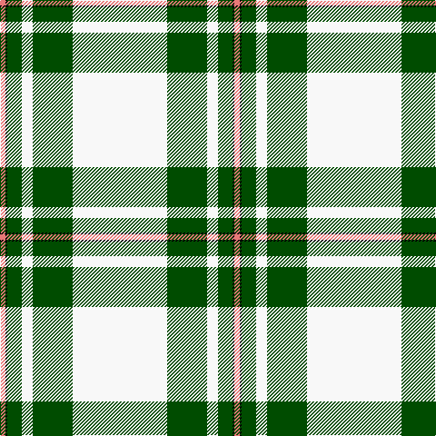

In pattern [RKGWGW](/patterns/rkgwgw/).

This was sourced from register-of-tartans.  It is a [6 stripes tartan](/stripes/stripes6/).

Original link https://www.tartanregister.gov.uk/tartanDetails.aspx?ref=2453

## Thread count
LR/6 K2 G16 W12 G44 W/104

## Palette
Each colour and its ΔE from the base-6 reference it is a variant of.

| Colour | Shade | Base | ΔE (OKLab) |
|---|---|---|---|
| G | <code style="background-color:#004C00;">#004C00</code> `#004C00` | G <code style="background-color:#006400;">#006400</code> | 0.08 |
| K | <code style="background-color:#000000;">#000000</code> `#000000` | K <code style="background-color:#000000;">#000000</code> | 0.00 |
| LR | <code style="background-color:#E87878;">#E87878</code> `#E87878` | R <code style="background-color:#C80000;">#C80000</code> | 0.19 |
| W | <code style="background-color:#F8F8F8;">#F8F8F8</code> `#F8F8F8` | W <code style="background-color:#F4F4F0;">#F4F4F0</code> | 0.01 |

# Sample pattern

## Nearest tartans

The nearest existing variants by ΔTartan distance.

1. [MacGregor - 1975 (Dance, Green)](/setts/s6/w104g44w12g16k2r6-g006400-k000000-re87878-wf8f8f8/) — ΔT 0.34
1. [Westfalia Dress (Corporate)](/setts/s6/w88g36w12g22b2r8-b003c64-g005c30-re86000-wf8f0e4/) — ΔT 0.63
1. [MacGregor Dress Green Clan Tartan Tartan Number: 1577. Earliest known date: pre 1992 A dancers tartan. See products available Copyright © Blair Urquhart, Comrie, 2015](/setts/s6/w94g40w12g16k2r6-g006818-k101010-rc80000-we0e0e0/) — ΔT 0.63
1. [MacGregor, Green](/setts/s6/w94g40w12g16k2r6-g008000-k000000-rc00000-we0e0e0/) — ΔT 0.85
1. [Skye, Green (Dance)](/setts/s6/b8w4b2w72g42y8-b506878-g006818-wf0e0c8-yfce888/) — ΔT 1.43
1. [Westfalia (Corporate)](/setts/s6/g88w36g12w22b2r8-b003c64-g005c30-re86000-wf8f0e4/) — ΔT 1.46
1. [Summer Spirit (Fashion)](/setts/s8/r4w4k4w56k16w18k2y4-k101010-rc80000-wfcfcec-ye8c000/) — ΔT 1.59
1. [Young, Christina](/setts/s6/w108k14r14y12ya8r2-k101010-rc80000-we0e0e0-yd87c00-yae8c000/) — ΔT 1.66
1. [MacGregor Dress Burgundy (Dance)](/setts/s6/w104r44w12r16k2ra6-k000000-r800028-rae87878-wf8f8f8/) — ΔT 1.74
1. [Unidentified, Arisaid](/setts/s9/w216k8g24ga24w4k4r45w8r12-g003000-ga30a010-k000000-r900030-we0e0e0/) — ΔT 1.83

## Neighbour map

Every grey dot is one of 15726 variants placed by the first two principal components of the ΔTartan feature space (44% of its variance). Red is this tartan; blue dots are its nearest — click one to open its page.

<svg viewBox="0 0 640 380" role="img" style="max-width:100%;height:auto;border:1px solid #e0e0e0;border-radius:4px;display:block" xmlns="http://www.w3.org/2000/svg"><image href="/nn/cloud.v1.png" width="640" height="380"/><a href="/setts/s6/w104g44w12g16k2r6-g006400-k000000-re87878-wf8f8f8/"><circle cx="387.4" cy="105.1" r="4" fill="#3465a4"><title>MacGregor - 1975 (Dance, Green)</title></circle></a><a href="/setts/s6/w88g36w12g22b2r8-b003c64-g005c30-re86000-wf8f0e4/"><circle cx="358.1" cy="118.2" r="4" fill="#3465a4"><title>Westfalia Dress (Corporate)</title></circle></a><a href="/setts/s6/w94g40w12g16k2r6-g006818-k101010-rc80000-we0e0e0/"><circle cx="391.2" cy="115.9" r="4" fill="#3465a4"><title>MacGregor Dress Green Clan Tartan Tartan Number: 1577. Earliest known date: pre 1992 A dancers tartan. See products available Copyright © Blair Urquhart, Comrie, 2015</title></circle></a><a href="/setts/s6/w94g40w12g16k2r6-g008000-k000000-rc00000-we0e0e0/"><circle cx="395.1" cy="117.7" r="4" fill="#3465a4"><title>MacGregor, Green</title></circle></a><a href="/setts/s6/b8w4b2w72g42y8-b506878-g006818-wf0e0c8-yfce888/"><circle cx="335.1" cy="122.4" r="4" fill="#3465a4"><title>Skye, Green (Dance)</title></circle></a><a href="/setts/s6/g88w36g12w22b2r8-b003c64-g005c30-re86000-wf8f0e4/"><circle cx="360.6" cy="128.7" r="4" fill="#3465a4"><title>Westfalia (Corporate)</title></circle></a><a href="/setts/s8/r4w4k4w56k16w18k2y4-k101010-rc80000-wfcfcec-ye8c000/"><circle cx="414.1" cy="101.5" r="4" fill="#3465a4"><title>Summer Spirit (Fashion)</title></circle></a><a href="/setts/s6/w108k14r14y12ya8r2-k101010-rc80000-we0e0e0-yd87c00-yae8c000/"><circle cx="415.0" cy="74.9" r="4" fill="#3465a4"><title>Young, Christina</title></circle></a><a href="/setts/s6/w104r44w12r16k2ra6-k000000-r800028-rae87878-wf8f8f8/"><circle cx="396.1" cy="95.7" r="4" fill="#3465a4"><title>MacGregor Dress Burgundy (Dance)</title></circle></a><a href="/setts/s9/w216k8g24ga24w4k4r45w8r12-g003000-ga30a010-k000000-r900030-we0e0e0/"><circle cx="391.2" cy="44.5" r="4" fill="#3465a4"><title>Unidentified, Arisaid</title></circle></a><circle cx="383.5" cy="103.7" r="5" fill="#c00000"/></svg>

ID: /setts/s6/w104g44w12g16k2r6-g004c00-k000000-re87878-wf8f8f8/
