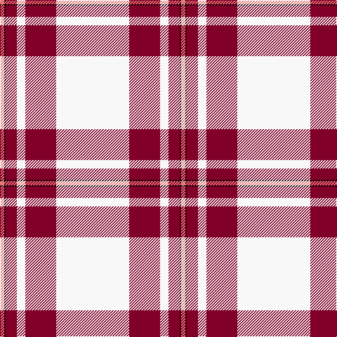

In pattern [RKRWRW](/patterns/rkrwrw/).

This was sourced from register-of-tartans.  It is a [6 stripes tartan](/stripes/stripes6/).

Original link https://www.tartanregister.gov.uk/tartanDetails.aspx?ref=2452

## Attestations

This cloth appears in 2 source records; the oldest owns this page.

- 01/01/1975 — MacGregor Dress Burgundy (Dance) (register-of-tartans, [record](https://www.tartanregister.gov.uk/tartanDetails.aspx?ref=2452))
- 1975 — MacGregor - 1975 (Dance, Burgundy) (tartans-authority, [record](http://www.tartansauthority.com/tartan-ferret/display/1577/))

## Thread count
LR/6 K2 DR16 W12 DR44 W/104

## Palette
Each colour and its ΔE from the base-6 reference it is a variant of.

| Colour | Shade | Base | ΔE (OKLab) |
|---|---|---|---|
| DR | <code style="background-color:#800028;">#800028</code> `#800028` | R <code style="background-color:#C80000;">#C80000</code> | 0.16 |
| K | <code style="background-color:#000000;">#000000</code> `#000000` | K <code style="background-color:#000000;">#000000</code> | 0.00 |
| LR | <code style="background-color:#E87878;">#E87878</code> `#E87878` | R <code style="background-color:#C80000;">#C80000</code> | 0.19 |
| W | <code style="background-color:#F8F8F8;">#F8F8F8</code> `#F8F8F8` | W <code style="background-color:#F4F4F0;">#F4F4F0</code> | 0.01 |

# Sample pattern

ID: /setts/s6/w104r44w12r16k2ra6-k000000-r800028-rae87878-wf8f8f8/
