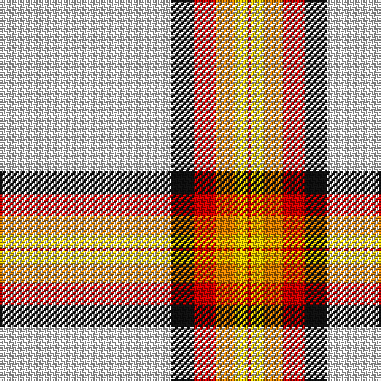

In pattern [RYYRKW](/patterns/ryyrkw/).

This was sourced from register-of-tartans.  It is a [6 stripes tartan](/stripes/stripes6/).

Original link https://www.tartanregister.gov.uk/tartanDetails.aspx?ref=4799

## Thread count
LN/108 K14 R14 O12 Ya8 R/2

## Palette
Each colour and its ΔE from the base-6 reference it is a variant of.

| Colour | Shade | Base | ΔE (OKLab) |
|---|---|---|---|
| K | <code style="background-color:#101010;">#101010</code> `#101010` | K <code style="background-color:#000000;">#000000</code> | 0.17 |
| LN | <code style="background-color:#E0E0E0;">#E0E0E0</code> `#E0E0E0` | W <code style="background-color:#F7F7F7;">#F7F7F7</code> | 0.07 |
| LP | <code style="background-color:#C49CD8;">#C49CD8</code> `#C49CD8` | W <code style="background-color:#F7F7F7;">#F7F7F7</code> | 0.25 |
| LPa | <code style="background-color:#9C68A4;">#9C68A4</code> `#9C68A4` | R <code style="background-color:#CC0000;">#CC0000</code> | 0.21 |
| N | <code style="background-color:#808080;">#808080</code> `#808080` | G <code style="background-color:#006100;">#006100</code> | 0.23 |
| O | <code style="background-color:#D87C00;">#D87C00</code> `#D87C00` | Y <code style="background-color:#F2BF00;">#F2BF00</code> | 0.17 |
| R | <code style="background-color:#C80000;">#C80000</code> `#C80000` | R <code style="background-color:#CC0000;">#CC0000</code> | 0.01 |
| Y | <code style="background-color:#E8C000;">#E8C000</code> `#E8C000` | Y <code style="background-color:#F2BF00;">#F2BF00</code> | 0.02 |
| Ya | <code style="background-color:#E8C000;">#E8C000</code> `#E8C000` | Y <code style="background-color:#F2BF00;">#F2BF00</code> | 0.02 |

# Sample pattern

## Nearest tartans

The nearest existing variants by ΔTartan distance.

1. [Unidentified Arisaid](/setts/s9/w216k8g24ga24w4k4r45w8r12-g002814-ga309c18-k101010-r960028-we0e0e0/) — ΔT 1.15
1. [Unidentified, Arisaid](/setts/s9/w216k8g24ga24w4k4r45w8r12-g003000-ga30a010-k000000-r900030-we0e0e0/) — ΔT 1.20
1. [MacGregor Dress Red (Dance)](/setts/s6/w104r44w12r16k2b6-b2c2c80-k101010-rc80000-wf8f8f8/) — ΔT 1.38
1. [MacGregor Dress Burgundy (Dance)](/setts/s6/w104r44w12r16k2ra6-k000000-r800028-rae87878-wf8f8f8/) — ΔT 1.39
1. [Aviemore Dress Tartan Tartan Number: 8177. Earliest known date: Threadcount and colours aren't 100% original. Generated manually. See products available Copyright © Blair Urquhart, Comrie, 2015](/setts/s7/w120r2b20r44b6ra6g2-b2c2c80-g006818-ra00048-rac80000-we0e0e0/) — ΔT 1.47
1. [McBrayer Dress](/setts/s8/w114k2r24w2g24r28w2r4-g508844-k101010-rc80000-wf4e0c8/) — ΔT 1.62
1. [Unidentified, Blanket](/setts/s8/w100k2r24w2g24r26w2r4-g008000-k000000-rc00000-we0e0e0/) — ΔT 1.64
1. [MacGregor Dress Green (Dance)](/setts/s6/w104g44w12g16k2r6-g004c00-k000000-re87878-wf8f8f8/) — ΔT 1.66
1. [Boucherville Formal District Tartan Tartan Number: 2118. Earliest known date: 1990 Three designers from La Navette d'Art ENR, Jeanette Blanchette, Pauline Bastien and Jacqueline Provost, based their design on symbolic colours. Le bleu azur represente la loyaute, le gris argent la serenite, le jaune (l'or) la generosite, le vert represente l'esperance, et le blanc symbole de purete et d'innocence "nous rappelle notre appartenance au Quebec." "Les tisserands, c'est nous tous...!" See products available Copyright © Blair Urquhart, Comrie, 2015](/setts/s9/w40y4r10w8b4r4b4r4g1-b2c2c80-g006818-r888888-we0e0e0-ye8c000/) — ΔT 1.67
1. [Unidentified Blanket](/setts/s8/w100k2r24w2g24r26w2r4-g005020-k101010-rdc0000-we0e0e0/) — ΔT 1.69

## Neighbour map

Every grey dot is one of 15726 variants placed by the first two principal components of the ΔTartan feature space (44% of its variance). Red is this tartan; blue dots are its nearest — click one to open its page.

<svg viewBox="0 0 640 380" role="img" style="max-width:100%;height:auto;border:1px solid #e0e0e0;border-radius:4px;display:block" xmlns="http://www.w3.org/2000/svg"><image href="/nn/cloud.v1.png" width="640" height="380"/><a href="/setts/s9/w216k8g24ga24w4k4r45w8r12-g002814-ga309c18-k101010-r960028-we0e0e0/"><circle cx="394.4" cy="45.2" r="4" fill="#3465a4"><title>Unidentified Arisaid</title></circle></a><a href="/setts/s9/w216k8g24ga24w4k4r45w8r12-g003000-ga30a010-k000000-r900030-we0e0e0/"><circle cx="391.2" cy="44.5" r="4" fill="#3465a4"><title>Unidentified, Arisaid</title></circle></a><a href="/setts/s6/w104r44w12r16k2b6-b2c2c80-k101010-rc80000-wf8f8f8/"><circle cx="405.2" cy="95.6" r="4" fill="#3465a4"><title>MacGregor Dress Red (Dance)</title></circle></a><a href="/setts/s6/w104r44w12r16k2ra6-k000000-r800028-rae87878-wf8f8f8/"><circle cx="396.1" cy="95.7" r="4" fill="#3465a4"><title>MacGregor Dress Burgundy (Dance)</title></circle></a><a href="/setts/s7/w120r2b20r44b6ra6g2-b2c2c80-g006818-ra00048-rac80000-we0e0e0/"><circle cx="359.6" cy="65.7" r="4" fill="#3465a4"><title>Aviemore Dress Tartan Tartan Number: 8177. Earliest known date: Threadcount and colours aren't 100% original. Generated manually. See products available Copyright © Blair Urquhart, Comrie, 2015</title></circle></a><a href="/setts/s8/w114k2r24w2g24r28w2r4-g508844-k101010-rc80000-wf4e0c8/"><circle cx="391.0" cy="76.5" r="4" fill="#3465a4"><title>McBrayer Dress</title></circle></a><a href="/setts/s8/w100k2r24w2g24r26w2r4-g008000-k000000-rc00000-we0e0e0/"><circle cx="362.5" cy="79.2" r="4" fill="#3465a4"><title>Unidentified, Blanket</title></circle></a><a href="/setts/s6/w104g44w12g16k2r6-g004c00-k000000-re87878-wf8f8f8/"><circle cx="383.5" cy="103.7" r="4" fill="#3465a4"><title>MacGregor Dress Green (Dance)</title></circle></a><a href="/setts/s9/w40y4r10w8b4r4b4r4g1-b2c2c80-g006818-r888888-we0e0e0-ye8c000/"><circle cx="361.8" cy="81.6" r="4" fill="#3465a4"><title>Boucherville Formal District Tartan Tartan Number: 2118. Earliest known date: 1990 Three designers from La Navette d'Art ENR, Jeanette Blanchette, Pauline Bastien and Jacqueline Provost, based their design on symbolic colours. Le bleu azur represente la loyaute, le gris argent la serenite, le jaune (l'or) la generosite, le vert represente l'esperance, et le blanc symbole de purete et d'innocence &quot;nous rappelle notre appartenance au Quebec.&quot; &quot;Les tisserands, c'est nous tous...!&quot; See products available Copyright © Blair Urquhart, Comrie, 2015</title></circle></a><a href="/setts/s8/w100k2r24w2g24r26w2r4-g005020-k101010-rdc0000-we0e0e0/"><circle cx="363.2" cy="77.6" r="4" fill="#3465a4"><title>Unidentified Blanket</title></circle></a><circle cx="415.0" cy="74.9" r="5" fill="#c00000"/></svg>

ID: /setts/s6/w108k14r14y12ya8r2-k101010-rc80000-we0e0e0-yd87c00-yae8c000/
