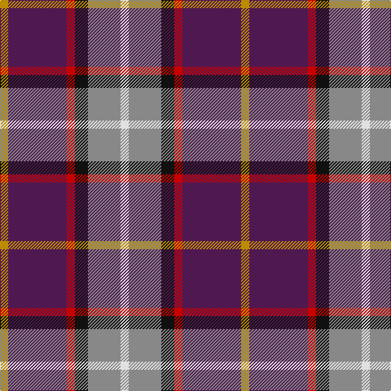

In pattern [WRKRBY](/patterns/wrkrby/).

This was sourced from tartans-authority.  It is a [6 stripes tartan](/stripes/stripes6/).

Original link http://www.tartansauthority.com/tartan-ferret/display/7902/

## Thread count
DY/10 DP72 R10 K16 N40 LN/10

## Palette
Each colour and its ΔE from the base-6 reference it is a variant of.

| Colour | Shade | Base | ΔE (OKLab) |
|---|---|---|---|
| DP | <code style="background-color:#501850;">#501850</code> `#501850` | B <code style="background-color:#2C4084;">#2C4084</code> | 0.13 |
| DY | <code style="background-color:#BC8C00;">#BC8C00</code> `#BC8C00` | Y <code style="background-color:#E8C000;">#E8C000</code> | 0.16 |
| K | <code style="background-color:#101010;">#101010</code> `#101010` | K <code style="background-color:#000000;">#000000</code> | 0.17 |
| LN | <code style="background-color:#E0E0E0;">#E0E0E0</code> `#E0E0E0` | W <code style="background-color:#F4F4F0;">#F4F4F0</code> | 0.06 |
| N | <code style="background-color:#888888;">#888888</code> `#888888` | R <code style="background-color:#C80000;">#C80000</code> | 0.24 |
| R | <code style="background-color:#C80000;">#C80000</code> `#C80000` | R <code style="background-color:#C80000;">#C80000</code> | 0.00 |

# Sample pattern

## Nearest tartans

The nearest existing variants by ΔTartan distance.

1. [MacLeod Society of Scotland](/setts/s6/g6ga6r44k10b44y4-b2c2c80-g006818-ga289c18-k101010-rc80000-ye8c000/) — ΔT 0.97
1. [Galvez-Brown (Personal)](/setts/s7/b72y10r24ra18ba10w24y14-b003c64-ba440044-r880000-rac80000-wfcfcfc-ybc8c00/) — ΔT 1.11
1. [Dunbog Primary School Corporate Tartan Tartan Number: 954. Earliest known date: 1985 C. Armstrong is a pupil at the school. See products available Copyright © Blair Urquhart, Comrie, 2015](/setts/s6/r24b6g10ba32y4g4-b2c2c80-ba202060-g006818-rc80000-ye8c000/) — ΔT 1.12
1. [Nicolson of Tiree & Coll (Clan)](/setts/s6/g12b32r44ba12k8bb8-b2c2c80-ba003c64-bb780078-g289c18-k101010-rc80000/) — ΔT 1.15
1. [MacCreary (Personal)](/setts/s9/k8b24w6b8g16y4r48b8r8-b1c0070-g006818-k101010-rcc4438-wa8ace8-yd09800/) — ΔT 1.19
1. [Eichelberger (Perrsonal)](/setts/s7/k40r12y6b48g6r16w8-b2c2c80-g006818-k101010-rc80000-we0e0e0-yfccc00/) — ΔT 1.23
1. [Deeside District Tartan Tartan Number: 1833. Earliest known date: 1963 The name Deas is described as an 'alias' for Davidson in historic records, and is a recognised sept of Clan Dhai (Davidson). See products available Copyright © Blair Urquhart, Comrie, 2015](/setts/s7/w4r4b8r28g4ba20y4-b780078-ba1c0070-g006818-r888888-we0e0e0-ye8c000/) — ΔT 1.23
1. [Fife (McGill)](/setts/s6/b62ba8b12k38r40y8-b2c2c80-ba5c8ca8-k101010-rc80000-ye8c000/) — ΔT 1.24
1. [Afternoon Tea / Assam](/setts/s6/r15ra98b72ba25b8w15-b202060-ba5c8ca8-rc80000-ra880000-wfcfcfc/) — ΔT 1.29
1. [Clinton (Personal)](/setts/s8/w10b12r36k16ba10k8b54w6-b2c2c80-ba7878a8-k101010-rd40000-we0e0e0/) — ΔT 1.30

## Neighbour map

Every grey dot is one of 15726 variants placed by the first two principal components of the ΔTartan feature space (44% of its variance). Red is this tartan; blue dots are its nearest — click one to open its page.

<svg viewBox="0 0 640 380" role="img" style="max-width:100%;height:auto;border:1px solid #e0e0e0;border-radius:4px;display:block" xmlns="http://www.w3.org/2000/svg"><image href="/nn/cloud.v1.png" width="640" height="380"/><a href="/setts/s6/g6ga6r44k10b44y4-b2c2c80-g006818-ga289c18-k101010-rc80000-ye8c000/"><circle cx="185.4" cy="157.2" r="4" fill="#3465a4"><title>MacLeod Society of Scotland</title></circle></a><a href="/setts/s7/b72y10r24ra18ba10w24y14-b003c64-ba440044-r880000-rac80000-wfcfcfc-ybc8c00/"><circle cx="117.3" cy="164.2" r="4" fill="#3465a4"><title>Galvez-Brown (Personal)</title></circle></a><a href="/setts/s6/r24b6g10ba32y4g4-b2c2c80-ba202060-g006818-rc80000-ye8c000/"><circle cx="177.9" cy="198.2" r="4" fill="#3465a4"><title>Dunbog Primary School Corporate Tartan Tartan Number: 954. Earliest known date: 1985 C. Armstrong is a pupil at the school. See products available Copyright © Blair Urquhart, Comrie, 2015</title></circle></a><a href="/setts/s6/g12b32r44ba12k8bb8-b2c2c80-ba003c64-bb780078-g289c18-k101010-rc80000/"><circle cx="125.9" cy="202.9" r="4" fill="#3465a4"><title>Nicolson of Tiree &amp; Coll (Clan)</title></circle></a><a href="/setts/s9/k8b24w6b8g16y4r48b8r8-b1c0070-g006818-k101010-rcc4438-wa8ace8-yd09800/"><circle cx="179.4" cy="134.7" r="4" fill="#3465a4"><title>MacCreary (Personal)</title></circle></a><a href="/setts/s7/k40r12y6b48g6r16w8-b2c2c80-g006818-k101010-rc80000-we0e0e0-yfccc00/"><circle cx="114.0" cy="168.2" r="4" fill="#3465a4"><title>Eichelberger (Perrsonal)</title></circle></a><a href="/setts/s7/w4r4b8r28g4ba20y4-b780078-ba1c0070-g006818-r888888-we0e0e0-ye8c000/"><circle cx="154.9" cy="169.1" r="4" fill="#3465a4"><title>Deeside District Tartan Tartan Number: 1833. Earliest known date: 1963 The name Deas is described as an 'alias' for Davidson in historic records, and is a recognised sept of Clan Dhai (Davidson). See products available Copyright © Blair Urquhart, Comrie, 2015</title></circle></a><a href="/setts/s6/b62ba8b12k38r40y8-b2c2c80-ba5c8ca8-k101010-rc80000-ye8c000/"><circle cx="186.2" cy="208.1" r="4" fill="#3465a4"><title>Fife (McGill)</title></circle></a><a href="/setts/s6/r15ra98b72ba25b8w15-b202060-ba5c8ca8-rc80000-ra880000-wfcfcfc/"><circle cx="214.7" cy="173.9" r="4" fill="#3465a4"><title>Afternoon Tea / Assam</title></circle></a><a href="/setts/s8/w10b12r36k16ba10k8b54w6-b2c2c80-ba7878a8-k101010-rd40000-we0e0e0/"><circle cx="169.7" cy="170.1" r="4" fill="#3465a4"><title>Clinton (Personal)</title></circle></a><circle cx="176.5" cy="175.8" r="5" fill="#c00000"/></svg>

ID: /setts/s6/w10r40k16ra10b72y10-b501850-k101010-r888888-rac80000-we0e0e0-ybc8c00/
