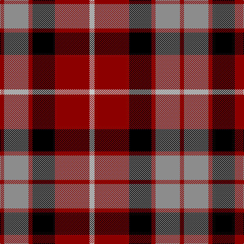

In pattern [RRRKRW](/patterns/rrrkrw/).

This was sourced from register-of-tartans.  It is a [6 stripes tartan](/stripes/stripes6/).

Original link https://www.tartanregister.gov.uk/tartanDetails.aspx?ref=4551

## Thread count
DR/8 N48 DR8 K44 DR68 Na/10

## Palette
Each colour and its ΔE from the base-6 reference it is a variant of.

| Colour | Shade | Base | ΔE (OKLab) |
|---|---|---|---|
| DR | <code style="background-color:#8C0000;">#8C0000</code> `#8C0000` | R <code style="background-color:#C80000;">#C80000</code> | 0.13 |
| K | <code style="background-color:#000000;">#000000</code> `#000000` | K <code style="background-color:#000000;">#000000</code> | 0.00 |
| N | <code style="background-color:#8C8C8C;">#8C8C8C</code> `#8C8C8C` | R <code style="background-color:#C80000;">#C80000</code> | 0.24 |
| Na | <code style="background-color:#C8C8C8;">#C8C8C8</code> `#C8C8C8` | W <code style="background-color:#F4F4F0;">#F4F4F0</code> | 0.13 |

# Sample pattern

## Nearest tartans

The nearest existing variants by ΔTartan distance.

1. [Aberdeen University](/setts/s5/y8r60k28b32y8-b304080-k000000-rc00000-yf0c000/) — ΔT 0.65
1. [Graham of Menteith, (Red)](/setts/s6/r52b6r8k32ba32k8-b5480b0-ba304080-k000000-rc00000/) — ΔT 0.71
1. [Wcwm 759-3](/setts/s6/w10r68k48r8ra48r8-k000000-r8c8c8c-ra8c0000-wc8c8c8/) — ΔT 0.79
1. [Aberdeen University Corporate Tartan Tartan Number: 2152. Earliest known date: 1993 Aberdeen Unversity tartan was designed by the Weaver Incorporation of Aberdeen and Harry Lindley, to commemorate the Quincentennial of the University. The colours of the armourial bearings of the University were used as the starting point of the design, which was approved by the Principal in August 1992. See products available Copyright © Blair Urquhart, Comrie, 2015](/setts/s5/y8r60k28b32y8-b2c2c80-k101010-rc80000-ye8c000/) — ΔT 0.87
1. [Aberdeen University (1992)](/setts/s5/y8r54k24b30y8-b2c2c80-k101010-rc8002c-ye8c000/) — ΔT 1.04
1. [Biffy Clyro](/setts/s7/y6b44k6b6k22r40y6-b202060-k101010-rc80000-yfccc00/) — ΔT 1.05
1. [Hoffman Texas German](/setts/s7/k46r54b6r10w6k28y12-b0000cd-k1c1714-rca2625-wffffff-yffe700/) — ΔT 1.07
1. [Strathspey, Check](/setts/s6/g6r44b10g20k20g4-b5480b0-g008000-k000000-rc00000/) — ΔT 1.07
1. [SAL Cubiska Stenen](/setts/s5/r30g6w4k20w10-g007800-k000000-rc80000-wf8f8f8/) — ΔT 1.07
1. [Thompson Black (Fashion)](/setts/s6/g12k60r32g8ra32k8-g006818-k101010-rc80000-ra888888/) — ΔT 1.10

## Neighbour map

Every grey dot is one of 15726 variants placed by the first two principal components of the ΔTartan feature space (44% of its variance). Red is this tartan; blue dots are its nearest — click one to open its page.

<svg viewBox="0 0 640 380" role="img" style="max-width:100%;height:auto;border:1px solid #e0e0e0;border-radius:4px;display:block" xmlns="http://www.w3.org/2000/svg"><image href="/nn/cloud.v1.png" width="640" height="380"/><a href="/setts/s5/y8r60k28b32y8-b304080-k000000-rc00000-yf0c000/"><circle cx="185.8" cy="216.3" r="4" fill="#3465a4"><title>Aberdeen University</title></circle></a><a href="/setts/s6/r52b6r8k32ba32k8-b5480b0-ba304080-k000000-rc00000/"><circle cx="204.9" cy="208.8" r="4" fill="#3465a4"><title>Graham of Menteith, (Red)</title></circle></a><a href="/setts/s6/w10r68k48r8ra48r8-k000000-r8c8c8c-ra8c0000-wc8c8c8/"><circle cx="189.6" cy="203.8" r="4" fill="#3465a4"><title>Wcwm 759-3</title></circle></a><a href="/setts/s5/y8r60k28b32y8-b2c2c80-k101010-rc80000-ye8c000/"><circle cx="197.7" cy="219.5" r="4" fill="#3465a4"><title>Aberdeen University Corporate Tartan Tartan Number: 2152. Earliest known date: 1993 Aberdeen Unversity tartan was designed by the Weaver Incorporation of Aberdeen and Harry Lindley, to commemorate the Quincentennial of the University. The colours of the armourial bearings of the University were used as the starting point of the design, which was approved by the Principal in August 1992. See products available Copyright © Blair Urquhart, Comrie, 2015</title></circle></a><a href="/setts/s5/y8r54k24b30y8-b2c2c80-k101010-rc8002c-ye8c000/"><circle cx="188.1" cy="224.3" r="4" fill="#3465a4"><title>Aberdeen University (1992)</title></circle></a><a href="/setts/s7/y6b44k6b6k22r40y6-b202060-k101010-rc80000-yfccc00/"><circle cx="178.1" cy="199.1" r="4" fill="#3465a4"><title>Biffy Clyro</title></circle></a><a href="/setts/s7/k46r54b6r10w6k28y12-b0000cd-k1c1714-rca2625-wffffff-yffe700/"><circle cx="206.5" cy="175.4" r="4" fill="#3465a4"><title>Hoffman Texas German</title></circle></a><a href="/setts/s6/g6r44b10g20k20g4-b5480b0-g008000-k000000-rc00000/"><circle cx="196.8" cy="194.8" r="4" fill="#3465a4"><title>Strathspey, Check</title></circle></a><a href="/setts/s5/r30g6w4k20w10-g007800-k000000-rc80000-wf8f8f8/"><circle cx="166.2" cy="209.8" r="4" fill="#3465a4"><title>SAL Cubiska Stenen</title></circle></a><a href="/setts/s6/g12k60r32g8ra32k8-g006818-k101010-rc80000-ra888888/"><circle cx="199.7" cy="222.8" r="4" fill="#3465a4"><title>Thompson Black (Fashion)</title></circle></a><circle cx="205.7" cy="204.5" r="5" fill="#c00000"/></svg>

ID: /setts/s6/w10r68k44r8ra48r8-k000000-r8c0000-ra8c8c8c-wc8c8c8/
