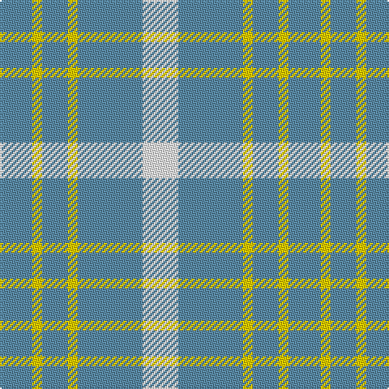

In pattern [BYBYBW](/patterns/bybybw/).

This was sourced from tartans-authority.  It is a [6 stripes tartan](/stripes/stripes6/).

Original link http://www.tartansauthority.com/tartan-ferret/display/11149/

## Thread count
B/20 Y6 B16 Y6 B40 W/22

## Palette
Each colour and its ΔE from the base-6 reference it is a variant of.

| Colour | Shade | Base | ΔE (OKLab) |
|---|---|---|---|
| B | <code style="background-color:#5C8CA8;">#5C8CA8</code> `#5C8CA8` | B <code style="background-color:#2A418A;">#2A418A</code> | 0.23 |
| W | <code style="background-color:#FCFCFC;">#FCFCFC</code> `#FCFCFC` | W <code style="background-color:#F7F7F7;">#F7F7F7</code> | 0.01 |
| Y | <code style="background-color:#FCCC00;">#FCCC00</code> `#FCCC00` | Y <code style="background-color:#F2BF00;">#F2BF00</code> | 0.04 |

# Sample pattern

## Nearest tartans

The nearest existing variants by ΔTartan distance.

1. [Lucard, Stéphane (Personal)](/setts/s4/w11b20y3b8x2~b788cb4-wffffff-ye0a126/) — ΔT 1.09
1. [Justus Dress (Personal)](/setts/s7/b1y4r1y1ya1y4b1x12~b3850c8-r880000-yb8b8b8-yad09800/) — ΔT 1.55
1. [Tokharion](/setts/s6/b1y5b1y5b2w1x4~b2c2c80-we0e0e0-ya08858/) — ΔT 1.66
1. [Genesee Community College](/setts/s4/b18w4b3y12x2~b1474b4-wffffff-ye0a126/) — ΔT 1.70
1. [Carlisle Family Tartan Tartan Number: 674. Earliest known date: 1987 Derived from the Coat of Arms. See products available Copyright © Blair Urquhart, Comrie, 2015](/setts/s7/b11y5k1y2r1y2b11x12~b5c8ca8-k101010-rc80000-ye8c000/) — ΔT 1.75
1. [Carlisle](/setts/s7/b11y5k1y2r1y2b11x12~b5480b0-k000000-rc00000-yf0c000/) — ΔT 1.79
1. [Blue Meadow](/setts/s4/b4g8b18w3x2~b1474b4-g289c18-wffffff/) — ΔT 1.82
1. [Blue Meadow Check (Fashion)](/setts/s4/b4g8b18w3x2~b1474b4-g289c18-wfcfcfc/) — ΔT 1.83
1. [Milne, Green (Dance)](/setts/s8/w12r2w12g17w12r2w5b2x4~b9058d8-g009468-rc80000-wf8f8f8/) — ΔT 1.89
1. [Unidentified (Shirt)](/setts/s6/w7b16w20b3w3y3x2~b2c4084-we0e0e0-ye8c000/) — ΔT 1.91

## Neighbour map

Every grey dot is one of 15726 variants placed by the first two principal components of the ΔTartan feature space (44% of its variance). Red is this tartan; blue dots are its nearest — click one to open its page.

<svg viewBox="0 0 640 380" role="img" style="max-width:100%;height:auto;border:1px solid #e0e0e0;border-radius:4px;display:block" xmlns="http://www.w3.org/2000/svg"><image href="/nn/cloud.v1.png" width="640" height="380"/><a href="/setts/s4/w11b20y3b8x2~b788cb4-wffffff-ye0a126/"><circle cx="363.2" cy="280.3" r="4" fill="#3465a4"><title>Lucard, Stéphane (Personal)</title></circle></a><a href="/setts/s7/b1y4r1y1ya1y4b1x12~b3850c8-r880000-yb8b8b8-yad09800/"><circle cx="342.6" cy="244.8" r="4" fill="#3465a4"><title>Justus Dress (Personal)</title></circle></a><a href="/setts/s6/b1y5b1y5b2w1x4~b2c2c80-we0e0e0-ya08858/"><circle cx="359.5" cy="263.4" r="4" fill="#3465a4"><title>Tokharion</title></circle></a><a href="/setts/s4/b18w4b3y12x2~b1474b4-wffffff-ye0a126/"><circle cx="286.9" cy="271.1" r="4" fill="#3465a4"><title>Genesee Community College</title></circle></a><a href="/setts/s7/b11y5k1y2r1y2b11x12~b5c8ca8-k101010-rc80000-ye8c000/"><circle cx="385.0" cy="202.1" r="4" fill="#3465a4"><title>Carlisle Family Tartan Tartan Number: 674. Earliest known date: 1987 Derived from the Coat of Arms. See products available Copyright © Blair Urquhart, Comrie, 2015</title></circle></a><a href="/setts/s7/b11y5k1y2r1y2b11x12~b5480b0-k000000-rc00000-yf0c000/"><circle cx="365.5" cy="194.8" r="4" fill="#3465a4"><title>Carlisle</title></circle></a><a href="/setts/s4/b4g8b18w3x2~b1474b4-g289c18-wffffff/"><circle cx="362.1" cy="285.6" r="4" fill="#3465a4"><title>Blue Meadow</title></circle></a><a href="/setts/s4/b4g8b18w3x2~b1474b4-g289c18-wfcfcfc/"><circle cx="363.6" cy="286.2" r="4" fill="#3465a4"><title>Blue Meadow Check (Fashion)</title></circle></a><a href="/setts/s8/w12r2w12g17w12r2w5b2x4~b9058d8-g009468-rc80000-wf8f8f8/"><circle cx="298.1" cy="197.5" r="4" fill="#3465a4"><title>Milne, Green (Dance)</title></circle></a><a href="/setts/s6/w7b16w20b3w3y3x2~b2c4084-we0e0e0-ye8c000/"><circle cx="284.2" cy="225.1" r="4" fill="#3465a4"><title>Unidentified (Shirt)</title></circle></a><circle cx="363.7" cy="260.7" r="5" fill="#c00000"/></svg>

ID: /setts/s6/w11b20y3b8y3b10x2~b5c8ca8-wfcfcfc-yfccc00/
