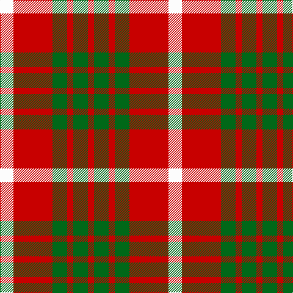

In pattern [RGRGRW](/stripes/rgrgrw/).

This was sourced from register-of-tartans.  It is a [6 stripe tartan](/stripes/stripes6/).

Original link https://www.tartanregister.gov.uk/tartanDetails.aspx?ref=62

## Attestations

This cloth appears in 2 source records; the oldest owns this page.

- 01/01/1977 — Al-Maktoum (register-of-tartans, [record](https://www.tartanregister.gov.uk/tartanDetails.aspx?ref=62))
- 1977 — Al-Maktoum (Military) (tartans-authority, [record](http://www.tartansauthority.com/tartan-ferret/display/1531/))

## Register references

External register numbers recorded for this tartan.

- Scottish Register of Tartans: [62](https://www.tartanregister.gov.uk/tartanDetails.aspx?ref=62)
- Scottish Tartans Authority (ITI): 1531
- Scottish Tartans World Register: 1531

## Thread count
W/22 R64 G24 R10 G24 R/10

## Palette
Each colour and its ΔE from the base-6 reference it is a variant of.

| Colour | Shade | Base | ΔE (OKLab) |
|---|---|---|---|
| DR | <code style="background-color:#880000;">#880000</code> `#880000` | R <code style="background-color:#CC0000;">#CC0000</code> | 0.15 |
| G | <code style="background-color:#006818;">#006818</code> `#006818` | G <code style="background-color:#006100;">#006100</code> | 0.02 |
| N | <code style="background-color:#B8B8B8;">#B8B8B8</code> `#B8B8B8` | Y <code style="background-color:#F2BF00;">#F2BF00</code> | 0.17 |
| R | <code style="background-color:#C80000;">#C80000</code> `#C80000` | R <code style="background-color:#CC0000;">#CC0000</code> | 0.01 |
| W | <code style="background-color:#FCFCFC;">#FCFCFC</code> `#FCFCFC` | W <code style="background-color:#F7F7F7;">#F7F7F7</code> | 0.01 |

# Sample pattern

## Nearest tartans

The nearest existing variants by ΔTartan distance.

1. [Makhtoum](/setts/s6/w11r40g13r5g12r5~x2/) — ΔT 0.82
1. [MacKinnon #6](/setts/s4/r3dg20r25w3~x4/) — ΔT 1.25
1. [Austin College Page](/setts/s10/r3ly2r2ly3r3ly7r3k7r14ly2~x2/) — ΔT 1.31
1. [Buchele Check (Fashion?)](/setts/s6/r4ly1r3ly1ly8ly2~x4/) — ΔT 1.32
1. [Brice (Artefact)](/setts/s6/r6k9r12w2k2w4~x2/) — ΔT 1.36
1. [MacDonald Lord of the Isles #2](/setts/s5/dg16r5dg2r18k2~x2/) — ΔT 1.43
1. [MacKinnon 11](/setts/s4/r3g20r25w3~x4/) — ΔT 1.44
1. [Unidentified #42](/setts/s7/ly1r3dg7r3dg7r3ly1~x4/) — ΔT 1.44
1. [Nisbet](/setts/s6/r10g24k10r28lb3r6~x2/) — ΔT 1.47
1. [Banff](/setts/s7/o6ly3o20o20o3o3lb6~x2/) — ΔT 1.49

## Neighbour map

Every grey dot is one of 14299 variants placed by the first two principal components of the ΔTartan feature space (44% of its variance). Red is this tartan; blue dots are its nearest — click one to open its page.

<svg viewBox="0 0 640 380" role="img" style="max-width:100%;height:auto;border:1px solid #e0e0e0;border-radius:4px;display:block" xmlns="http://www.w3.org/2000/svg"><image href="/nn/cloud.v1.png" width="640" height="380"/><a href="/setts/s6/w11r40g13r5g12r5~x2/"><circle cx="328.7" cy="216.4" r="4" fill="#3465a4"><title>Makhtoum</title></circle></a><a href="/setts/s4/r3dg20r25w3~x4/"><circle cx="335.1" cy="239.8" r="4" fill="#3465a4"><title>MacKinnon #6</title></circle></a><a href="/setts/s10/r3ly2r2ly3r3ly7r3k7r14ly2~x2/"><circle cx="258.2" cy="190.2" r="4" fill="#3465a4"><title>Austin College Page</title></circle></a><a href="/setts/s6/r4ly1r3ly1ly8ly2~x4/"><circle cx="260.5" cy="216.1" r="4" fill="#3465a4"><title>Buchele Check (Fashion?)</title></circle></a><a href="/setts/s6/r6k9r12w2k2w4~x2/"><circle cx="234.0" cy="229.8" r="4" fill="#3465a4"><title>Brice (Artefact)</title></circle></a><a href="/setts/s5/dg16r5dg2r18k2~x2/"><circle cx="343.2" cy="232.8" r="4" fill="#3465a4"><title>MacDonald Lord of the Isles #2</title></circle></a><a href="/setts/s4/r3g20r25w3~x4/"><circle cx="339.7" cy="246.1" r="4" fill="#3465a4"><title>MacKinnon 11</title></circle></a><a href="/setts/s7/ly1r3dg7r3dg7r3ly1~x4/"><circle cx="301.1" cy="244.0" r="4" fill="#3465a4"><title>Unidentified #42</title></circle></a><a href="/setts/s6/r10g24k10r28lb3r6~x2/"><circle cx="286.6" cy="216.8" r="4" fill="#3465a4"><title>Nisbet</title></circle></a><a href="/setts/s7/o6ly3o20o20o3o3lb6~x2/"><circle cx="248.2" cy="199.2" r="4" fill="#3465a4"><title>Banff</title></circle></a><circle cx="275.9" cy="228.0" r="5" fill="#c00000"/></svg>

ID: /setts/s6/w11r32g12r5g12r5~x2/
