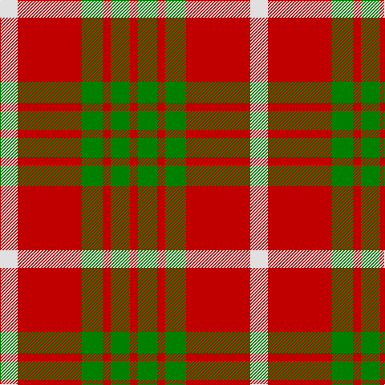

This page is one **sett** — a single exact thread-count. It belongs to the [tartan](/tartans/ln11r40g13r5g12r5/)
(the same proportion at any scale), whose colour order is pattern [RGRGRW](/stripes/rgrgrw/).

Sourced from weddslist.  It is a [6 stripe tartan](/stripes/stripes6/).

Original link http://www.weddslist.com/cgi-bin/tartans/pg.pl?source=sts

## Also known as

This cloth is also recorded under:

- Makhtoum Regimental

2 attestations — the source records this cloth was collapsed from (oldest owns this page)

<ul>
<li>undated — Makhtoum (weddslist, <a href="http://www.weddslist.com/cgi-bin/tartans/pg.pl?source=sts">record</a>)</li>
<li>undated — Makhtoum Regimental Tartan Tartan Number: 1531. Earliest known date: 1977 Based on Cameron. Designed for HH Shaikh Rashid Bin Saeed al-Maktoum, the ruler of Dubai, for the Dubai Pipe Band. See products available Copyright © Blair Urquhart, Comrie, 2015 (house-of-tartan, <a href="http://www.house-of-tartan.scotland.net/house/TartanViewjs.asp?colr=Def&tnam=1531">record</a>)</li>
</ul>

## Thread count
LN/22 R80 G26 R10 G24 R/10

## Palette
Each colour and the base-6 reference it is a variant of.

| Colour | Shade | Base |
|---|---|---|
| G | <code style="background-color:#008000;">#008000</code> `oklch(52.0% 0.177 142.5)` <small>#008000</small> | G <code style="background-color:#006100;">#006100</code> |
| LN | <code style="background-color:#E0E0E0;">#E0E0E0</code> `oklch(90.7% 0.000 89.9)` <small>#E0E0E0</small> | W <code style="background-color:#F7F7F7;">#F7F7F7</code> |
| R | <code style="background-color:#C00000;">#C00000</code> `oklch(50.7% 0.208 29.2)` <small>#C00000</small> | R <code style="background-color:#CC0000;">#CC0000</code> |

# Sample pattern

## Nearest tartans

The nearest existing variants by ΔTartan distance, with this tartan at the top so the swatches line up against it.

ΔTartan

Tartan

Sett

—

<a href="/ttd/edit/#slug=w11r40g13r5g12r5~x2">Makhtoum</a> <a class="nn-out" href="/setts/s6/w11r40g13r5g12r5~x2/" title="open its dictionary page">↗</a>

0.82

<a href="/ttd/edit/#slug=w11r32g12r5g12r5~x2">Al-Maktoum</a> <a class="nn-out" href="/setts/s6/w11r32g12r5g12r5~x2/" title="open its dictionary page">↗</a>

0.90

<a href="/ttd/edit/#slug=r1g3r1g3r8ly1~x8">Cameron</a> <a class="nn-out" href="/setts/s6/r1g3r1g3r8ly1~x8/" title="open its dictionary page">↗</a>

1.04

<a href="/ttd/edit/#slug=r3dg20r25w3~x4">MacKinnon #6</a> <a class="nn-out" href="/setts/s4/r3dg20r25w3~x4/" title="open its dictionary page">↗</a>

1.07

<a href="/ttd/edit/#slug=dg16r5dg2r18k2~x2">MacDonald Lord of the Isles #2</a> <a class="nn-out" href="/setts/s5/dg16r5dg2r18k2~x2/" title="open its dictionary page">↗</a>

1.09

<a href="/ttd/edit/#slug=r3g20r25w3~x4">MacKinnon 11</a> <a class="nn-out" href="/setts/s4/r3g20r25w3~x4/" title="open its dictionary page">↗</a>

1.21

<a href="/ttd/edit/#slug=g16r5g2r18k2~x2">MacDonald, Lord of The Isles (Artef)</a> <a class="nn-out" href="/setts/s5/g16r5g2r18k2~x2/" title="open its dictionary page">↗</a>

1.23

<a href="/ttd/edit/#slug=dg7r3dg1r9k1~x2">MacDonald of Sleat</a> <a class="nn-out" href="/setts/s5/dg7r3dg1r9k1~x2/" title="open its dictionary page">↗</a>

1.24

<a href="/ttd/edit/#slug=r1g7r9ly1~x4">Bryce</a> <a class="nn-out" href="/setts/s4/r1g7r9ly1~x4/" title="open its dictionary page">↗</a>

1.31

<a href="/ttd/edit/#slug=r21g3r21g16lo3w2lo3~x2">Claus of the North Pole (Restricted)</a> <a class="nn-out" href="/setts/s7/r21g3r21g16lo3w2lo3~x2/" title="open its dictionary page">↗</a>

1.36

<a href="/ttd/edit/#slug=r6g21k8r28k2r4~x2">Dunbar</a> <a class="nn-out" href="/setts/s6/r6g21k8r28k2r4~x2/" title="open its dictionary page">↗</a>

## Neighbour map

Every grey dot is one of 14299 variants placed by the first two principal components of the ΔTartan feature space (44% of its variance). Red is this tartan; blue dots are its nearest — click one to open its page.

<svg viewBox="0 0 640 380" role="img" style="max-width:100%;height:auto;border:1px solid #e0e0e0;border-radius:4px;display:block" xmlns="http://www.w3.org/2000/svg"><image href="/nn/cloud.v1.png" width="640" height="380"/><a href="/setts/s6/w11r32g12r5g12r5~x2/"><circle cx="275.9" cy="228.0" r="4" fill="#3465a4"><title>Al-Maktoum</title></circle></a><a href="/setts/s6/r1g3r1g3r8ly1~x8/"><circle cx="370.7" cy="226.4" r="4" fill="#3465a4"><title>Cameron</title></circle></a><a href="/setts/s4/r3dg20r25w3~x4/"><circle cx="335.1" cy="239.8" r="4" fill="#3465a4"><title>MacKinnon #6</title></circle></a><a href="/setts/s5/dg16r5dg2r18k2~x2/"><circle cx="343.2" cy="232.8" r="4" fill="#3465a4"><title>MacDonald Lord of the Isles #2</title></circle></a><a href="/setts/s4/r3g20r25w3~x4/"><circle cx="339.7" cy="246.1" r="4" fill="#3465a4"><title>MacKinnon 11</title></circle></a><a href="/setts/s5/g16r5g2r18k2~x2/"><circle cx="352.4" cy="240.2" r="4" fill="#3465a4"><title>MacDonald, Lord of The Isles (Artef)</title></circle></a><a href="/setts/s5/dg7r3dg1r9k1~x2/"><circle cx="354.7" cy="237.0" r="4" fill="#3465a4"><title>MacDonald of Sleat</title></circle></a><a href="/setts/s4/r1g7r9ly1~x4/"><circle cx="355.9" cy="245.7" r="4" fill="#3465a4"><title>Bryce</title></circle></a><a href="/setts/s7/r21g3r21g16lo3w2lo3~x2/"><circle cx="356.4" cy="192.1" r="4" fill="#3465a4"><title>Claus of the North Pole (Restricted)</title></circle></a><a href="/setts/s6/r6g21k8r28k2r4~x2/"><circle cx="345.5" cy="207.7" r="4" fill="#3465a4"><title>Dunbar</title></circle></a><circle cx="328.7" cy="216.4" r="5" fill="#c00000"/></svg>

ID: /setts/s6/w11r40g13r5g12r5~x2/
