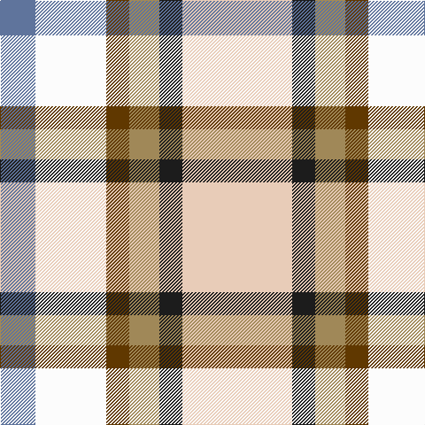

In pattern [BWGYBW](/patterns/bwgybw/).

This was sourced from register-of-tartans.  It is a [6 stripes tartan](/stripes/stripes6/).

Original link https://www.tartanregister.gov.uk/tartanDetails.aspx?ref=11030

## Thread count
B/40 W80 T26 LT34 K26 LR/124

## Palette
Each colour and its ΔE from the base-6 reference it is a variant of.

| Colour | Shade | Base | ΔE (OKLab) |
|---|---|---|---|
| B | <code style="background-color:#5F749C;">#5F749C</code> `#5F749C` | B <code style="background-color:#2C4084;">#2C4084</code> | 0.17 |
| K | <code style="background-color:#1C1C1C;">#1C1C1C</code> `#1C1C1C` | B <code style="background-color:#2C4084;">#2C4084</code> | 0.20 |
| LR | <code style="background-color:#E8CCB8;">#E8CCB8</code> `#E8CCB8` | W <code style="background-color:#F4F4F0;">#F4F4F0</code> | 0.11 |
| LT | <code style="background-color:#A08858;">#A08858</code> `#A08858` | Y <code style="background-color:#E8C000;">#E8C000</code> | 0.21 |
| T | <code style="background-color:#603800;">#603800</code> `#603800` | G <code style="background-color:#006400;">#006400</code> | 0.16 |
| W | <code style="background-color:#FCFCFC;">#FCFCFC</code> `#FCFCFC` | W <code style="background-color:#F4F4F0;">#F4F4F0</code> | 0.03 |

# Sample pattern

## Nearest tartans

The nearest existing variants by ΔTartan distance.

1. [MacGregor-Ryan (Personal)](/setts/s6/w134k26b34g26wa80ba40-b643424-ba5c8ca8-g603800-k101010-wc0c0c0-wae0e0e0/) — ΔT 0.68
1. [SCH '67 Class](/setts/s6/b6r4y30w20k4ya6-b000064-k101010-re87878-wffffff-yb0b0b0-yae0a126/) — ΔT 1.24
1. [Desang (Corporate)](/setts/s8/b16w8k12wa32g8wa32w8r16-b2c2c88-g3c9000-k101010-ra8003c-we0e0e0-wae8ccb8/) — ΔT 1.46
1. [Edmonton, City of](/setts/s9/b32y8g16y8ba16y8b32w60ya8-b2888c4-ba780078-g289c18-wf0f0d8-ye8c000-yabc8c00/) — ΔT 1.52
1. [Fraser, Red dress](/setts/s7/r8b36ra8g38w50r20w8-b304080-g008000-rc00000-ra800000-we0e0e0/) — ΔT 1.52
1. [Devon Rural Skills Trust](/setts/s8/w30g24b6g24r24b6ga24y6-b2888c4-g5c6428-ga005834-rc80000-wfcfcfc-ye8c000/) — ΔT 1.61
1. [Ontario, Northern](/setts/s7/r34g10b4w24b4y8ga14-b304080-g808080-ga008000-r806050-we0e0e0-yf0c000/) — ΔT 1.62
1. [Montessori School of Denver](/setts/s6/g25r9b3y7w3ba11-b6495ed-ba4b0082-g008b8b-rff6347-wffffff-yffff00/) — ΔT 1.64
1. [Desang](/setts/s8/b8w4k6wa16g4wa16w4ba8-b202060-ba680028-g285800-k101010-we0e0e0-wae8ccb8/) — ΔT 1.65
1. [Fraser Red Dress](/setts/s7/r8b36ra8g38w50r20w8-b2c4084-g005020-rdc0000-ra960000-we0e0e0/) — ΔT 1.69

## Neighbour map

Every grey dot is one of 15726 variants placed by the first two principal components of the ΔTartan feature space (44% of its variance). Red is this tartan; blue dots are its nearest — click one to open its page.

<svg viewBox="0 0 640 380" role="img" style="max-width:100%;height:auto;border:1px solid #e0e0e0;border-radius:4px;display:block" xmlns="http://www.w3.org/2000/svg"><image href="/nn/cloud.v1.png" width="640" height="380"/><a href="/setts/s6/w134k26b34g26wa80ba40-b643424-ba5c8ca8-g603800-k101010-wc0c0c0-wae0e0e0/"><circle cx="87.8" cy="191.6" r="4" fill="#3465a4"><title>MacGregor-Ryan (Personal)</title></circle></a><a href="/setts/s6/b6r4y30w20k4ya6-b000064-k101010-re87878-wffffff-yb0b0b0-yae0a126/"><circle cx="131.0" cy="157.8" r="4" fill="#3465a4"><title>SCH '67 Class</title></circle></a><a href="/setts/s8/b16w8k12wa32g8wa32w8r16-b2c2c88-g3c9000-k101010-ra8003c-we0e0e0-wae8ccb8/"><circle cx="96.5" cy="193.5" r="4" fill="#3465a4"><title>Desang (Corporate)</title></circle></a><a href="/setts/s9/b32y8g16y8ba16y8b32w60ya8-b2888c4-ba780078-g289c18-wf0f0d8-ye8c000-yabc8c00/"><circle cx="84.8" cy="153.4" r="4" fill="#3465a4"><title>Edmonton, City of</title></circle></a><a href="/setts/s7/r8b36ra8g38w50r20w8-b304080-g008000-rc00000-ra800000-we0e0e0/"><circle cx="84.5" cy="194.1" r="4" fill="#3465a4"><title>Fraser, Red dress</title></circle></a><a href="/setts/s8/w30g24b6g24r24b6ga24y6-b2888c4-g5c6428-ga005834-rc80000-wfcfcfc-ye8c000/"><circle cx="34.5" cy="199.8" r="4" fill="#3465a4"><title>Devon Rural Skills Trust</title></circle></a><a href="/setts/s7/r34g10b4w24b4y8ga14-b304080-g808080-ga008000-r806050-we0e0e0-yf0c000/"><circle cx="101.8" cy="172.6" r="4" fill="#3465a4"><title>Ontario, Northern</title></circle></a><a href="/setts/s6/g25r9b3y7w3ba11-b6495ed-ba4b0082-g008b8b-rff6347-wffffff-yffff00/"><circle cx="124.0" cy="168.6" r="4" fill="#3465a4"><title>Montessori School of Denver</title></circle></a><a href="/setts/s8/b8w4k6wa16g4wa16w4ba8-b202060-ba680028-g285800-k101010-we0e0e0-wae8ccb8/"><circle cx="91.5" cy="193.4" r="4" fill="#3465a4"><title>Desang</title></circle></a><a href="/setts/s7/r8b36ra8g38w50r20w8-b2c4084-g005020-rdc0000-ra960000-we0e0e0/"><circle cx="83.8" cy="192.7" r="4" fill="#3465a4"><title>Fraser Red Dress</title></circle></a><circle cx="68.1" cy="191.6" r="5" fill="#c00000"/></svg>

ID: /setts/s6/w124b26y34g26wa80ba40-b1c1c1c-ba5f749c-g603800-we8ccb8-wafcfcfc-ya08858/
