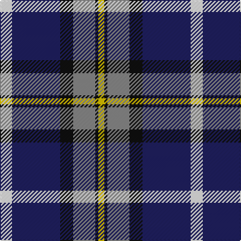

In pattern [WBKRKY](/patterns/wbkrky/).

This was sourced from register-of-tartans.  It is a [6 stripes tartan](/stripes/stripes6/).

Original link https://www.tartanregister.gov.uk/tartanDetails.aspx?ref=691

## Thread count
W/12 DB48 K13 N22 K3 Y/6

## Palette
Each colour and its ΔE from the base-6 reference it is a variant of.

| Colour | Shade | Base | ΔE (OKLab) |
|---|---|---|---|
| DB | <code style="background-color:#202060;">#202060</code> `#202060` | B <code style="background-color:#2C4084;">#2C4084</code> | 0.11 |
| K | <code style="background-color:#101010;">#101010</code> `#101010` | K <code style="background-color:#000000;">#000000</code> | 0.17 |
| N | <code style="background-color:#888888;">#888888</code> `#888888` | R <code style="background-color:#C80000;">#C80000</code> | 0.24 |
| W | <code style="background-color:#F8F8F8;">#F8F8F8</code> `#F8F8F8` | W <code style="background-color:#F4F4F0;">#F4F4F0</code> | 0.01 |
| Y | <code style="background-color:#E8C000;">#E8C000</code> `#E8C000` | Y <code style="background-color:#E8C000;">#E8C000</code> | 0.00 |

# Sample pattern

## Nearest tartans

The nearest existing variants by ΔTartan distance.

1. [Clunie (Name)](/setts/s6/w12b48k14r22k4y12-b202060-k101010-r888888-wf8f8f8-ye8c000/) — ΔT 0.73
1. [Sinclair dress](/setts/s7/b8r4b64k20g8w44g4-b304080-g008000-k000000-rc00000-we0e0e0/) — ΔT 0.84
1. [Kuznetsov (2014)](/setts/s7/b49y12r12y12g32w8b3-b000064-g003820-rdc0000-wffffff-yfccc00/) — ΔT 0.90
1. [Sinclair Dress (Dance)](/setts/s7/b8r4b62k20g8w42g4-b38409c-g006818-k101010-rc80000-we0e0e0/) — ΔT 0.97
1. [Thomson Dress (Blue)](/setts/s6/r6b60k12w24k24y6-b1870a4-k101010-rc80000-we0e0e0-ye8c000/) — ΔT 1.02
1. [Ferguson, dress](/setts/s7/b68k42w32r5w32g4w6-b304080-g003000-k000000-r900030-we0e0e0/) — ΔT 1.02
1. [Afternoon Tea / Earl Grey](/setts/s6/r15b98ba72y25ba8w15-b5c8ca8-ba202060-rc80000-wfcfcfc-yfccc00/) — ΔT 1.03
1. [Afternoon Tea / Darjeeling](/setts/s6/w15g98b72r25b8y15-b202060-g406054-r880000-wfcfcfc-yfccc00/) — ΔT 1.06
1. [Lovell (2014)](/setts/s8/y8k8b56ba16k20r8y20r4-b2c2c80-ba202060-k101010-rc80000-ye8c000/) — ΔT 1.06
1. [Kuznetsov (2014)](/setts/s7/b49y12r12y12g32w8b3-b202060-g003820-rc80000-wfcfcfc-ye8c000/) — ΔT 1.09

## Neighbour map

Every grey dot is one of 15726 variants placed by the first two principal components of the ΔTartan feature space (44% of its variance). Red is this tartan; blue dots are its nearest — click one to open its page.

<svg viewBox="0 0 640 380" role="img" style="max-width:100%;height:auto;border:1px solid #e0e0e0;border-radius:4px;display:block" xmlns="http://www.w3.org/2000/svg"><image href="/nn/cloud.v1.png" width="640" height="380"/><a href="/setts/s6/w12b48k14r22k4y12-b202060-k101010-r888888-wf8f8f8-ye8c000/"><circle cx="151.4" cy="176.8" r="4" fill="#3465a4"><title>Clunie (Name)</title></circle></a><a href="/setts/s7/b8r4b64k20g8w44g4-b304080-g008000-k000000-rc00000-we0e0e0/"><circle cx="206.1" cy="139.9" r="4" fill="#3465a4"><title>Sinclair dress</title></circle></a><a href="/setts/s7/b49y12r12y12g32w8b3-b000064-g003820-rdc0000-wffffff-yfccc00/"><circle cx="153.0" cy="152.8" r="4" fill="#3465a4"><title>Kuznetsov (2014)</title></circle></a><a href="/setts/s7/b8r4b62k20g8w42g4-b38409c-g006818-k101010-rc80000-we0e0e0/"><circle cx="210.0" cy="143.4" r="4" fill="#3465a4"><title>Sinclair Dress (Dance)</title></circle></a><a href="/setts/s6/r6b60k12w24k24y6-b1870a4-k101010-rc80000-we0e0e0-ye8c000/"><circle cx="176.6" cy="178.5" r="4" fill="#3465a4"><title>Thomson Dress (Blue)</title></circle></a><a href="/setts/s7/b68k42w32r5w32g4w6-b304080-g003000-k000000-r900030-we0e0e0/"><circle cx="151.1" cy="148.1" r="4" fill="#3465a4"><title>Ferguson, dress</title></circle></a><a href="/setts/s6/r15b98ba72y25ba8w15-b5c8ca8-ba202060-rc80000-wfcfcfc-yfccc00/"><circle cx="182.7" cy="168.3" r="4" fill="#3465a4"><title>Afternoon Tea / Earl Grey</title></circle></a><a href="/setts/s6/w15g98b72r25b8y15-b202060-g406054-r880000-wfcfcfc-yfccc00/"><circle cx="199.7" cy="178.9" r="4" fill="#3465a4"><title>Afternoon Tea / Darjeeling</title></circle></a><a href="/setts/s8/y8k8b56ba16k20r8y20r4-b2c2c80-ba202060-k101010-rc80000-ye8c000/"><circle cx="162.0" cy="152.3" r="4" fill="#3465a4"><title>Lovell (2014)</title></circle></a><a href="/setts/s7/b49y12r12y12g32w8b3-b202060-g003820-rc80000-wfcfcfc-ye8c000/"><circle cx="163.5" cy="154.4" r="4" fill="#3465a4"><title>Kuznetsov (2014)</title></circle></a><circle cx="193.9" cy="160.5" r="5" fill="#c00000"/></svg>

ID: /setts/s6/w12b48k13r22k3y6-b202060-k101010-r888888-wf8f8f8-ye8c000/
