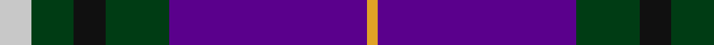
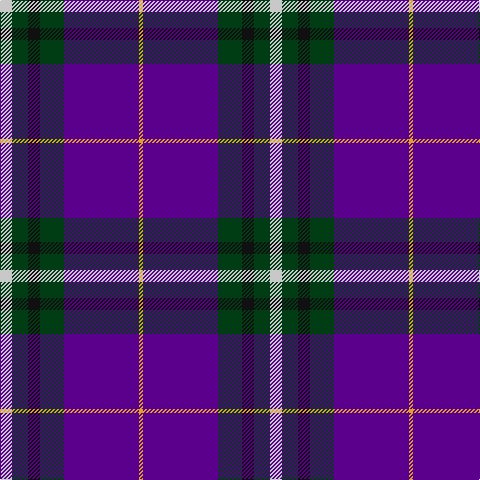

In pattern [WGKGBY](/patterns/wgkgby/).

This was sourced from register-of-tartans.  It is a [6 stripes tartan](/stripes/stripes6/).

Original link https://www.tartanregister.gov.uk/tartanDetails.aspx?ref=11270

## Thread count
N/12 DG16 K12 DG24 P75 Y/4

## Palette
Each colour and its ΔE from the base-6 reference it is a variant of.

| Colour | Shade | Base | ΔE (OKLab) |
|---|---|---|---|
| DG | <code style="background-color:#003C14;">#003C14</code> `#003C14` | G <code style="background-color:#006100;">#006100</code> | 0.13 |
| K | <code style="background-color:#101010;">#101010</code> `#101010` | K <code style="background-color:#000000;">#000000</code> | 0.17 |
| N | <code style="background-color:#C8C8C8;">#C8C8C8</code> `#C8C8C8` | W <code style="background-color:#F7F7F7;">#F7F7F7</code> | 0.14 |
| P | <code style="background-color:#5A008C;">#5A008C</code> `#5A008C` | B <code style="background-color:#2A418A;">#2A418A</code> | 0.13 |
| Y | <code style="background-color:#E0A126;">#E0A126</code> `#E0A126` | Y <code style="background-color:#F2BF00;">#F2BF00</code> | 0.08 |

# Sample pattern

## Nearest tartans

The nearest existing variants by ΔTartan distance.

1. [Widows Sons Scotland (MRA)](/setts/s6/w9k16g10k22b67y4~b5a008c-g003c14-k101010-wc8c8c8-ye0a126/) — ΔT 0.51
1. [Widows Sons Scotland Dress](/setts/s6/w12g12k12g24b75y4~b780078-g006818-k101010-wc0c0c0-yfccc00/) — ΔT 1.00
1. [Doten (2013)](/setts/s5/r14y6b38k3g2~b202060-g006818-k101010-rc80000-yb8b8b8~x2/) — ΔT 1.06
1. [Widows Sons Scotland (MRA)](/setts/s6/r9k16g10k22b67y4~b780078-g003820-k101010-r888888-ye8c000/) — ΔT 1.06
1. [St. Leonards (Corporate)](/setts/s8/r16b2ra6r3k4ba2b40ba6~b2c2c80-ba2888c4-k101010-rc80000-ra888888~x2/) — ΔT 1.12
1. [LLoyd of Astargus Canadian Family Tartan Tartan Number: 5771. Earliest known date: 2001 The designer of this tartan is of Welsh & Scottish blood and sees this tartan as being appropriate for any Lloyds with Scottish blood. The 'Astargus' derives from Gaelic - 'Astar' being said to mean "travelling or making distance" and 'gus' meaning "until I come back" See products available Copyright © Blair Urquhart, Comrie, 2015](/setts/s6/r3b38k13w3ra20y2~b202060-k101010-r800000-ra888888-we0e0e0-yf0c400~x2/) — ΔT 1.23
1. [Diaspora](/setts/s6/b3g1r22k12b28w3~b003478-g003800-k000034-r8c0000-wc8c8c8~x2/) — ΔT 1.23
1. [Ikelman #4 (Personal)](/setts/s7/r10b15g2b2w1b1w1~b1c0070-g006818-r880000-we0e0e0~x4/) — ΔT 1.24
1. [SheBoom](/setts/s8/k35b2k3ba13g8w4g8ba8~b9058d8-ba780078-g408060-k101010-we0e0e0~x2/) — ΔT 1.26
1. [Gorman Family (Canada) (Personal)](/setts/s6/g6b16ba49bb14ba2w6~b405068-ba1c0070-bb487088-g289c18-we0e0e0~x2/) — ΔT 1.26

## Neighbour map

Every grey dot is one of 15726 variants placed by the first two principal components of the ΔTartan feature space (44% of its variance). Red is this tartan; blue dots are its nearest — click one to open its page.

<svg viewBox="0 0 640 380" role="img" style="max-width:100%;height:auto;border:1px solid #e0e0e0;border-radius:4px;display:block" xmlns="http://www.w3.org/2000/svg"><image href="/nn/cloud.v1.png" width="640" height="380"/><a href="/setts/s6/w9k16g10k22b67y4~b5a008c-g003c14-k101010-wc8c8c8-ye0a126/"><circle cx="290.2" cy="166.3" r="4" fill="#3465a4"><title>Widows Sons Scotland (MRA)</title></circle></a><a href="/setts/s6/w12g12k12g24b75y4~b780078-g006818-k101010-wc0c0c0-yfccc00/"><circle cx="296.9" cy="151.5" r="4" fill="#3465a4"><title>Widows Sons Scotland Dress</title></circle></a><a href="/setts/s5/r14y6b38k3g2~b202060-g006818-k101010-rc80000-yb8b8b8~x2/"><circle cx="346.4" cy="165.2" r="4" fill="#3465a4"><title>Doten (2013)</title></circle></a><a href="/setts/s6/r9k16g10k22b67y4~b780078-g003820-k101010-r888888-ye8c000/"><circle cx="307.9" cy="168.3" r="4" fill="#3465a4"><title>Widows Sons Scotland (MRA)</title></circle></a><a href="/setts/s8/r16b2ra6r3k4ba2b40ba6~b2c2c80-ba2888c4-k101010-rc80000-ra888888~x2/"><circle cx="316.8" cy="134.7" r="4" fill="#3465a4"><title>St. Leonards (Corporate)</title></circle></a><a href="/setts/s6/r3b38k13w3ra20y2~b202060-k101010-r800000-ra888888-we0e0e0-yf0c400~x2/"><circle cx="234.0" cy="144.3" r="4" fill="#3465a4"><title>LLoyd of Astargus Canadian Family Tartan Tartan Number: 5771. Earliest known date: 2001 The designer of this tartan is of Welsh &amp; Scottish blood and sees this tartan as being appropriate for any Lloyds with Scottish blood. The 'Astargus' derives from Gaelic - 'Astar' being said to mean &quot;travelling or making distance&quot; and 'gus' meaning &quot;until I come back&quot; See products available Copyright © Blair Urquhart, Comrie, 2015</title></circle></a><a href="/setts/s6/b3g1r22k12b28w3~b003478-g003800-k000034-r8c0000-wc8c8c8~x2/"><circle cx="279.5" cy="162.6" r="4" fill="#3465a4"><title>Diaspora</title></circle></a><a href="/setts/s7/r10b15g2b2w1b1w1~b1c0070-g006818-r880000-we0e0e0~x4/"><circle cx="338.0" cy="171.5" r="4" fill="#3465a4"><title>Ikelman #4 (Personal)</title></circle></a><a href="/setts/s8/k35b2k3ba13g8w4g8ba8~b9058d8-ba780078-g408060-k101010-we0e0e0~x2/"><circle cx="241.1" cy="148.9" r="4" fill="#3465a4"><title>SheBoom</title></circle></a><a href="/setts/s6/g6b16ba49bb14ba2w6~b405068-ba1c0070-bb487088-g289c18-we0e0e0~x2/"><circle cx="302.7" cy="157.4" r="4" fill="#3465a4"><title>Gorman Family (Canada) (Personal)</title></circle></a><circle cx="289.8" cy="161.7" r="5" fill="#c00000"/></svg>

ID: /setts/s6/w12g16k12g24b75y4~b5a008c-g003c14-k101010-wc8c8c8-ye0a126/
