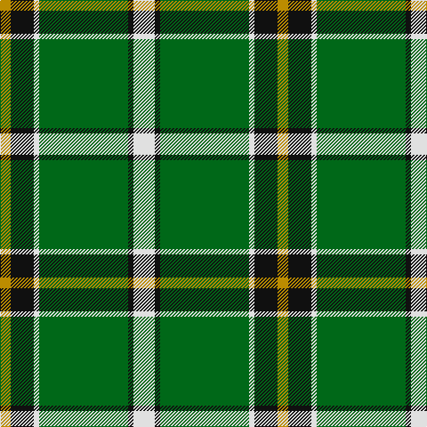

**Bands:** [WKGWKY](/stripes/wkgwky/) · **Stripes:** [W K G W K LO](/stripes/stripes6/) W K G W K LO

This was sourced from tartans-authority.  It is a [6 band tartan](/bands/bands6/).

Original link http://www.tartansauthority.com/tartan-ferret/display/7407/

## Attestations

This cloth appears in 2 source records; the oldest owns this page.

- 2004 — Limerick County Crest (Fashion) (tartans-authority, [record](http://www.tartansauthority.com/tartan-ferret/display/7407/))
- 01/05/2005 — Limerick County, Crest Range (register-of-tartans, [record](https://www.tartanregister.gov.uk/tartanDetails.aspx?ref=5362))

## Register references

External register numbers recorded for this tartan.

- Scottish Register of Tartans: [5362](https://www.tartanregister.gov.uk/tartanDetails.aspx?ref=5362)
- Scottish Tartans Authority (ITI): 7407
- Scottish Tartans World Register: 3091

## Thread count
DY/12 K26 LN6 G100 K6 LN/24

## Palette
Each colour and its ΔE from the base-6 reference it is a variant of.

| Colour | Shade | Base | ΔE (OKLab) |
|---|---|---|---|
| DY | <code style="background-color:#BC8C00;">#BC8C00</code> `#BC8C00` | Y <code style="background-color:#F2BF00;">#F2BF00</code> | 0.16 |
| G | <code style="background-color:#006818;">#006818</code> `#006818` | G <code style="background-color:#006100;">#006100</code> | 0.02 |
| K | <code style="background-color:#101010;">#101010</code> `#101010` | K <code style="background-color:#000000;">#000000</code> | 0.17 |
| LN | <code style="background-color:#E0E0E0;">#E0E0E0</code> `#E0E0E0` | W <code style="background-color:#F7F7F7;">#F7F7F7</code> | 0.07 |

# Sample pattern

## Nearest tartans

The nearest existing variants by ΔTartan distance.

1. [Herbage](/setts/s5/g25k8y10r1y3~x4/) — ΔT 1.11
1. [Keppoch](/setts/s7/k5g2k5g2db8g25w4~x2/) — ΔT 1.12
1. [Alberta (Province)](/setts/s7/g13k1r1k1b2k1ly4~x8/) — ΔT 1.16
1. [New York Jets](/setts/s8/dg60w3k12o5dg9o6k4w10/) — ΔT 1.18
1. [Alberta (District)](/setts/s7/g12k1r1k1b2k1ly4~x8/) — ΔT 1.22
1. [MacAuliffe (Name)](/setts/s8/g37w2g6db23ly6db2ly3db2~x2/) — ΔT 1.25
1. [Carrick, hunting](/setts/s8/g13p1g1p1g3db5k4ly2~x2/) — ΔT 1.25
1. [Alberta District Tartan Tartan Number: 2055. Earliest known date: 1961 Designed for the Edmonton Rehabilitation Society as a project for handloom weaving by disabled students. The Provincial Legislative of Alberta gave formal approval for the Alberta tartan in 1961. See products available Copyright © Blair Urquhart, Comrie, 2015](/setts/s7/g12k1r1k1t2k1ly4~x2/) — ΔT 1.26
1. [Instakilt, Green (Fashion)](/setts/s7/g8w4g50k12g4k15lo5~x2/) — ΔT 1.33
1. [Pollock](/setts/s7/g3r16w4k6g28r1g3~x2/) — ΔT 1.38

## Neighbour map

Every grey dot is one of 14313 variants placed by the first two principal components of the ΔTartan feature space (44% of its variance). Red is this tartan; blue dots are its nearest — click one to open its page.

<svg viewBox="0 0 640 380" role="img" style="max-width:100%;height:auto;border:1px solid #e0e0e0;border-radius:4px;display:block" xmlns="http://www.w3.org/2000/svg"><image href="/nn/cloud.v1.png" width="640" height="380"/><a href="/setts/s5/g25k8y10r1y3~x4/"><circle cx="302.0" cy="181.7" r="4" fill="#3465a4"><title>Herbage</title></circle></a><a href="/setts/s7/k5g2k5g2db8g25w4~x2/"><circle cx="297.5" cy="187.0" r="4" fill="#3465a4"><title>Keppoch</title></circle></a><a href="/setts/s7/g13k1r1k1b2k1ly4~x8/"><circle cx="291.1" cy="152.7" r="4" fill="#3465a4"><title>Alberta (Province)</title></circle></a><a href="/setts/s8/dg60w3k12o5dg9o6k4w10/"><circle cx="360.7" cy="143.1" r="4" fill="#3465a4"><title>New York Jets</title></circle></a><a href="/setts/s7/g12k1r1k1b2k1ly4~x8/"><circle cx="271.0" cy="156.6" r="4" fill="#3465a4"><title>Alberta (District)</title></circle></a><a href="/setts/s8/g37w2g6db23ly6db2ly3db2~x2/"><circle cx="317.8" cy="157.1" r="4" fill="#3465a4"><title>MacAuliffe (Name)</title></circle></a><a href="/setts/s8/g13p1g1p1g3db5k4ly2~x2/"><circle cx="260.3" cy="159.2" r="4" fill="#3465a4"><title>Carrick, hunting</title></circle></a><a href="/setts/s7/g12k1r1k1t2k1ly4~x2/"><circle cx="270.7" cy="155.4" r="4" fill="#3465a4"><title>Alberta District Tartan Tartan Number: 2055. Earliest known date: 1961 Designed for the Edmonton Rehabilitation Society as a project for handloom weaving by disabled students. The Provincial Legislative of Alberta gave formal approval for the Alberta tartan in 1961. See products available Copyright © Blair Urquhart, Comrie, 2015</title></circle></a><a href="/setts/s7/g8w4g50k12g4k15lo5~x2/"><circle cx="338.9" cy="177.0" r="4" fill="#3465a4"><title>Instakilt, Green (Fashion)</title></circle></a><a href="/setts/s7/g3r16w4k6g28r1g3~x2/"><circle cx="322.6" cy="141.7" r="4" fill="#3465a4"><title>Pollock</title></circle></a><circle cx="309.9" cy="166.4" r="5" fill="#c00000"/></svg>

ID: /setts/s6/w12k3g50w3k13lo6~x2/
