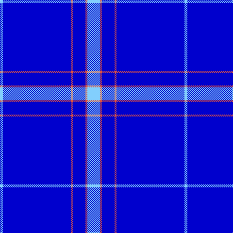

In pattern [WBRBRW](/patterns/wbrbrw/).

This was sourced from register-of-tartans.  It is a [6 stripes tartan](/stripes/stripes6/).

Original link https://www.tartanregister.gov.uk/tartanDetails.aspx?ref=10620

## Thread count
LB/6 B140 O4 B26 O4 LB/26

## Palette
Each colour and its ΔE from the base-6 reference it is a variant of.

| Colour | Shade | Base | ΔE (OKLab) |
|---|---|---|---|
| B | <code style="background-color:#0000CD;">#0000CD</code> `#0000CD` | B <code style="background-color:#2A418A;">#2A418A</code> | 0.14 |
| LB | <code style="background-color:#82CFFD;">#82CFFD</code> `#82CFFD` | W <code style="background-color:#F7F7F7;">#F7F7F7</code> | 0.18 |
| O | <code style="background-color:#E1523D;">#E1523D</code> `#E1523D` | R <code style="background-color:#CC0000;">#CC0000</code> | 0.10 |

# Sample pattern

## Nearest tartans

The nearest existing variants by ΔTartan distance.

1. [Blueheart](/setts/s7/k1b18w5b1w3b18k1x4~b0000cd-k101010-w00fcfc/) — ΔT 1.52
1. [Royal Warrant Holders](/setts/s8/b61y3ba2w2b20w2b4y4x2~b0000ff-ba202060-we0e0e0-ye8c000/) — ΔT 1.66
1. [Duke of York (Royal)](/setts/s8/b61r6w2r8y2b3y2b15x2~b00008c-r8c0000-wfcfcfc-yc88c00/) — ΔT 2.34
1. [Steffen, Markus (Personal)](/setts/s6/b35w4b10r3ra3r3x4~b00009c-r8b1c62-rab0171f-wffffff/) — ΔT 2.51
1. [Waugh](/setts/s5/b100g10k5g10r8~b000080-g65909a-k000000-rb22222/) — ΔT 2.59
1. [Auchairne](/setts/s6/b10ba6b3ba62w4ba5x2~b8080d0-ba000050-we0e0e0/) — ΔT 2.62
1. [RAAF](/setts/s9/b66w2b10w2b10w2b12r3ba24x2~b1c0070-ba5c8ca8-rc80000-we0e0e0/) — ΔT 2.70
1. [Volunteer Lifesaving Corps (Corp.)](/setts/s5/r5w4k4b80w4x2~b38409c-k101010-rc80000-wf8f8f8/) — ΔT 2.71
1. [Mack of Stoneywood Dress (Personal)](/setts/s8/b80r1b2r1b6r10b1r7x2~b000080-re3170d/) — ΔT 2.75
1. [MacLaine of Lochbuie Hunting](/setts/s5/b32r3b4k1y3~b00006b-k000000-rc80000-yc8c800/) — ΔT 2.80

## Neighbour map

Every grey dot is one of 15726 variants placed by the first two principal components of the ΔTartan feature space (44% of its variance). Red is this tartan; blue dots are its nearest — click one to open its page.

<svg viewBox="0 0 640 380" role="img" style="max-width:100%;height:auto;border:1px solid #e0e0e0;border-radius:4px;display:block" xmlns="http://www.w3.org/2000/svg"><image href="/nn/cloud.v1.png" width="640" height="380"/><a href="/setts/s7/k1b18w5b1w3b18k1x4~b0000cd-k101010-w00fcfc/"><circle cx="479.6" cy="198.1" r="4" fill="#3465a4"><title>Blueheart</title></circle></a><a href="/setts/s8/b61y3ba2w2b20w2b4y4x2~b0000ff-ba202060-we0e0e0-ye8c000/"><circle cx="588.1" cy="141.0" r="4" fill="#3465a4"><title>Royal Warrant Holders</title></circle></a><a href="/setts/s8/b61r6w2r8y2b3y2b15x2~b00008c-r8c0000-wfcfcfc-yc88c00/"><circle cx="548.3" cy="144.0" r="4" fill="#3465a4"><title>Duke of York (Royal)</title></circle></a><a href="/setts/s6/b35w4b10r3ra3r3x4~b00009c-r8b1c62-rab0171f-wffffff/"><circle cx="463.6" cy="196.7" r="4" fill="#3465a4"><title>Steffen, Markus (Personal)</title></circle></a><a href="/setts/s5/b100g10k5g10r8~b000080-g65909a-k000000-rb22222/"><circle cx="498.1" cy="185.9" r="4" fill="#3465a4"><title>Waugh</title></circle></a><a href="/setts/s6/b10ba6b3ba62w4ba5x2~b8080d0-ba000050-we0e0e0/"><circle cx="550.0" cy="190.2" r="4" fill="#3465a4"><title>Auchairne</title></circle></a><a href="/setts/s9/b66w2b10w2b10w2b12r3ba24x2~b1c0070-ba5c8ca8-rc80000-we0e0e0/"><circle cx="492.1" cy="136.3" r="4" fill="#3465a4"><title>RAAF</title></circle></a><a href="/setts/s5/r5w4k4b80w4x2~b38409c-k101010-rc80000-wf8f8f8/"><circle cx="560.0" cy="168.1" r="4" fill="#3465a4"><title>Volunteer Lifesaving Corps (Corp.)</title></circle></a><a href="/setts/s8/b80r1b2r1b6r10b1r7x2~b000080-re3170d/"><circle cx="626.0" cy="144.2" r="4" fill="#3465a4"><title>Mack of Stoneywood Dress (Personal)</title></circle></a><a href="/setts/s5/b32r3b4k1y3~b00006b-k000000-rc80000-yc8c800/"><circle cx="572.9" cy="170.7" r="4" fill="#3465a4"><title>MacLaine of Lochbuie Hunting</title></circle></a><circle cx="560.3" cy="168.6" r="5" fill="#c00000"/></svg>

ID: /setts/s6/w13r2b13r2b70w3x2~b0000cd-re1523d-w82cffd/
