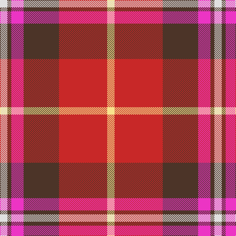

In pattern [WBRBRY](/patterns/wbrbry/).

This was sourced from register-of-tartans.  It is a [6 stripes tartan](/stripes/stripes6/).

Original link https://www.tartanregister.gov.uk/tartanDetails.aspx?ref=11449

## Thread count
LN/15 T8 LR25 T72 R98 LY/15

## Palette
Each colour and its ΔE from the base-6 reference it is a variant of.

| Colour | Shade | Base | ΔE (OKLab) |
|---|---|---|---|
| LN | <code style="background-color:#E0E0E0;">#E0E0E0</code> `#E0E0E0` | W <code style="background-color:#F7F7F7;">#F7F7F7</code> | 0.07 |
| LR | <code style="background-color:#EC34C4;">#EC34C4</code> `#EC34C4` | R <code style="background-color:#CC0000;">#CC0000</code> | 0.24 |
| LY | <code style="background-color:#F8E38C;">#F8E38C</code> `#F8E38C` | Y <code style="background-color:#F2BF00;">#F2BF00</code> | 0.11 |
| R | <code style="background-color:#C82828;">#C82828</code> `#C82828` | R <code style="background-color:#CC0000;">#CC0000</code> | 0.03 |
| T | <code style="background-color:#4C3428;">#4C3428</code> `#4C3428` | B <code style="background-color:#2A418A;">#2A418A</code> | 0.17 |

# Sample pattern

## Nearest tartans

The nearest existing variants by ΔTartan distance.

1. [Thermos Un-named (aretefact)](/setts/s6/k12r40w4ra18w6wa4-k101010-rc80000-ra880000-we0e0e0-wac0c0c0/) — ΔT 0.85
1. [Ferguson's Promise (Commemorative)](/setts/s7/r76k24ra30rb8ra30k4w8-k101010-r880000-rae87878-rbc8002c-we0e0e0/) — ΔT 0.87
1. [Ferguson's Promise](/setts/s7/r76k24ra30rb8ra30k4w8-k1c1714-r9e3552-raf4758c-rbb62531-wf9f5ef/) — ΔT 0.92
1. [Rose Dress White Dress Clan Tartan Tartan Number: 1227. Earliest known date: 1930-50 This sample comes from the MacGregor-Hastie collection which forms the basis of the cloth archive of the Scottish Tartans Society. Stocked by Dalgliesh See products available Copyright © Blair Urquhart, Comrie, 2015](/setts/s6/r32b6k6g6w18k3-b2c2c80-g006818-k101010-rc80000-we0e0e0/) — ΔT 1.17
1. [MIT1951](/setts/s10/r48ra10y14b4y8b28r22b6r6w8-b1c1c1c-rc8002c-ra901c38-we0e0e0-yb0b0b0/) — ΔT 1.26
1. [McGill University](/setts/s5/w6r48b24g16y6-b23138d-g063928-rff0000-wffffff-ycea12c/) — ΔT 1.31
1. [Scottish American Society of Michigan (Official)](/setts/s6/r96b32y10g34w16k6-b5f749c-g23321b-k000000-rb62531-wf9f5ef-ye0a126/) — ΔT 1.33
1. [Australia Dress](/setts/s9/y22r8g4k8g4r8g24r40b4-b2888c4-g8c7038-k101010-ra00000-yb8b8b8/) — ΔT 1.38
1. [McGill University (Corporate)](/setts/s5/w6r48b24g16y6-b1c0070-g003820-rc80000-we0e0e0-ybc8c00/) — ΔT 1.38
1. [Siddle, New (Corporate)](/setts/s5/r30b20w15wa3y3-b202060-rc80000-we0e0e0-wa98c8e8-yfccc00/) — ΔT 1.38

## Neighbour map

Every grey dot is one of 15726 variants placed by the first two principal components of the ΔTartan feature space (44% of its variance). Red is this tartan; blue dots are its nearest — click one to open its page.

<svg viewBox="0 0 640 380" role="img" style="max-width:100%;height:auto;border:1px solid #e0e0e0;border-radius:4px;display:block" xmlns="http://www.w3.org/2000/svg"><image href="/nn/cloud.v1.png" width="640" height="380"/><a href="/setts/s6/k12r40w4ra18w6wa4-k101010-rc80000-ra880000-we0e0e0-wac0c0c0/"><circle cx="226.7" cy="164.5" r="4" fill="#3465a4"><title>Thermos Un-named (aretefact)</title></circle></a><a href="/setts/s7/r76k24ra30rb8ra30k4w8-k101010-r880000-rae87878-rbc8002c-we0e0e0/"><circle cx="234.2" cy="140.3" r="4" fill="#3465a4"><title>Ferguson's Promise (Commemorative)</title></circle></a><a href="/setts/s7/r76k24ra30rb8ra30k4w8-k1c1714-r9e3552-raf4758c-rbb62531-wf9f5ef/"><circle cx="241.2" cy="141.6" r="4" fill="#3465a4"><title>Ferguson's Promise</title></circle></a><a href="/setts/s6/r32b6k6g6w18k3-b2c2c80-g006818-k101010-rc80000-we0e0e0/"><circle cx="186.8" cy="159.6" r="4" fill="#3465a4"><title>Rose Dress White Dress Clan Tartan Tartan Number: 1227. Earliest known date: 1930-50 This sample comes from the MacGregor-Hastie collection which forms the basis of the cloth archive of the Scottish Tartans Society. Stocked by Dalgliesh See products available Copyright © Blair Urquhart, Comrie, 2015</title></circle></a><a href="/setts/s10/r48ra10y14b4y8b28r22b6r6w8-b1c1c1c-rc8002c-ra901c38-we0e0e0-yb0b0b0/"><circle cx="231.3" cy="144.5" r="4" fill="#3465a4"><title>MIT1951</title></circle></a><a href="/setts/s5/w6r48b24g16y6-b23138d-g063928-rff0000-wffffff-ycea12c/"><circle cx="197.3" cy="185.0" r="4" fill="#3465a4"><title>McGill University</title></circle></a><a href="/setts/s6/r96b32y10g34w16k6-b5f749c-g23321b-k000000-rb62531-wf9f5ef-ye0a126/"><circle cx="230.5" cy="135.6" r="4" fill="#3465a4"><title>Scottish American Society of Michigan (Official)</title></circle></a><a href="/setts/s9/y22r8g4k8g4r8g24r40b4-b2888c4-g8c7038-k101010-ra00000-yb8b8b8/"><circle cx="231.5" cy="166.2" r="4" fill="#3465a4"><title>Australia Dress</title></circle></a><a href="/setts/s5/w6r48b24g16y6-b1c0070-g003820-rc80000-we0e0e0-ybc8c00/"><circle cx="209.5" cy="196.6" r="4" fill="#3465a4"><title>McGill University (Corporate)</title></circle></a><a href="/setts/s5/r30b20w15wa3y3-b202060-rc80000-we0e0e0-wa98c8e8-yfccc00/"><circle cx="171.2" cy="181.4" r="4" fill="#3465a4"><title>Siddle, New (Corporate)</title></circle></a><circle cx="220.5" cy="163.6" r="5" fill="#c00000"/></svg>

ID: /setts/s6/w15b8r25b72ra98y15-b4c3428-rec34c4-rac82828-we0e0e0-yf8e38c/
