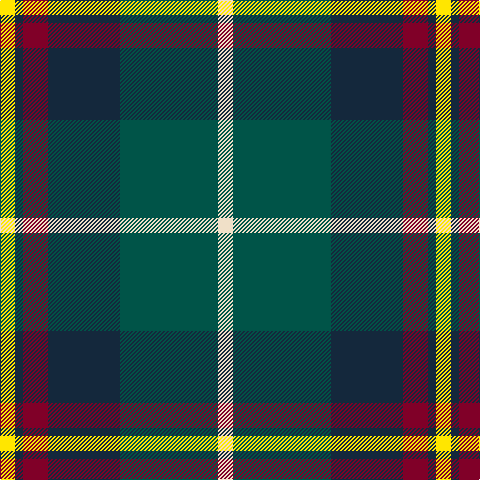

In pattern [WGBRBY](/stripes/wgbrby/).

This was sourced from register-of-tartans.  It is a [6 stripe tartan](/stripes/stripes6/).

Original link https://www.tartanregister.gov.uk/tartanDetails.aspx?ref=11278

## Register references

External register numbers recorded for this tartan.

- Scottish Register of Tartans: [11278](https://www.tartanregister.gov.uk/tartanDetails.aspx?ref=11278)

## Thread count
Y/15 DN8 DR25 DN72 G98 W/15

## Palette
Each colour and the base-6 reference it is a variant of.

| Colour | Shade | Base |
|---|---|---|
| DN | <code style="background-color:#14283C;">#14283C</code> `oklch(27.1% 0.046 249.9)` <small>#14283C</small> | B <code style="background-color:#2A418A;">#2A418A</code> |
| DR | <code style="background-color:#800028;">#800028</code> `oklch(38.2% 0.152 14.5)` <small>#800028</small> | R <code style="background-color:#CC0000;">#CC0000</code> |
| G | <code style="background-color:#005448;">#005448</code> `oklch(39.9% 0.073 178.8)` <small>#005448</small> | G <code style="background-color:#006100;">#006100</code> |
| W | <code style="background-color:#F0E0C8;">#F0E0C8</code> `oklch(91.3% 0.036 78.1)` <small>#F0E0C8</small> | W <code style="background-color:#F7F7F7;">#F7F7F7</code> |
| Y | <code style="background-color:#FFE600;">#FFE600</code> `oklch(91.7% 0.192 101.4)` <small>#FFE600</small> | Y <code style="background-color:#F2BF00;">#F2BF00</code> |

# Sample pattern

## Nearest tartans

The nearest existing variants by ΔTartan distance.

1. [Afternoon Tea / Afternoon Tea](/setts/s6/w15k8m25k72g98ly15/) — ΔT 0.62
1. [Afternoon Tea / Black Tea](/setts/s6/m15dt8y25dt72n98w15/) — ΔT 0.72
1. [MacFadzean/MacPhedran](/setts/s7/g3db12w1k12g13r2g2~x4/) — ΔT 0.75
1. [Afternoon Tea / Darjeeling](/setts/s6/w15y98db72r25db8ly15/) — ΔT 0.75
1. [Canine All Dogs](/setts/s6/r5t3g24db24r4ly2~x2/) — ΔT 0.75
1. [Wilson's No.111](/setts/s8/dp19w2g12t3k4~x2/) — ΔT 0.78
1. [Paterson (Personal)](/setts/s7/g3db12w1k12g13r2g2~x2/) — ΔT 0.81
1. [Turnbull Hunting (Name)](/setts/s5/r2ly1g10db10w1~x6/) — ΔT 0.81
1. [Rhun (Fashion)](/setts/s7/r12db68w7k39g75r6g6/) — ΔT 0.82
1. [State Seal of Washington (Fashion)](/setts/s7/b5dy28lb5k20lo5b47lo4~x2/) — ΔT 0.87

## Neighbour map

Every grey dot is one of 14299 variants placed by the first two principal components of the ΔTartan feature space (44% of its variance). Red is this tartan; blue dots are its nearest — click one to open its page.

<svg viewBox="0 0 640 380" role="img" style="max-width:100%;height:auto;border:1px solid #e0e0e0;border-radius:4px;display:block" xmlns="http://www.w3.org/2000/svg"><image href="/nn/cloud.v1.png" width="640" height="380"/><a href="/setts/s6/w15k8m25k72g98ly15/"><circle cx="201.5" cy="180.6" r="4" fill="#3465a4"><title>Afternoon Tea / Afternoon Tea</title></circle></a><a href="/setts/s6/m15dt8y25dt72n98w15/"><circle cx="211.7" cy="182.8" r="4" fill="#3465a4"><title>Afternoon Tea / Black Tea</title></circle></a><a href="/setts/s7/g3db12w1k12g13r2g2~x4/"><circle cx="193.9" cy="187.3" r="4" fill="#3465a4"><title>MacFadzean/MacPhedran</title></circle></a><a href="/setts/s6/w15y98db72r25db8ly15/"><circle cx="203.2" cy="180.3" r="4" fill="#3465a4"><title>Afternoon Tea / Darjeeling</title></circle></a><a href="/setts/s6/r5t3g24db24r4ly2~x2/"><circle cx="218.8" cy="188.2" r="4" fill="#3465a4"><title>Canine All Dogs</title></circle></a><a href="/setts/s8/dp19w2g12t3k4~x2/"><circle cx="183.3" cy="183.4" r="4" fill="#3465a4"><title>Wilson's No.111</title></circle></a><a href="/setts/s7/g3db12w1k12g13r2g2~x2/"><circle cx="200.8" cy="194.5" r="4" fill="#3465a4"><title>Paterson (Personal)</title></circle></a><a href="/setts/s5/r2ly1g10db10w1~x6/"><circle cx="220.9" cy="202.5" r="4" fill="#3465a4"><title>Turnbull Hunting (Name)</title></circle></a><a href="/setts/s7/r12db68w7k39g75r6g6/"><circle cx="196.9" cy="183.3" r="4" fill="#3465a4"><title>Rhun (Fashion)</title></circle></a><a href="/setts/s7/b5dy28lb5k20lo5b47lo4~x2/"><circle cx="219.0" cy="176.9" r="4" fill="#3465a4"><title>State Seal of Washington (Fashion)</title></circle></a><circle cx="206.2" cy="187.6" r="5" fill="#c00000"/></svg>

ID: /setts/s6/w15dg98dt72r25dt8ly15/
