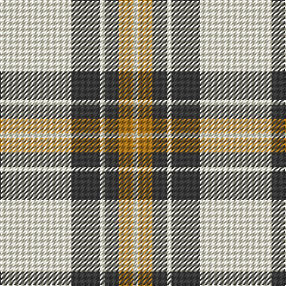

This page is one **sett** — a single exact thread-count. It belongs to the [tartan](/tartans/w15do6w1do3o3w1/)
(the same proportion at any scale), whose colour order is pattern [WBWBRW](/stripes/wbwbrw/).

Sourced from tartans-authority.  It is a [6 stripe tartan](/stripes/stripes6/).

Original link http://www.tartansauthority.com/tartan-ferret/display/3774/

2 attestations — the source records this cloth was collapsed from (oldest owns this page)

<ul>
<li>pre 2002 — Burns (Fashion) (tartans-authority, <a href="http://www.tartansauthority.com/tartan-ferret/display/3774/">record</a>)</li>
<li>undated — Burns (register-of-tartans, <a href="https://www.tartanregister.gov.uk/tartanDetails.aspx?ref=5040">record</a>)</li>
</ul>

## Register references

External register numbers recorded for this tartan.

- Scottish Register of Tartans: [5040](https://www.tartanregister.gov.uk/tartanDetails.aspx?ref=5040)
- Scottish Tartans Authority (ITI): 3774

## Thread count
LY/60 N24 LY4 N12 LT12 LY/4

## Palette

Palette: <strong>custom</strong>
<table><thead><tr><th>Colour</th><th>Threads</th><th>Shade</th><th>Base</th><th>OKLCh</th></tr></thead><tbody><tr><td>LY/</td><td style="text-align:right;font-variant-numeric:tabular-nums">60</td><td><code style="background-color:#F8F4D0;">#F8F4D0</code> <small style="color:#888">#F8F4D0</small></td><td>W <code style="background-color:#F7F7F7;">#F7F7F7</code></td><td><small style="color:#888">oklch(96.1% 0.047 102.0)</small></td></tr><tr><td>N</td><td style="text-align:right;font-variant-numeric:tabular-nums">24</td><td><code style="background-color:#3C3C3C;">#3C3C3C</code> <small style="color:#888">#3C3C3C</small></td><td>B <code style="background-color:#2A418A;">#2A418A</code></td><td><small style="color:#888">oklch(35.6% 0.000 89.9)</small></td></tr><tr><td>LY</td><td style="text-align:right;font-variant-numeric:tabular-nums">4</td><td><code style="background-color:#F8F4D0;">#F8F4D0</code> <small style="color:#888">#F8F4D0</small></td><td>W <code style="background-color:#F7F7F7;">#F7F7F7</code></td><td><small style="color:#888">oklch(96.1% 0.047 102.0)</small></td></tr><tr><td>N</td><td style="text-align:right;font-variant-numeric:tabular-nums">12</td><td><code style="background-color:#3C3C3C;">#3C3C3C</code> <small style="color:#888">#3C3C3C</small></td><td>B <code style="background-color:#2A418A;">#2A418A</code></td><td><small style="color:#888">oklch(35.6% 0.000 89.9)</small></td></tr><tr><td>LT</td><td style="text-align:right;font-variant-numeric:tabular-nums">12</td><td><code style="background-color:#B0781C;">#B0781C</code> <small style="color:#888">#B0781C</small></td><td>R <code style="background-color:#CC0000;">#CC0000</code></td><td><small style="color:#888">oklch(61.6% 0.122 73.7)</small></td></tr><tr><td>LY/</td><td style="text-align:right;font-variant-numeric:tabular-nums">4</td><td><code style="background-color:#F8F4D0;">#F8F4D0</code> <small style="color:#888">#F8F4D0</small></td><td>W <code style="background-color:#F7F7F7;">#F7F7F7</code></td><td><small style="color:#888">oklch(96.1% 0.047 102.0)</small></td></tr></tbody></table>

# Sample pattern

## Nearest tartans

The nearest existing variants by ΔTartan distance, with this tartan at the top so the swatches line up against it.

ΔTartan

Tartan

Sett

—

<a href="/ttd/edit/#slug=w15do6w1do3o3w1~x4">Burns (Fashion)</a> <a class="nn-out" href="/setts/s6/w15do6w1do3o3w1~x4/" title="open its dictionary page">↗</a>

1.24

<a href="/ttd/edit/#slug=db4ly9w4db9ly18w1~x2">WVU Mountaineer Tartan</a> <a class="nn-out" href="/setts/s6/db4ly9w4db9ly18w1~x2/" title="open its dictionary page">↗</a>

1.32

<a href="/ttd/edit/#slug=dt4ly9w4dt9ly18w1~x2">WVU Mountaineer (Corporate)</a> <a class="nn-out" href="/setts/s6/dt4ly9w4dt9ly18w1~x2/" title="open its dictionary page">↗</a>

1.34

<a href="/ttd/edit/#slug=w24g2w8db5ly4db5ly4~x2">Clackson Arisaid (Name?)</a> <a class="nn-out" href="/setts/s7/w24g2w8db5ly4db5ly4~x2/" title="open its dictionary page">↗</a>

1.43

<a href="/ttd/edit/#slug=r1w14k6w1k3ly1~x4">MacPherson #10</a> <a class="nn-out" href="/setts/s6/r1w14k6w1k3ly1~x4/" title="open its dictionary page">↗</a>

1.50

<a href="/ttd/edit/#slug=w2r1w2g6w10r6w2g1w2~x4">O'Neill Pipe Band 1999/ Oliver dress</a> <a class="nn-out" href="/setts/s9/w2r1w2g6w10r6w2g1w2~x4/" title="open its dictionary page">↗</a>

1.56

<a href="/ttd/edit/#slug=w5r3w35k28w4k11w2~x2">MacPherson of Cluny (Black and White)</a> <a class="nn-out" href="/setts/s7/w5r3w35k28w4k11w2~x2/" title="open its dictionary page">↗</a>

1.60

<a href="/ttd/edit/#slug=k4ly18n44k3ly10k4">Stutterheim</a> <a class="nn-out" href="/setts/s6/k4ly18n44k3ly10k4/" title="open its dictionary page">↗</a>

1.60

<a href="/ttd/edit/#slug=w2o1w2g6w10o6w2g1w2~x2">O'Neill</a> <a class="nn-out" href="/setts/s9/w2o1w2g6w10o6w2g1w2~x2/" title="open its dictionary page">↗</a>

1.63

<a href="/ttd/edit/#slug=dy8lr29dy8lo3dy8lr8lo3~x2">Lister (Misty Mountain)</a> <a class="nn-out" href="/setts/s7/dy8lr29dy8lo3dy8lr8lo3~x2/" title="open its dictionary page">↗</a>

1.65

<a href="/ttd/edit/#slug=w6b3w20k2w3k25w3~x2">Forbes Dress (Clans Originaux)</a> <a class="nn-out" href="/setts/s7/w6b3w20k2w3k25w3~x2/" title="open its dictionary page">↗</a>

## Neighbour map

Every grey dot is one of 14359 variants placed by the first two principal components of the ΔTartan feature space (44% of its variance). Red is this tartan; blue dots are its nearest — click one to open its page.

<svg viewBox="0 0 640 380" role="img" style="max-width:100%;height:auto;border:1px solid #e0e0e0;border-radius:4px;display:block" xmlns="http://www.w3.org/2000/svg"><image href="/nn/cloud.v1.png" width="640" height="380"/><a href="/setts/s6/db4ly9w4db9ly18w1~x2/"><circle cx="299.4" cy="179.9" r="4" fill="#3465a4"><title>WVU Mountaineer Tartan</title></circle></a><a href="/setts/s6/dt4ly9w4dt9ly18w1~x2/"><circle cx="314.6" cy="183.4" r="4" fill="#3465a4"><title>WVU Mountaineer (Corporate)</title></circle></a><a href="/setts/s7/w24g2w8db5ly4db5ly4~x2/"><circle cx="303.2" cy="162.2" r="4" fill="#3465a4"><title>Clackson Arisaid (Name?)</title></circle></a><a href="/setts/s6/r1w14k6w1k3ly1~x4/"><circle cx="300.1" cy="150.3" r="4" fill="#3465a4"><title>MacPherson #10</title></circle></a><a href="/setts/s9/w2r1w2g6w10r6w2g1w2~x4/"><circle cx="286.0" cy="184.8" r="4" fill="#3465a4"><title>O'Neill Pipe Band 1999/ Oliver dress</title></circle></a><a href="/setts/s7/w5r3w35k28w4k11w2~x2/"><circle cx="300.9" cy="158.3" r="4" fill="#3465a4"><title>MacPherson of Cluny (Black and White)</title></circle></a><a href="/setts/s6/k4ly18n44k3ly10k4/"><circle cx="305.0" cy="178.3" r="4" fill="#3465a4"><title>Stutterheim</title></circle></a><a href="/setts/s9/w2o1w2g6w10o6w2g1w2~x2/"><circle cx="285.4" cy="192.4" r="4" fill="#3465a4"><title>O'Neill</title></circle></a><a href="/setts/s7/dy8lr29dy8lo3dy8lr8lo3~x2/"><circle cx="311.1" cy="200.9" r="4" fill="#3465a4"><title>Lister (Misty Mountain)</title></circle></a><a href="/setts/s7/w6b3w20k2w3k25w3~x2/"><circle cx="281.1" cy="170.6" r="4" fill="#3465a4"><title>Forbes Dress (Clans Originaux)</title></circle></a><circle cx="321.6" cy="166.7" r="5" fill="#c00000"/></svg>

ID: /setts/s6/w15do6w1do3o3w1~x4/
