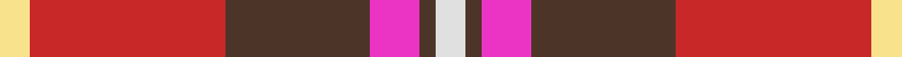
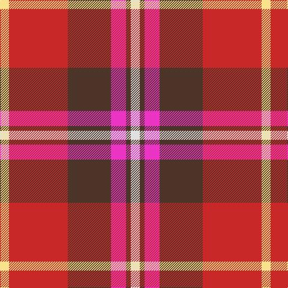

In pattern [WBRBRY](/stripes/wbrbry/).

This was sourced from register-of-tartans.  It is a [6 stripe tartan](/stripes/stripes6/).

Original link https://www.tartanregister.gov.uk/tartanDetails.aspx?ref=11449

## Register references

External register numbers recorded for this tartan.

- Scottish Register of Tartans: [11449](https://www.tartanregister.gov.uk/tartanDetails.aspx?ref=11449)

## Thread count
LY/15 R98 T72 LR25 T8 LN/15

## Palette
Each colour and its ΔE from the base-6 reference it is a variant of.

| Colour | Shade | Base | ΔE (OKLab) |
|---|---|---|---|
| LN | <code style="background-color:#E0E0E0;">#E0E0E0</code> `#E0E0E0` | W <code style="background-color:#F7F7F7;">#F7F7F7</code> | 0.07 |
| LR | <code style="background-color:#EC34C4;">#EC34C4</code> `#EC34C4` | R <code style="background-color:#CC0000;">#CC0000</code> | 0.24 |
| LY | <code style="background-color:#F8E38C;">#F8E38C</code> `#F8E38C` | Y <code style="background-color:#F2BF00;">#F2BF00</code> | 0.11 |
| R | <code style="background-color:#C82828;">#C82828</code> `#C82828` | R <code style="background-color:#CC0000;">#CC0000</code> | 0.03 |
| T | <code style="background-color:#4C3428;">#4C3428</code> `#4C3428` | B <code style="background-color:#2A418A;">#2A418A</code> | 0.17 |

# Sample pattern

## Nearest tartans

The nearest existing variants by ΔTartan distance.

1. [Thermos Un-named (aretefact)](/setts/s6/k6r20w2r9w3lb2~x2/) — ΔT 0.85
1. [Ferguson's Promise (Commemorative)](/setts/s7/r38k12r15r4r15k2w4~x2/) — ΔT 0.87
1. [Ferguson's Promise](/setts/s7/m38k12r15r4r15k2w4~x2/) — ΔT 0.93
1. [MIT1951](/setts/s10/r24r5lr7dt2lr4dt14r11dt3r3w4~x2/) — ΔT 1.26
1. [McGill University](/setts/s5/w3r24db12dg8ly3~x2/) — ΔT 1.31
1. [Scottish American Society of Michigan (Official)](/setts/s6/r48t16lo5dg17w8k3~x2/) — ΔT 1.34
1. [Australia Dress](/setts/s9/lr11r4y2k4y2r4y12r20t2~x2/) — ΔT 1.38
1. [McGill University (Corporate)](/setts/s5/w3r24db12dg8lo3~x2/) — ΔT 1.39
1. [Siddle, New (Corporate)](/setts/s5/r30db20w15lb3ly3/) — ΔT 1.39
1. [Indiana "Cardinal"](/setts/s8/db8ly1dg12r10o2r6o2r4~x4/) — ΔT 1.39

## Neighbour map

Every grey dot is one of 14299 variants placed by the first two principal components of the ΔTartan feature space (44% of its variance). Red is this tartan; blue dots are its nearest — click one to open its page.

<svg viewBox="0 0 640 380" role="img" style="max-width:100%;height:auto;border:1px solid #e0e0e0;border-radius:4px;display:block" xmlns="http://www.w3.org/2000/svg"><image href="/nn/cloud.v1.png" width="640" height="380"/><a href="/setts/s6/k6r20w2r9w3lb2~x2/"><circle cx="226.7" cy="162.2" r="4" fill="#3465a4"><title>Thermos Un-named (aretefact)</title></circle></a><a href="/setts/s7/r38k12r15r4r15k2w4~x2/"><circle cx="235.3" cy="139.0" r="4" fill="#3465a4"><title>Ferguson's Promise (Commemorative)</title></circle></a><a href="/setts/s7/m38k12r15r4r15k2w4~x2/"><circle cx="242.4" cy="141.0" r="4" fill="#3465a4"><title>Ferguson's Promise</title></circle></a><a href="/setts/s10/r24r5lr7dt2lr4dt14r11dt3r3w4~x2/"><circle cx="232.2" cy="143.0" r="4" fill="#3465a4"><title>MIT1951</title></circle></a><a href="/setts/s5/w3r24db12dg8ly3~x2/"><circle cx="197.2" cy="181.7" r="4" fill="#3465a4"><title>McGill University</title></circle></a><a href="/setts/s6/r48t16lo5dg17w8k3~x2/"><circle cx="232.2" cy="134.7" r="4" fill="#3465a4"><title>Scottish American Society of Michigan (Official)</title></circle></a><a href="/setts/s9/lr11r4y2k4y2r4y12r20t2~x2/"><circle cx="232.7" cy="167.0" r="4" fill="#3465a4"><title>Australia Dress</title></circle></a><a href="/setts/s5/w3r24db12dg8lo3~x2/"><circle cx="210.0" cy="194.9" r="4" fill="#3465a4"><title>McGill University (Corporate)</title></circle></a><a href="/setts/s5/r30db20w15lb3ly3/"><circle cx="171.7" cy="178.3" r="4" fill="#3465a4"><title>Siddle, New (Corporate)</title></circle></a><a href="/setts/s8/db8ly1dg12r10o2r6o2r4~x4/"><circle cx="212.2" cy="181.7" r="4" fill="#3465a4"><title>Indiana &quot;Cardinal&quot;</title></circle></a><circle cx="221.2" cy="162.3" r="5" fill="#c00000"/></svg>

ID: /setts/s6/w15do8m25do72r98ly15/
