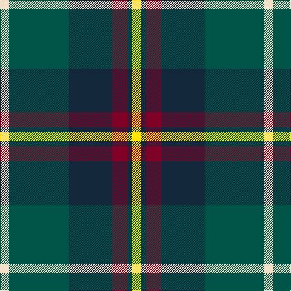

In pattern [WGBRBY](/patterns/wgbrby/).

This was sourced from register-of-tartans.  It is a [6 stripes tartan](/stripes/stripes6/).

Original link https://www.tartanregister.gov.uk/tartanDetails.aspx?ref=11278

## Register references

External register numbers recorded for this tartan.

- Scottish Register of Tartans: [11278](https://www.tartanregister.gov.uk/tartanDetails.aspx?ref=11278)

## Thread count
W/15 G98 DN72 DR25 DN8 Y/15

## Palette
Each colour and its ΔE from the base-6 reference it is a variant of.

| Colour | Shade | Base | ΔE (OKLab) |
|---|---|---|---|
| DN | <code style="background-color:#14283C;">#14283C</code> `#14283C` | B <code style="background-color:#2A418A;">#2A418A</code> | 0.15 |
| DR | <code style="background-color:#800028;">#800028</code> `#800028` | R <code style="background-color:#CC0000;">#CC0000</code> | 0.17 |
| G | <code style="background-color:#005448;">#005448</code> `#005448` | G <code style="background-color:#006100;">#006100</code> | 0.10 |
| W | <code style="background-color:#F0E0C8;">#F0E0C8</code> `#F0E0C8` | W <code style="background-color:#F7F7F7;">#F7F7F7</code> | 0.07 |
| Y | <code style="background-color:#FFE600;">#FFE600</code> `#FFE600` | Y <code style="background-color:#F2BF00;">#F2BF00</code> | 0.10 |

# Sample pattern

## Nearest tartans

The nearest existing variants by ΔTartan distance.

1. [Afternoon Tea / Afternoon Tea](/setts/s6/w15k8r25k72g98y15~g408060-k1c1714-r781638-we0e0e0-yc89800/) — ΔT 0.62
1. [Afternoon Tea / Black Tea](/setts/s6/r15b8g25b72ba98w15~b1c1c1c-ba646464-g789484-ra00048-wf8f8f8/) — ΔT 0.72
1. [Afternoon Tea / Darjeeling](/setts/s6/w15g98b72r25b8y15~b202060-g406054-r880000-wfcfcfc-yfccc00/) — ΔT 0.75
1. [MacFadzean/MacPhedran](/setts/s7/g3b12w1k12g13r2g2~b2c2c80-g408060-k101010-rc80000-wf8f8f8~x4/) — ΔT 0.75
1. [Canine All Dogs](/setts/s6/r5b3g24ba24r4y2~b2888c4-ba2c2c80-g006818-rc80000-ye8c000~x2/) — ΔT 0.75
1. [Wilson's No.111](/setts/s8/b19w2g12ba3k4ba3g12w2~b440044-ba5c8ca8-g006818-k101010-we0e0e0~x2/) — ΔT 0.78
1. [Paterson (Personal)](/setts/s7/g3b12w1k12g13r2g2~b2c2c80-g006818-k101010-rc80000-wfcfcfc~x2/) — ΔT 0.81
1. [Turnbull Hunting (Name)](/setts/s5/r2y1g10b10w1~b2c2c80-g006818-rc80000-we0e0e0-ye8c000~x6/) — ΔT 0.81
1. [Rhun (Fashion)](/setts/s7/r12b68w7k39g75r6g6~b1c1c50-g006818-k101010-rc80000-we0e0e0/) — ΔT 0.82
1. [State Seal of Washington (Fashion)](/setts/s7/b5g28w5k20y5b47y4~b1474b4-g604000-k101010-we8ccb8-ybc8c00~x2/) — ΔT 0.87

## Neighbour map

Every grey dot is one of 15726 variants placed by the first two principal components of the ΔTartan feature space (44% of its variance). Red is this tartan; blue dots are its nearest — click one to open its page.

<svg viewBox="0 0 640 380" role="img" style="max-width:100%;height:auto;border:1px solid #e0e0e0;border-radius:4px;display:block" xmlns="http://www.w3.org/2000/svg"><image href="/nn/cloud.v1.png" width="640" height="380"/><a href="/setts/s6/w15k8r25k72g98y15~g408060-k1c1714-r781638-we0e0e0-yc89800/"><circle cx="198.8" cy="180.2" r="4" fill="#3465a4"><title>Afternoon Tea / Afternoon Tea</title></circle></a><a href="/setts/s6/r15b8g25b72ba98w15~b1c1c1c-ba646464-g789484-ra00048-wf8f8f8/"><circle cx="209.3" cy="181.6" r="4" fill="#3465a4"><title>Afternoon Tea / Black Tea</title></circle></a><a href="/setts/s6/w15g98b72r25b8y15~b202060-g406054-r880000-wfcfcfc-yfccc00/"><circle cx="200.4" cy="179.6" r="4" fill="#3465a4"><title>Afternoon Tea / Darjeeling</title></circle></a><a href="/setts/s7/g3b12w1k12g13r2g2~b2c2c80-g408060-k101010-rc80000-wf8f8f8~x4/"><circle cx="190.7" cy="184.6" r="4" fill="#3465a4"><title>MacFadzean/MacPhedran</title></circle></a><a href="/setts/s6/r5b3g24ba24r4y2~b2888c4-ba2c2c80-g006818-rc80000-ye8c000~x2/"><circle cx="215.9" cy="185.1" r="4" fill="#3465a4"><title>Canine All Dogs</title></circle></a><a href="/setts/s8/b19w2g12ba3k4ba3g12w2~b440044-ba5c8ca8-g006818-k101010-we0e0e0~x2/"><circle cx="180.3" cy="182.0" r="4" fill="#3465a4"><title>Wilson's No.111</title></circle></a><a href="/setts/s7/g3b12w1k12g13r2g2~b2c2c80-g006818-k101010-rc80000-wfcfcfc~x2/"><circle cx="197.5" cy="190.6" r="4" fill="#3465a4"><title>Paterson (Personal)</title></circle></a><a href="/setts/s5/r2y1g10b10w1~b2c2c80-g006818-rc80000-we0e0e0-ye8c000~x6/"><circle cx="217.9" cy="201.2" r="4" fill="#3465a4"><title>Turnbull Hunting (Name)</title></circle></a><a href="/setts/s7/r12b68w7k39g75r6g6~b1c1c50-g006818-k101010-rc80000-we0e0e0/"><circle cx="193.7" cy="179.5" r="4" fill="#3465a4"><title>Rhun (Fashion)</title></circle></a><a href="/setts/s7/b5g28w5k20y5b47y4~b1474b4-g604000-k101010-we8ccb8-ybc8c00~x2/"><circle cx="216.1" cy="174.6" r="4" fill="#3465a4"><title>State Seal of Washington (Fashion)</title></circle></a><circle cx="203.2" cy="185.7" r="5" fill="#c00000"/></svg>

ID: /setts/s6/w15g98b72r25b8y15~b14283c-g005448-r800028-wf0e0c8-yffe600/
