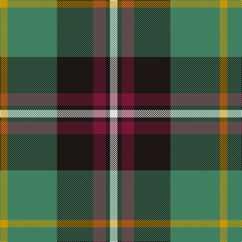

In pattern [WKRKGY](/patterns/wkrkgy/).

This was sourced from register-of-tartans.  It is a [6 stripes tartan](/stripes/stripes6/).

Original link https://www.tartanregister.gov.uk/tartanDetails.aspx?ref=11447

## Thread count
DY/15 G98 K72 DR25 K8 LN/15

## Palette
Each colour and its ΔE from the base-6 reference it is a variant of.

| Colour | Shade | Base | ΔE (OKLab) |
|---|---|---|---|
| DR | <code style="background-color:#781638;">#781638</code> `#781638` | R <code style="background-color:#CC0000;">#CC0000</code> | 0.18 |
| DY | <code style="background-color:#C89800;">#C89800</code> `#C89800` | Y <code style="background-color:#F2BF00;">#F2BF00</code> | 0.12 |
| G | <code style="background-color:#408060;">#408060</code> `#408060` | G <code style="background-color:#006100;">#006100</code> | 0.14 |
| K | <code style="background-color:#1C1714;">#1C1714</code> `#1C1714` | K <code style="background-color:#000000;">#000000</code> | 0.21 |
| LN | <code style="background-color:#E0E0E0;">#E0E0E0</code> `#E0E0E0` | W <code style="background-color:#F7F7F7;">#F7F7F7</code> | 0.07 |

# Sample pattern

## Nearest tartans

The nearest existing variants by ΔTartan distance.

1. [Afternoon Tea / Darjeeling](/setts/s6/w15g98b72r25b8y15~b14283c-g005448-r800028-wf0e0c8-yffe600/) — ΔT 0.62
1. [Afternoon Tea / Black Tea](/setts/s6/r15b8g25b72ba98w15~b1c1c1c-ba646464-g789484-ra00048-wf8f8f8/) — ΔT 0.76
1. [Wilson's No.111](/setts/s8/b19w2g12ba3k4ba3g12w2~b440044-ba5c8ca8-g006818-k101010-we0e0e0~x2/) — ΔT 0.84
1. [Afternoon Tea / Darjeeling](/setts/s6/w15g98b72r25b8y15~b202060-g406054-r880000-wfcfcfc-yfccc00/) — ΔT 0.92
1. [Ritchie, Stephen James (Personal)](/setts/s7/b4ba19y2k19ba2y25w2~b2888c4-ba5c5c5c-k101010-wc4c4c4-ya0a0a0~x2/) — ΔT 1.00
1. [Turnbull Hunting (Name)](/setts/s5/r2y1g10b10w1~b2c2c80-g006818-rc80000-we0e0e0-ye8c000~x6/) — ΔT 1.00
1. [Canine All Dogs](/setts/s6/r5b3g24ba24r4y2~b2888c4-ba2c2c80-g006818-rc80000-ye8c000~x2/) — ΔT 1.02
1. [Snodgrass](/setts/s8/k3r1y1b11g13b5r1y1~b304080-g008000-k000000-rc00000-yf0c000~x2/) — ΔT 1.04
1. [Bryan Wedding (Personal)](/setts/s6/g30y5b10k10w2k2~b5c8ca8-g604000-k101010-wfcfcfc-yfccc00~x2/) — ΔT 1.04
1. [Turnbull, hunting](/setts/s5/r7y3g28b28w3~b304080-g008000-r800000-we0e0e0-yf0c000~x2/) — ΔT 1.04

## Neighbour map

Every grey dot is one of 15726 variants placed by the first two principal components of the ΔTartan feature space (44% of its variance). Red is this tartan; blue dots are its nearest — click one to open its page.

<svg viewBox="0 0 640 380" role="img" style="max-width:100%;height:auto;border:1px solid #e0e0e0;border-radius:4px;display:block" xmlns="http://www.w3.org/2000/svg"><image href="/nn/cloud.v1.png" width="640" height="380"/><a href="/setts/s6/w15g98b72r25b8y15~b14283c-g005448-r800028-wf0e0c8-yffe600/"><circle cx="203.2" cy="185.7" r="4" fill="#3465a4"><title>Afternoon Tea / Darjeeling</title></circle></a><a href="/setts/s6/r15b8g25b72ba98w15~b1c1c1c-ba646464-g789484-ra00048-wf8f8f8/"><circle cx="209.3" cy="181.6" r="4" fill="#3465a4"><title>Afternoon Tea / Black Tea</title></circle></a><a href="/setts/s8/b19w2g12ba3k4ba3g12w2~b440044-ba5c8ca8-g006818-k101010-we0e0e0~x2/"><circle cx="180.3" cy="182.0" r="4" fill="#3465a4"><title>Wilson's No.111</title></circle></a><a href="/setts/s6/w15g98b72r25b8y15~b202060-g406054-r880000-wfcfcfc-yfccc00/"><circle cx="200.4" cy="179.6" r="4" fill="#3465a4"><title>Afternoon Tea / Darjeeling</title></circle></a><a href="/setts/s7/b4ba19y2k19ba2y25w2~b2888c4-ba5c5c5c-k101010-wc4c4c4-ya0a0a0~x2/"><circle cx="172.8" cy="166.5" r="4" fill="#3465a4"><title>Ritchie, Stephen James (Personal)</title></circle></a><a href="/setts/s5/r2y1g10b10w1~b2c2c80-g006818-rc80000-we0e0e0-ye8c000~x6/"><circle cx="217.9" cy="201.2" r="4" fill="#3465a4"><title>Turnbull Hunting (Name)</title></circle></a><a href="/setts/s6/r5b3g24ba24r4y2~b2888c4-ba2c2c80-g006818-rc80000-ye8c000~x2/"><circle cx="215.9" cy="185.1" r="4" fill="#3465a4"><title>Canine All Dogs</title></circle></a><a href="/setts/s8/k3r1y1b11g13b5r1y1~b304080-g008000-k000000-rc00000-yf0c000~x2/"><circle cx="218.7" cy="159.9" r="4" fill="#3465a4"><title>Snodgrass</title></circle></a><a href="/setts/s6/g30y5b10k10w2k2~b5c8ca8-g604000-k101010-wfcfcfc-yfccc00~x2/"><circle cx="250.7" cy="162.7" r="4" fill="#3465a4"><title>Bryan Wedding (Personal)</title></circle></a><a href="/setts/s5/r7y3g28b28w3~b304080-g008000-r800000-we0e0e0-yf0c000~x2/"><circle cx="204.2" cy="206.9" r="4" fill="#3465a4"><title>Turnbull, hunting</title></circle></a><circle cx="198.8" cy="180.2" r="5" fill="#c00000"/></svg>

ID: /setts/s6/w15k8r25k72g98y15~g408060-k1c1714-r781638-we0e0e0-yc89800/
