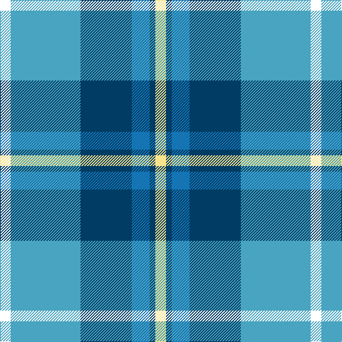

This page is one **sett** — a single exact thread-count. It belongs to the [tartan](/tartans/w15lg98dt72b25dt8ly15/)
(the same proportion at any scale), whose colour order is pattern [WYBBBY](/stripes/wybbby/).

Sourced from register-of-tartans.  It is a [6 stripe tartan](/stripes/stripes6/).

Original link https://www.tartanregister.gov.uk/tartanDetails.aspx?ref=11451

## Register references

External register numbers recorded for this tartan.

- Scottish Register of Tartans: [11451](https://www.tartanregister.gov.uk/tartanDetails.aspx?ref=11451)

## Thread count
W/15 B98 DB72 Ba25 DB8 LY/15

## Palette

Palette: <strong>Tartan Register</strong>
<table><thead><tr><th>Colour</th><th>Threads</th><th>Shade</th><th>Base</th><th>OKLCh</th></tr></thead><tbody><tr><td>W/</td><td style="text-align:right;font-variant-numeric:tabular-nums">15</td><td><code style="background-color:#FFFFFF;">#FFFFFF</code> <small style="color:#888">#FFFFFF</small></td><td>W <code style="background-color:#F7F7F7;">#F7F7F7</code></td><td><small style="color:#888">oklch(100.0% 0.000 89.9)</small></td></tr><tr><td>B</td><td style="text-align:right;font-variant-numeric:tabular-nums">98</td><td><code style="background-color:#48A4C0;">#48A4C0</code> <small style="color:#888">#48A4C0</small></td><td>Y <code style="background-color:#F2BF00;">#F2BF00</code></td><td><small style="color:#888">oklch(67.5% 0.096 221.0)</small></td></tr><tr><td>DB</td><td style="text-align:right;font-variant-numeric:tabular-nums">72</td><td><code style="background-color:#003C64;">#003C64</code> <small style="color:#888">#003C64</small></td><td>B <code style="background-color:#2A418A;">#2A418A</code></td><td><small style="color:#888">oklch(34.5% 0.089 246.0)</small></td></tr><tr><td>Ba</td><td style="text-align:right;font-variant-numeric:tabular-nums">25</td><td><code style="background-color:#1474B4;">#1474B4</code> <small style="color:#888">#1474B4</small></td><td>B <code style="background-color:#2A418A;">#2A418A</code></td><td><small style="color:#888">oklch(54.0% 0.129 245.1)</small></td></tr><tr><td>DB</td><td style="text-align:right;font-variant-numeric:tabular-nums">8</td><td><code style="background-color:#003C64;">#003C64</code> <small style="color:#888">#003C64</small></td><td>B <code style="background-color:#2A418A;">#2A418A</code></td><td><small style="color:#888">oklch(34.5% 0.089 246.0)</small></td></tr><tr><td>LY/</td><td style="text-align:right;font-variant-numeric:tabular-nums">15</td><td><code style="background-color:#F8E38C;">#F8E38C</code> <small style="color:#888">#F8E38C</small></td><td>Y <code style="background-color:#F2BF00;">#F2BF00</code></td><td><small style="color:#888">oklch(91.4% 0.110 96.2)</small></td></tr></tbody></table>

# Sample pattern

## Nearest tartans

The nearest existing variants by ΔTartan distance, with this tartan at the top so the swatches line up against it.

ΔTartan

Tartan

Sett

—

<a href="/ttd/edit/#slug=w15lg98dt72b25dt8ly15">Afternoon Tea / Mint Tea</a> <a class="nn-out" href="/setts/s6/w15lg98dt72b25dt8ly15/" title="open its dictionary page">↗</a>

0.57

<a href="/ttd/edit/#slug=w3b12db1g15m3w1~x4">Eeraerts, Laurent (Personal)</a> <a class="nn-out" href="/setts/s6/w3b12db1g15m3w1~x4/" title="open its dictionary page">↗</a>

0.69

<a href="/ttd/edit/#slug=r15t98dt72ly25dt8w15">Afternoon Tea / Earl Grey</a> <a class="nn-out" href="/setts/s6/r15t98dt72ly25dt8w15/" title="open its dictionary page">↗</a>

1.13

<a href="/ttd/edit/#slug=dt36t21ly4lb12dp2~x2">Emond, Kenneth (Personal)</a> <a class="nn-out" href="/setts/s5/dt36t21ly4lb12dp2~x2/" title="open its dictionary page">↗</a>

1.17

<a href="/ttd/edit/#slug=w8t30g5w3db8r5">Roseberry</a> <a class="nn-out" href="/setts/s6/w8t30g5w3db8r5/" title="open its dictionary page">↗</a>

1.20

<a href="/ttd/edit/#slug=w20db14b14w4dt2t2b7~x2">Earl of St. Andrews Dress (Dance)</a> <a class="nn-out" href="/setts/s7/w20db14b14w4dt2t2b7~x2/" title="open its dictionary page">↗</a>

1.22

<a href="/ttd/edit/#slug=dt7w3dt2w6dt16t26r4~x2">Keela (Corporate)</a> <a class="nn-out" href="/setts/s7/dt7w3dt2w6dt16t26r4~x2/" title="open its dictionary page">↗</a>

1.25

<a href="/ttd/edit/#slug=b30dt15lb4dg12lb9b8lb3~x2">Newall (Personal)</a> <a class="nn-out" href="/setts/s7/b30dt15lb4dg12lb9b8lb3~x2/" title="open its dictionary page">↗</a>

1.26

<a href="/ttd/edit/#slug=w28t19db19w4dbi2lp2db7~x2">St Andrews, Earl of, dress</a> <a class="nn-out" href="/setts/s7/w28t19db19w4dbi2lp2db7~x2/" title="open its dictionary page">↗</a>

1.27

<a href="/ttd/edit/#slug=r2t2r2t21lg11k17lb2~x2">Loch Ness (Fashion)</a> <a class="nn-out" href="/setts/s7/r2t2r2t21lg11k17lb2~x2/" title="open its dictionary page">↗</a>

1.27

<a href="/ttd/edit/#slug=g5db15t11w2t1w1dg4~x4">Highlands Country Club</a> <a class="nn-out" href="/setts/s7/g5db15t11w2t1w1dg4~x4/" title="open its dictionary page">↗</a>

## Neighbour map

Every grey dot is one of 14359 variants placed by the first two principal components of the ΔTartan feature space (44% of its variance). Red is this tartan; blue dots are its nearest — click one to open its page.

<svg viewBox="0 0 640 380" role="img" style="max-width:100%;height:auto;border:1px solid #e0e0e0;border-radius:4px;display:block" xmlns="http://www.w3.org/2000/svg"><image href="/nn/cloud.v1.png" width="640" height="380"/><a href="/setts/s6/w3b12db1g15m3w1~x4/"><circle cx="204.5" cy="165.6" r="4" fill="#3465a4"><title>Eeraerts, Laurent (Personal)</title></circle></a><a href="/setts/s6/r15t98dt72ly25dt8w15/"><circle cx="207.9" cy="187.0" r="4" fill="#3465a4"><title>Afternoon Tea / Earl Grey</title></circle></a><a href="/setts/s5/dt36t21ly4lb12dp2~x2/"><circle cx="239.8" cy="180.6" r="4" fill="#3465a4"><title>Emond, Kenneth (Personal)</title></circle></a><a href="/setts/s6/w8t30g5w3db8r5/"><circle cx="216.1" cy="173.5" r="4" fill="#3465a4"><title>Roseberry</title></circle></a><a href="/setts/s7/w20db14b14w4dt2t2b7~x2/"><circle cx="143.4" cy="182.5" r="4" fill="#3465a4"><title>Earl of St. Andrews Dress (Dance)</title></circle></a><a href="/setts/s7/dt7w3dt2w6dt16t26r4~x2/"><circle cx="213.0" cy="182.9" r="4" fill="#3465a4"><title>Keela (Corporate)</title></circle></a><a href="/setts/s7/b30dt15lb4dg12lb9b8lb3~x2/"><circle cx="215.4" cy="216.3" r="4" fill="#3465a4"><title>Newall (Personal)</title></circle></a><a href="/setts/s7/w28t19db19w4dbi2lp2db7~x2/"><circle cx="173.4" cy="158.9" r="4" fill="#3465a4"><title>St Andrews, Earl of, dress</title></circle></a><a href="/setts/s7/r2t2r2t21lg11k17lb2~x2/"><circle cx="169.2" cy="171.4" r="4" fill="#3465a4"><title>Loch Ness (Fashion)</title></circle></a><a href="/setts/s7/g5db15t11w2t1w1dg4~x4/"><circle cx="198.6" cy="179.0" r="4" fill="#3465a4"><title>Highlands Country Club</title></circle></a><circle cx="192.8" cy="182.4" r="5" fill="#c00000"/></svg>

ID: /setts/s6/w15lg98dt72b25dt8ly15/
