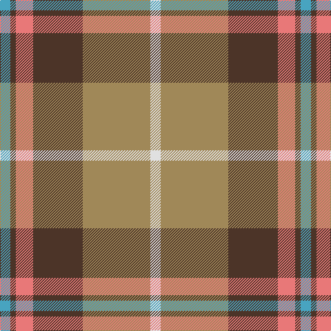

This page is one **sett** — a single exact thread-count. It belongs to the [tartan](/tartans/b15t8lr25t72lt98ln15/)
(the same proportion at any scale), whose colour order is pattern [WYBRBY](/stripes/wybrby/).

Sourced from register-of-tartans.  It is a [6 stripe tartan](/stripes/stripes6/).

Original link https://www.tartanregister.gov.uk/tartanDetails.aspx?ref=11450

## Register references

External register numbers recorded for this tartan.

- Scottish Register of Tartans: [11450](https://www.tartanregister.gov.uk/tartanDetails.aspx?ref=11450)

## Thread count
B/15 T8 LR25 T72 LT98 LN/15

## Palette
Each colour and the base-6 reference it is a variant of.

| Colour | Shade | Base |
|---|---|---|
| B | <code style="background-color:#48A4C0;">#48A4C0</code> `oklch(67.5% 0.096 221.0)` <small>#48A4C0</small> | Y <code style="background-color:#F2BF00;">#F2BF00</code> |
| LN | <code style="background-color:#E0E0E0;">#E0E0E0</code> `oklch(90.7% 0.000 89.9)` <small>#E0E0E0</small> | W <code style="background-color:#F7F7F7;">#F7F7F7</code> |
| LR | <code style="background-color:#E87878;">#E87878</code> `oklch(70.0% 0.139 21.2)` <small>#E87878</small> | R <code style="background-color:#CC0000;">#CC0000</code> |
| LT | <code style="background-color:#A08858;">#A08858</code> `oklch(63.7% 0.071 84.0)` <small>#A08858</small> | Y <code style="background-color:#F2BF00;">#F2BF00</code> |
| T | <code style="background-color:#4C3428;">#4C3428</code> `oklch(34.9% 0.040 47.5)` <small>#4C3428</small> | B <code style="background-color:#2A418A;">#2A418A</code> |

# Sample pattern

## Nearest tartans

The nearest existing variants by ΔTartan distance, with this tartan at the top so the swatches line up against it.

ΔTartan

Tartan

Sett

—

<a href="/ttd/edit/#slug=w15lo98do72r25do8lg15">Afternoon Tea / Milk Tea</a> <a class="nn-out" href="/setts/s6/w15lo98do72r25do8lg15/" title="open its dictionary page">↗</a>

0.87

<a href="/ttd/edit/#slug=n2r10n10o3r2lr24w2~x2">Un-named Dutch</a> <a class="nn-out" href="/setts/s7/n2r10n10o3r2lr24w2~x2/" title="open its dictionary page">↗</a>

0.91

<a href="/ttd/edit/#slug=dt8y4r30g30lo3g4~x2">Hutcheson (Name)</a> <a class="nn-out" href="/setts/s6/dt8y4r30g30lo3g4~x2/" title="open its dictionary page">↗</a>

1.00

<a href="/ttd/edit/#slug=g4lo7r9lo9b20w2b2~x2">Tombow 140th Anniversary, The</a> <a class="nn-out" href="/setts/s7/g4lo7r9lo9b20w2b2~x2/" title="open its dictionary page">↗</a>

1.04

<a href="/ttd/edit/#slug=o4do2o21db11w2o20r3~x2">Barbour Dress</a> <a class="nn-out" href="/setts/s7/o4do2o21db11w2o20r3~x2/" title="open its dictionary page">↗</a>

1.17

<a href="/ttd/edit/#slug=r3n20ly2n20y20lb20r3~x2">Brodie, Silver</a> <a class="nn-out" href="/setts/s7/r3n20ly2n20y20lb20r3~x2/" title="open its dictionary page">↗</a>

1.18

<a href="/ttd/edit/#slug=g24b2r25ly2k3~x2">Bronte</a> <a class="nn-out" href="/setts/s5/g24b2r25ly2k3~x2/" title="open its dictionary page">↗</a>

1.18

<a href="/ttd/edit/#slug=r15w1db4ly1g15~x4">Eglinton, Duke of (Artefact)</a> <a class="nn-out" href="/setts/s5/r15w1db4ly1g15~x4/" title="open its dictionary page">↗</a>

1.22

<a href="/ttd/edit/#slug=r3n20k2n20o20lb20r3~x2">Brodie Silver</a> <a class="nn-out" href="/setts/s7/r3n20k2n20o20lb20r3~x2/" title="open its dictionary page">↗</a>

1.26

<a href="/ttd/edit/#slug=ly15r9t30w3db4~x2">S.I.D.E. (Corporate)</a> <a class="nn-out" href="/setts/s5/ly15r9t30w3db4~x2/" title="open its dictionary page">↗</a>

1.27

<a href="/ttd/edit/#slug=r2g16r1r2r12ly1t1~x2">Spragg (Name)</a> <a class="nn-out" href="/setts/s7/r2g16r1r2r12ly1t1~x2/" title="open its dictionary page">↗</a>

## Neighbour map

Every grey dot is one of 14299 variants placed by the first two principal components of the ΔTartan feature space (44% of its variance). Red is this tartan; blue dots are its nearest — click one to open its page.

<svg viewBox="0 0 640 380" role="img" style="max-width:100%;height:auto;border:1px solid #e0e0e0;border-radius:4px;display:block" xmlns="http://www.w3.org/2000/svg"><image href="/nn/cloud.v1.png" width="640" height="380"/><a href="/setts/s7/n2r10n10o3r2lr24w2~x2/"><circle cx="251.4" cy="170.0" r="4" fill="#3465a4"><title>Un-named Dutch</title></circle></a><a href="/setts/s6/dt8y4r30g30lo3g4~x2/"><circle cx="256.0" cy="199.9" r="4" fill="#3465a4"><title>Hutcheson (Name)</title></circle></a><a href="/setts/s7/g4lo7r9lo9b20w2b2~x2/"><circle cx="182.4" cy="181.8" r="4" fill="#3465a4"><title>Tombow 140th Anniversary, The</title></circle></a><a href="/setts/s7/o4do2o21db11w2o20r3~x2/"><circle cx="189.8" cy="167.4" r="4" fill="#3465a4"><title>Barbour Dress</title></circle></a><a href="/setts/s7/r3n20ly2n20y20lb20r3~x2/"><circle cx="221.5" cy="207.7" r="4" fill="#3465a4"><title>Brodie, Silver</title></circle></a><a href="/setts/s5/g24b2r25ly2k3~x2/"><circle cx="284.0" cy="182.7" r="4" fill="#3465a4"><title>Bronte</title></circle></a><a href="/setts/s5/r15w1db4ly1g15~x4/"><circle cx="250.4" cy="177.2" r="4" fill="#3465a4"><title>Eglinton, Duke of (Artefact)</title></circle></a><a href="/setts/s7/r3n20k2n20o20lb20r3~x2/"><circle cx="220.1" cy="207.2" r="4" fill="#3465a4"><title>Brodie Silver</title></circle></a><a href="/setts/s5/ly15r9t30w3db4~x2/"><circle cx="230.9" cy="192.9" r="4" fill="#3465a4"><title>S.I.D.E. (Corporate)</title></circle></a><a href="/setts/s7/r2g16r1r2r12ly1t1~x2/"><circle cx="299.2" cy="152.4" r="4" fill="#3465a4"><title>Spragg (Name)</title></circle></a><circle cx="227.8" cy="181.5" r="5" fill="#c00000"/></svg>

ID: /setts/s6/w15lo98do72r25do8lg15/
