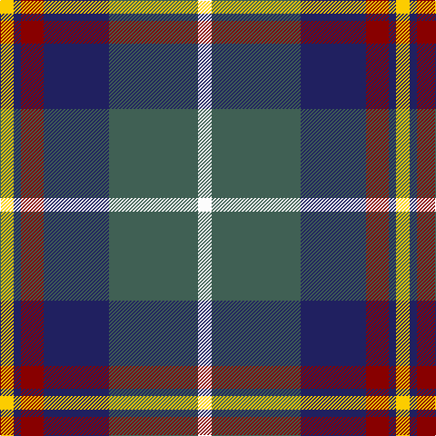

**Bands:** [YBRBGW](/stripes/ybrbgw/) · **Stripes:** [LY DB R DB Y W](/stripes/stripes6/) LY DB R DB Y W

This was sourced from tartans-authority.  It is a [6 band tartan](/bands/bands6/).

Original link http://www.tartansauthority.com/tartan-ferret/display/11278/

## Thread count
Y/15 DB8 DR25 DB72 N98 W/15

## Palette
Each colour and its ΔE from the base-6 reference it is a variant of.

| Colour | Shade | Base | ΔE (OKLab) |
|---|---|---|---|
| DB | <code style="background-color:#202060;">#202060</code> `#202060` | B <code style="background-color:#2A418A;">#2A418A</code> | 0.11 |
| DR | <code style="background-color:#880000;">#880000</code> `#880000` | R <code style="background-color:#CC0000;">#CC0000</code> | 0.15 |
| N | <code style="background-color:#406054;">#406054</code> `#406054` | G <code style="background-color:#006100;">#006100</code> | 0.11 |
| W | <code style="background-color:#FCFCFC;">#FCFCFC</code> `#FCFCFC` | W <code style="background-color:#F7F7F7;">#F7F7F7</code> | 0.01 |
| Y | <code style="background-color:#FCCC00;">#FCCC00</code> `#FCCC00` | Y <code style="background-color:#F2BF00;">#F2BF00</code> | 0.04 |

# Sample pattern

## Nearest tartans

The nearest existing variants by ΔTartan distance.

1. [Afternoon Tea / Black Tea](/setts/s6/m15dt8y25dt72n98w15/) — ΔT 0.45
1. [Ritchie, Stephen James (Personal)](/setts/s7/t4n19lr2k19n2lr25lb2~x2/) — ΔT 0.70
1. [Commonwealth Games Council (Corp.)](/setts/s6/m3k17n11m2o20w2~x2/) — ΔT 0.73
1. [Afternoon Tea / Darjeeling](/setts/s6/w15dg98dt72r25dt8ly15/) — ΔT 0.75
1. [State Seal of Washington (Fashion)](/setts/s7/b5dy28lb5k20lo5b47lo4~x2/) — ΔT 0.76
1. [Ballantyne (Personal) STWR](/setts/s8/db34dy9ly3dy9y30r3y11r5/) — ΔT 0.79
1. [MacFadzean/MacPhedran](/setts/s7/g3db12w1k12g13r2g2~x4/) — ΔT 0.83
1. [Jewell of Kernow (Personal)](/setts/s6/w6k29o29dp7k3r3~x2/) — ΔT 0.87
1. [Canine All Dogs](/setts/s6/r5t3g24db24r4ly2~x2/) — ΔT 0.87
1. [MacTavish Dress](/setts/s6/r4t28k6lb12k12lo3~x2/) — ΔT 0.91

## Neighbour map

Every grey dot is one of 14299 variants placed by the first two principal components of the ΔTartan feature space (44% of its variance). Red is this tartan; blue dots are its nearest — click one to open its page.

<svg viewBox="0 0 640 380" role="img" style="max-width:100%;height:auto;border:1px solid #e0e0e0;border-radius:4px;display:block" xmlns="http://www.w3.org/2000/svg"><image href="/nn/cloud.v1.png" width="640" height="380"/><a href="/setts/s6/m15dt8y25dt72n98w15/"><circle cx="211.7" cy="182.8" r="4" fill="#3465a4"><title>Afternoon Tea / Black Tea</title></circle></a><a href="/setts/s7/t4n19lr2k19n2lr25lb2~x2/"><circle cx="175.6" cy="167.6" r="4" fill="#3465a4"><title>Ritchie, Stephen James (Personal)</title></circle></a><a href="/setts/s6/m3k17n11m2o20w2~x2/"><circle cx="160.2" cy="191.2" r="4" fill="#3465a4"><title>Commonwealth Games Council (Corp.)</title></circle></a><a href="/setts/s6/w15dg98dt72r25dt8ly15/"><circle cx="206.2" cy="187.6" r="4" fill="#3465a4"><title>Afternoon Tea / Darjeeling</title></circle></a><a href="/setts/s7/b5dy28lb5k20lo5b47lo4~x2/"><circle cx="219.0" cy="176.9" r="4" fill="#3465a4"><title>State Seal of Washington (Fashion)</title></circle></a><a href="/setts/s8/db34dy9ly3dy9y30r3y11r5/"><circle cx="187.2" cy="174.1" r="4" fill="#3465a4"><title>Ballantyne (Personal) STWR</title></circle></a><a href="/setts/s7/g3db12w1k12g13r2g2~x4/"><circle cx="193.9" cy="187.3" r="4" fill="#3465a4"><title>MacFadzean/MacPhedran</title></circle></a><a href="/setts/s6/w6k29o29dp7k3r3~x2/"><circle cx="188.8" cy="177.3" r="4" fill="#3465a4"><title>Jewell of Kernow (Personal)</title></circle></a><a href="/setts/s6/r5t3g24db24r4ly2~x2/"><circle cx="218.8" cy="188.2" r="4" fill="#3465a4"><title>Canine All Dogs</title></circle></a><a href="/setts/s6/r4t28k6lb12k12lo3~x2/"><circle cx="168.3" cy="187.2" r="4" fill="#3465a4"><title>MacTavish Dress</title></circle></a><circle cx="203.2" cy="180.3" r="5" fill="#c00000"/></svg>

ID: /setts/s6/w15y98db72r25db8ly15/
