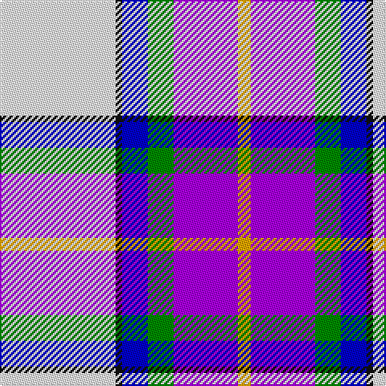

In pattern [WKBGBY](/patterns/wkbgby/).

This was sourced from register-of-tartans.  It is a [6 stripes tartan](/stripes/stripes6/).

Original link https://www.tartanregister.gov.uk/tartanDetails.aspx?ref=10216

## Thread count
W/72 K4 B16 G16 P40 Y/8

## Palette
Each colour and its ΔE from the base-6 reference it is a variant of.

| Colour | Shade | Base | ΔE (OKLab) |
|---|---|---|---|
| B | <code style="background-color:#0000CD;">#0000CD</code> `#0000CD` | B <code style="background-color:#2A418A;">#2A418A</code> | 0.14 |
| G | <code style="background-color:#008B00;">#008B00</code> `#008B00` | G <code style="background-color:#006100;">#006100</code> | 0.13 |
| K | <code style="background-color:#101010;">#101010</code> `#101010` | K <code style="background-color:#000000;">#000000</code> | 0.17 |
| P | <code style="background-color:#AA00FF;">#AA00FF</code> `#AA00FF` | B <code style="background-color:#2A418A;">#2A418A</code> | 0.28 |
| W | <code style="background-color:#FFFFFF;">#FFFFFF</code> `#FFFFFF` | W <code style="background-color:#F7F7F7;">#F7F7F7</code> | 0.02 |
| Y | <code style="background-color:#FFA500;">#FFA500</code> `#FFA500` | Y <code style="background-color:#F2BF00;">#F2BF00</code> | 0.06 |

# Sample pattern

## Nearest tartans

The nearest existing variants by ΔTartan distance.

1. [Edgar-Feyen (Personal)](/setts/s6/w18k1b4g4ba10y2x4~b2c2c80-ba780078-g006818-k101010-we0e0e0-yd87c00/) — ΔT 1.32
1. [St Andrews Links Dress](/setts/s7/w30b4w3ba2r2ba24wa2x2~b8968cd-ba551a8b-rcd5555-wfdf5e6-waffffff/) — ΔT 1.61
1. [Manx Dress](/setts/s6/g4w28b8y2ba17g4x2~b780078-ba2c2c80-g006818-we0e0e0-ye8c000/) — ΔT 1.63
1. [Alexander of Menstry Dress](/setts/s8/b5w30y9k9ba9g2ba2g5x2~b2c2c80-ba780078-g006818-k101010-wf8f8f8-ya0a0a0/) — ΔT 1.64
1. [Pipers' Trail Dance, The](/setts/s6/k6w49b50ba6bb8y4~b202060-ba780078-bb2c2c80-k101010-wfcfcfc-yfccc00/) — ΔT 1.67
1. [Dignan](/setts/s7/y2r1b16k5ba2w11ba1x4~b5480b0-ba800080-k000000-rc00000-we0e0e0-yf0c000/) — ΔT 1.68
1. [Manx, dress](/setts/s6/g4w28b8y2ba17g4x2~b800080-ba304080-g008000-we0e0e0-yf0c000/) — ΔT 1.69
1. [Jubilee, South Canterbury Centre Piping & Dancing Association](/setts/s8/b36ba5g5w2r4w2ra9w22x2~b0596fa-ba2c4084-g3c7846-rc82828-ra781c38-we0e0e0/) — ΔT 1.70
1. [Edinburgh Dress (Dance)](/setts/s10/w4k2w30g3b3g3b7ba14g3r3x2~b780078-ba2c2c80-g006818-k101010-rc80000-wfcfcfc/) — ΔT 1.71
1. [St Andrews Dress, Earl of.. District Tartan Tartan Number: 45. Earliest known date: pre 2003 See products available Copyright © Blair Urquhart, Comrie, 2015](/setts/s7/w28b19ba19w4bb2wa2ba7x2~b5c8ca8-ba2c2c80-bb202060-we0e0e0-wac49cd8/) — ΔT 1.71

## Neighbour map

Every grey dot is one of 15726 variants placed by the first two principal components of the ΔTartan feature space (44% of its variance). Red is this tartan; blue dots are its nearest — click one to open its page.

<svg viewBox="0 0 640 380" role="img" style="max-width:100%;height:auto;border:1px solid #e0e0e0;border-radius:4px;display:block" xmlns="http://www.w3.org/2000/svg"><image href="/nn/cloud.v1.png" width="640" height="380"/><a href="/setts/s6/w18k1b4g4ba10y2x4~b2c2c80-ba780078-g006818-k101010-we0e0e0-yd87c00/"><circle cx="182.6" cy="123.7" r="4" fill="#3465a4"><title>Edgar-Feyen (Personal)</title></circle></a><a href="/setts/s7/w30b4w3ba2r2ba24wa2x2~b8968cd-ba551a8b-rcd5555-wfdf5e6-waffffff/"><circle cx="246.4" cy="119.9" r="4" fill="#3465a4"><title>St Andrews Links Dress</title></circle></a><a href="/setts/s6/g4w28b8y2ba17g4x2~b780078-ba2c2c80-g006818-we0e0e0-ye8c000/"><circle cx="178.9" cy="153.5" r="4" fill="#3465a4"><title>Manx Dress</title></circle></a><a href="/setts/s8/b5w30y9k9ba9g2ba2g5x2~b2c2c80-ba780078-g006818-k101010-wf8f8f8-ya0a0a0/"><circle cx="129.1" cy="109.3" r="4" fill="#3465a4"><title>Alexander of Menstry Dress</title></circle></a><a href="/setts/s6/k6w49b50ba6bb8y4~b202060-ba780078-bb2c2c80-k101010-wfcfcfc-yfccc00/"><circle cx="156.2" cy="131.7" r="4" fill="#3465a4"><title>Pipers' Trail Dance, The</title></circle></a><a href="/setts/s7/y2r1b16k5ba2w11ba1x4~b5480b0-ba800080-k000000-rc00000-we0e0e0-yf0c000/"><circle cx="157.0" cy="117.7" r="4" fill="#3465a4"><title>Dignan</title></circle></a><a href="/setts/s6/g4w28b8y2ba17g4x2~b800080-ba304080-g008000-we0e0e0-yf0c000/"><circle cx="182.2" cy="154.2" r="4" fill="#3465a4"><title>Manx, dress</title></circle></a><a href="/setts/s8/b36ba5g5w2r4w2ra9w22x2~b0596fa-ba2c4084-g3c7846-rc82828-ra781c38-we0e0e0/"><circle cx="186.3" cy="111.9" r="4" fill="#3465a4"><title>Jubilee, South Canterbury Centre Piping &amp; Dancing Association</title></circle></a><a href="/setts/s10/w4k2w30g3b3g3b7ba14g3r3x2~b780078-ba2c2c80-g006818-k101010-rc80000-wfcfcfc/"><circle cx="171.3" cy="87.1" r="4" fill="#3465a4"><title>Edinburgh Dress (Dance)</title></circle></a><a href="/setts/s7/w28b19ba19w4bb2wa2ba7x2~b5c8ca8-ba2c2c80-bb202060-we0e0e0-wac49cd8/"><circle cx="166.8" cy="156.4" r="4" fill="#3465a4"><title>St Andrews Dress, Earl of.. District Tartan Tartan Number: 45. Earliest known date: pre 2003 See products available Copyright © Blair Urquhart, Comrie, 2015</title></circle></a><circle cx="170.4" cy="116.4" r="5" fill="#c00000"/></svg>

ID: /setts/s6/w18k1b4g4ba10y2x4~b0000cd-baaa00ff-g008b00-k101010-wffffff-yffa500/
