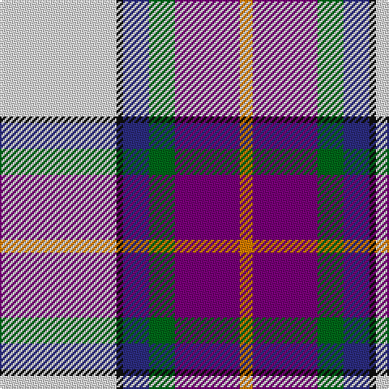

This page is one **sett** — a single exact thread-count. It belongs to the [tartan](/tartans/w18k1db4g4dp10lo2/)
(the same proportion at any scale), whose colour order is pattern [WKBGBY](/stripes/wkbgby/).

Sourced from tartans-authority.  It is a [6 stripe tartan](/stripes/stripes6/).

Original link http://www.tartansauthority.com/tartan-ferret/display/10216/

## Register references

External register numbers recorded for this tartan.

- Scottish Register of Tartans: [10216](https://www.tartanregister.gov.uk/tartanDetails?ref=10216)
- Scottish Tartans Authority (ITI): 10216

## Thread count
LN/72 K4 DB16 G16 P40 O/8

## Palette

Palette: <strong>Tartan Register</strong>
<table><thead><tr><th>Colour</th><th>Threads</th><th>Shade</th><th>Base</th><th>OKLCh</th></tr></thead><tbody><tr><td>LN/</td><td style="text-align:right;font-variant-numeric:tabular-nums">72</td><td><code style="background-color:#E0E0E0;">#E0E0E0</code> <small style="color:#888">#E0E0E0</small></td><td>W <code style="background-color:#F7F7F7;">#F7F7F7</code></td><td><small style="color:#888">oklch(90.7% 0.000 89.9)</small></td></tr><tr><td>K</td><td style="text-align:right;font-variant-numeric:tabular-nums">4</td><td><code style="background-color:#101010;">#101010</code> <small style="color:#888">#101010</small></td><td>K <code style="background-color:#000000;">#000000</code></td><td><small style="color:#888">oklch(17.3% 0.000 89.9)</small></td></tr><tr><td>DB</td><td style="text-align:right;font-variant-numeric:tabular-nums">16</td><td><code style="background-color:#2C2C80;">#2C2C80</code> <small style="color:#888">#2C2C80</small></td><td>B <code style="background-color:#2A418A;">#2A418A</code></td><td><small style="color:#888">oklch(35.0% 0.138 276.6)</small></td></tr><tr><td>G</td><td style="text-align:right;font-variant-numeric:tabular-nums">16</td><td><code style="background-color:#006818;">#006818</code> <small style="color:#888">#006818</small></td><td>G <code style="background-color:#006100;">#006100</code></td><td><small style="color:#888">oklch(45.0% 0.142 145.0)</small></td></tr><tr><td>P</td><td style="text-align:right;font-variant-numeric:tabular-nums">40</td><td><code style="background-color:#780078;">#780078</code> <small style="color:#888">#780078</small></td><td>B <code style="background-color:#2A418A;">#2A418A</code></td><td><small style="color:#888">oklch(40.2% 0.185 328.4)</small></td></tr><tr><td>O/</td><td style="text-align:right;font-variant-numeric:tabular-nums">8</td><td><code style="background-color:#D87C00;">#D87C00</code> <small style="color:#888">#D87C00</small></td><td>Y <code style="background-color:#F2BF00;">#F2BF00</code></td><td><small style="color:#888">oklch(67.3% 0.155 61.8)</small></td></tr></tbody></table>

# Sample pattern

## Nearest tartans

The nearest existing variants by ΔTartan distance, with this tartan at the top so the swatches line up against it.

ΔTartan

Tartan

Sett

—

<a href="/ttd/edit/#slug=w18k1db4g4dp10lo2~x4">Edgar-Feyen (Personal)</a> <a class="nn-out" href="/setts/s6/w18k1db4g4dp10lo2~x4/" title="open its dictionary page">↗</a>

0.93

<a href="/ttd/edit/#slug=ly2r1t16k5p2w11p1~x4">Dignan</a> <a class="nn-out" href="/setts/s7/ly2r1t16k5p2w11p1~x4/" title="open its dictionary page">↗</a>

1.03

<a href="/ttd/edit/#slug=db5w30lr9k9dp9g2dp2g5~x2">Alexander of Menstry Dress</a> <a class="nn-out" href="/setts/s8/db5w30lr9k9dp9g2dp2g5~x2/" title="open its dictionary page">↗</a>

1.10

<a href="/ttd/edit/#slug=w8g5t10dp24w30g2lp2~x2">Shiel, Purple (Dance)</a> <a class="nn-out" href="/setts/s7/w8g5t10dp24w30g2lp2~x2/" title="open its dictionary page">↗</a>

1.10

<a href="/ttd/edit/#slug=g4w28dp8ly2db17g4~x2">Manx Dress</a> <a class="nn-out" href="/setts/s6/g4w28dp8ly2db17g4~x2/" title="open its dictionary page">↗</a>

1.12

<a href="/ttd/edit/#slug=w8b5t10dp24w30b2dg2~x2">Shiel, Magenta (Dance)</a> <a class="nn-out" href="/setts/s7/w8b5t10dp24w30b2dg2~x2/" title="open its dictionary page">↗</a>

1.12

<a href="/ttd/edit/#slug=w37k4db12g12w2lr2r23w4r6~x2">Hebridean Arisaid, Red/White (Dance)</a> <a class="nn-out" href="/setts/s9/w37k4db12g12w2lr2r23w4r6~x2/" title="open its dictionary page">↗</a>

1.16

<a href="/ttd/edit/#slug=g4w28p8ly2db17g4~x2">Manx, dress</a> <a class="nn-out" href="/setts/s6/g4w28p8ly2db17g4~x2/" title="open its dictionary page">↗</a>

1.17

<a href="/ttd/edit/#slug=r3w30db10k3dp15g2dp3g1~x2">S.O.B.H.D. (Corporate)</a> <a class="nn-out" href="/setts/s8/r3w30db10k3dp15g2dp3g1~x2/" title="open its dictionary page">↗</a>

1.25

<a href="/ttd/edit/#slug=k6w49db50dp6dbi8ly4">Pipers' Trail Dance, The</a> <a class="nn-out" href="/setts/s6/k6w49db50dp6dbi8ly4/" title="open its dictionary page">↗</a>

1.32

<a href="/ttd/edit/#slug=w18k1db4g4p10lo2~x4">Edgar-Feyen</a> <a class="nn-out" href="/setts/s6/w18k1db4g4p10lo2~x4/" title="open its dictionary page">↗</a>

## Neighbour map

Every grey dot is one of 14359 variants placed by the first two principal components of the ΔTartan feature space (44% of its variance). Red is this tartan; blue dots are its nearest — click one to open its page.

<svg viewBox="0 0 640 380" role="img" style="max-width:100%;height:auto;border:1px solid #e0e0e0;border-radius:4px;display:block" xmlns="http://www.w3.org/2000/svg"><image href="/nn/cloud.v1.png" width="640" height="380"/><a href="/setts/s7/ly2r1t16k5p2w11p1~x4/"><circle cx="159.1" cy="116.6" r="4" fill="#3465a4"><title>Dignan</title></circle></a><a href="/setts/s8/db5w30lr9k9dp9g2dp2g5~x2/"><circle cx="130.8" cy="107.6" r="4" fill="#3465a4"><title>Alexander of Menstry Dress</title></circle></a><a href="/setts/s7/w8g5t10dp24w30g2lp2~x2/"><circle cx="197.8" cy="138.1" r="4" fill="#3465a4"><title>Shiel, Purple (Dance)</title></circle></a><a href="/setts/s6/g4w28dp8ly2db17g4~x2/"><circle cx="180.7" cy="151.4" r="4" fill="#3465a4"><title>Manx Dress</title></circle></a><a href="/setts/s7/w8b5t10dp24w30b2dg2~x2/"><circle cx="207.5" cy="141.1" r="4" fill="#3465a4"><title>Shiel, Magenta (Dance)</title></circle></a><a href="/setts/s9/w37k4db12g12w2lr2r23w4r6~x2/"><circle cx="164.6" cy="98.4" r="4" fill="#3465a4"><title>Hebridean Arisaid, Red/White (Dance)</title></circle></a><a href="/setts/s6/g4w28p8ly2db17g4~x2/"><circle cx="183.8" cy="152.5" r="4" fill="#3465a4"><title>Manx, dress</title></circle></a><a href="/setts/s8/r3w30db10k3dp15g2dp3g1~x2/"><circle cx="203.3" cy="74.9" r="4" fill="#3465a4"><title>S.O.B.H.D. (Corporate)</title></circle></a><a href="/setts/s6/k6w49db50dp6dbi8ly4/"><circle cx="158.4" cy="129.3" r="4" fill="#3465a4"><title>Pipers' Trail Dance, The</title></circle></a><a href="/setts/s6/w18k1db4g4p10lo2~x4/"><circle cx="171.6" cy="113.5" r="4" fill="#3465a4"><title>Edgar-Feyen</title></circle></a><circle cx="183.6" cy="121.3" r="5" fill="#c00000"/></svg>

ID: /setts/s6/w18k1db4g4dp10lo2~x4/
