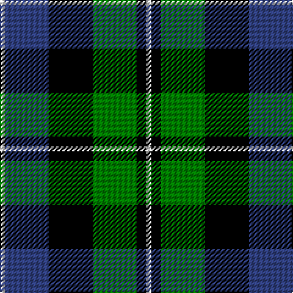

In pattern [WBKGKW](/patterns/wbkgkw/).

This was sourced from weddslist.  It is a [6 stripes tartan](/stripes/stripes6/).

Original link http://www.weddslist.com/cgi-bin/tartans/pg.pl?source=sts

## Thread count
LN/4 B36 K36 G36 K8 LN/4

## Palette
Each colour and its ΔE from the base-6 reference it is a variant of.

| Colour | Shade | Base | ΔE (OKLab) |
|---|---|---|---|
| B | <code style="background-color:#304080;">#304080</code> `#304080` | B <code style="background-color:#2A418A;">#2A418A</code> | 0.02 |
| G | <code style="background-color:#008000;">#008000</code> `#008000` | G <code style="background-color:#006100;">#006100</code> | 0.10 |
| K | <code style="background-color:#000000;">#000000</code> `#000000` | K <code style="background-color:#000000;">#000000</code> | 0.00 |
| LN | <code style="background-color:#E0E0E0;">#E0E0E0</code> `#E0E0E0` | W <code style="background-color:#F7F7F7;">#F7F7F7</code> | 0.07 |

# Sample pattern

## Nearest tartans

The nearest existing variants by ΔTartan distance.

1. [Ferguson](/setts/s6/g4b24r3k24g25k4~b304080-g008000-k000000-rc00000~x2/) — ΔT 0.43
1. [Melville](/setts/s6/k4w2g18k13b12k2~b304080-g008000-k000000-we0e0e0~x2/) — ΔT 0.43
1. [Unnamed, No 59](/setts/s6/b1ba11k11g11k2b1~b5480b0-ba304080-g008000-k000000~x2/) — ΔT 0.50
1. [Graham of Montrose](/setts/s6/g4b15w2k16g19k4~b304080-g008000-k000000-we0e0e0~x2/) — ΔT 0.59
1. [Unnamed, No 26](/setts/s6/w4b4g22k20b20w3~b304080-g008000-k000000-we0e0e0/) — ΔT 0.60
1. [Reid Taylor, "House Check"](/setts/s7/b2k1r1b9k9g10k2~b304080-g008000-k000000-rc00000~x2/) — ΔT 0.61
1. [Morrison](/setts/s6/k3g14k14g2b14r3~b304080-g008000-k000000-rc00000~x2/) — ΔT 0.62
1. [Ferguson of Balquhidder](/setts/s6/g2b12r1k12g12k2~b304080-g008000-k000000-rc00000~x2/) — ΔT 0.62
1. [Gunn](/setts/s6/r2g12k12g1b12g1~b304080-g008000-k000000-rc00000~x2/) — ΔT 0.63
1. [Campbell, The White Stripe](/setts/s6/b2k2b12k11g12w2~b304080-g008000-k000000-we0e0e0~x2/) — ΔT 0.66

## Neighbour map

Every grey dot is one of 15726 variants placed by the first two principal components of the ΔTartan feature space (44% of its variance). Red is this tartan; blue dots are its nearest — click one to open its page.

<svg viewBox="0 0 640 380" role="img" style="max-width:100%;height:auto;border:1px solid #e0e0e0;border-radius:4px;display:block" xmlns="http://www.w3.org/2000/svg"><image href="/nn/cloud.v1.png" width="640" height="380"/><a href="/setts/s6/g4b24r3k24g25k4~b304080-g008000-k000000-rc00000~x2/"><circle cx="151.1" cy="225.4" r="4" fill="#3465a4"><title>Ferguson</title></circle></a><a href="/setts/s6/k4w2g18k13b12k2~b304080-g008000-k000000-we0e0e0~x2/"><circle cx="155.7" cy="222.4" r="4" fill="#3465a4"><title>Melville</title></circle></a><a href="/setts/s6/b1ba11k11g11k2b1~b5480b0-ba304080-g008000-k000000~x2/"><circle cx="163.5" cy="212.1" r="4" fill="#3465a4"><title>Unnamed, No 59</title></circle></a><a href="/setts/s6/g4b15w2k16g19k4~b304080-g008000-k000000-we0e0e0~x2/"><circle cx="158.2" cy="225.0" r="4" fill="#3465a4"><title>Graham of Montrose</title></circle></a><a href="/setts/s6/w4b4g22k20b20w3~b304080-g008000-k000000-we0e0e0/"><circle cx="114.0" cy="225.2" r="4" fill="#3465a4"><title>Unnamed, No 26</title></circle></a><a href="/setts/s7/b2k1r1b9k9g10k2~b304080-g008000-k000000-rc00000~x2/"><circle cx="166.2" cy="207.6" r="4" fill="#3465a4"><title>Reid Taylor, &quot;House Check&quot;</title></circle></a><a href="/setts/s6/k3g14k14g2b14r3~b304080-g008000-k000000-rc00000~x2/"><circle cx="133.2" cy="235.5" r="4" fill="#3465a4"><title>Morrison</title></circle></a><a href="/setts/s6/g2b12r1k12g12k2~b304080-g008000-k000000-rc00000~x2/"><circle cx="167.5" cy="211.8" r="4" fill="#3465a4"><title>Ferguson of Balquhidder</title></circle></a><a href="/setts/s6/r2g12k12g1b12g1~b304080-g008000-k000000-rc00000~x2/"><circle cx="169.2" cy="206.0" r="4" fill="#3465a4"><title>Gunn</title></circle></a><a href="/setts/s6/b2k2b12k11g12w2~b304080-g008000-k000000-we0e0e0~x2/"><circle cx="125.5" cy="236.5" r="4" fill="#3465a4"><title>Campbell, The White Stripe</title></circle></a><circle cx="142.4" cy="217.5" r="5" fill="#c00000"/></svg>

ID: /setts/s6/w1b9k9g9k2w1~b304080-g008000-k000000-we0e0e0~x4/
