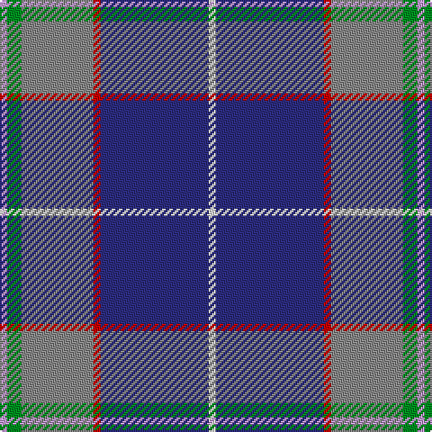

In pattern [WBRRGW](/stripes/wbrrgw/).

This was sourced from tartans-authority.  It is a [6 stripe tartan](/stripes/stripes6/).

Original link http://www.tartansauthority.com/tartan-ferret/display/10127/

## Thread count
LP/4 G8 N40 R4 DB60 LN/4

## Palette
Each colour and its ΔE from the base-6 reference it is a variant of.

| Colour | Shade | Base | ΔE (OKLab) |
|---|---|---|---|
| DB | <code style="background-color:#2C2C80;">#2C2C80</code> `#2C2C80` | B <code style="background-color:#2A418A;">#2A418A</code> | 0.06 |
| G | <code style="background-color:#009020;">#009020</code> `#009020` | G <code style="background-color:#006100;">#006100</code> | 0.15 |
| LN | <code style="background-color:#E0E0E0;">#E0E0E0</code> `#E0E0E0` | W <code style="background-color:#F7F7F7;">#F7F7F7</code> | 0.07 |
| LP | <code style="background-color:#C49CD8;">#C49CD8</code> `#C49CD8` | W <code style="background-color:#F7F7F7;">#F7F7F7</code> | 0.25 |
| N | <code style="background-color:#888888;">#888888</code> `#888888` | R <code style="background-color:#CC0000;">#CC0000</code> | 0.24 |
| R | <code style="background-color:#C80000;">#C80000</code> `#C80000` | R <code style="background-color:#CC0000;">#CC0000</code> | 0.01 |

# Sample pattern

## Nearest tartans

The nearest existing variants by ΔTartan distance.

1. [Shearer (2016)](/setts/s6/k4n4dt32r4t17w2~x2/) — ΔT 0.75
1. [Los Angeles](/setts/s8/ly4db24t5g2db3k5t33r2~x2/) — ΔT 0.88
1. [Blue Ridge Highlands Heritage](/setts/s8/t27db9lb3g6db33lb3dr3ly2~x2/) — ΔT 0.95
1. [Margach, William (Personal)](/setts/s6/m4k3b18r3dt34w3~x2/) — ΔT 1.03
1. [Wrigglesworth (Name)](/setts/s7/db30b10lb10db5m3ly3g3~x2/) — ΔT 1.05
1. [Heirloom Blue Alba (Fashion)](/setts/s9/t4lo2t34db10lr4db4dp4db23w3~x2/) — ΔT 1.06
1. [Pride of the Nation (Fashion)](/setts/s8/t12db6t50db39p12dp6p6w4/) — ΔT 1.08
1. [Gamblin Thompson (Personal)](/setts/s6/t2g13r2k6db23w1~x4/) — ΔT 1.09
1. [Oren Peterson](/setts/s6/m1g2t10r1db15w1~x4/) — ΔT 1.19
1. [Lambert, Patrice (Personal)](/setts/s8/w1dp3g6k1db12ly1db2ly1~x4/) — ΔT 1.20

## Neighbour map

Every grey dot is one of 14299 variants placed by the first two principal components of the ΔTartan feature space (44% of its variance). Red is this tartan; blue dots are its nearest — click one to open its page.

<svg viewBox="0 0 640 380" role="img" style="max-width:100%;height:auto;border:1px solid #e0e0e0;border-radius:4px;display:block" xmlns="http://www.w3.org/2000/svg"><image href="/nn/cloud.v1.png" width="640" height="380"/><a href="/setts/s6/k4n4dt32r4t17w2~x2/"><circle cx="249.5" cy="150.3" r="4" fill="#3465a4"><title>Shearer (2016)</title></circle></a><a href="/setts/s8/ly4db24t5g2db3k5t33r2~x2/"><circle cx="251.2" cy="128.4" r="4" fill="#3465a4"><title>Los Angeles</title></circle></a><a href="/setts/s8/t27db9lb3g6db33lb3dr3ly2~x2/"><circle cx="263.6" cy="146.0" r="4" fill="#3465a4"><title>Blue Ridge Highlands Heritage</title></circle></a><a href="/setts/s6/m4k3b18r3dt34w3~x2/"><circle cx="276.1" cy="175.6" r="4" fill="#3465a4"><title>Margach, William (Personal)</title></circle></a><a href="/setts/s7/db30b10lb10db5m3ly3g3~x2/"><circle cx="238.7" cy="159.6" r="4" fill="#3465a4"><title>Wrigglesworth (Name)</title></circle></a><a href="/setts/s9/t4lo2t34db10lr4db4dp4db23w3~x2/"><circle cx="238.0" cy="130.4" r="4" fill="#3465a4"><title>Heirloom Blue Alba (Fashion)</title></circle></a><a href="/setts/s8/t12db6t50db39p12dp6p6w4/"><circle cx="217.4" cy="153.1" r="4" fill="#3465a4"><title>Pride of the Nation (Fashion)</title></circle></a><a href="/setts/s6/t2g13r2k6db23w1~x4/"><circle cx="268.5" cy="149.0" r="4" fill="#3465a4"><title>Gamblin Thompson (Personal)</title></circle></a><a href="/setts/s6/m1g2t10r1db15w1~x4/"><circle cx="246.2" cy="144.0" r="4" fill="#3465a4"><title>Oren Peterson</title></circle></a><a href="/setts/s8/w1dp3g6k1db12ly1db2ly1~x4/"><circle cx="235.4" cy="144.8" r="4" fill="#3465a4"><title>Lambert, Patrice (Personal)</title></circle></a><circle cx="270.1" cy="149.8" r="5" fill="#c00000"/></svg>

ID: /setts/s6/w1db15r1o10g2lp1~x4/
