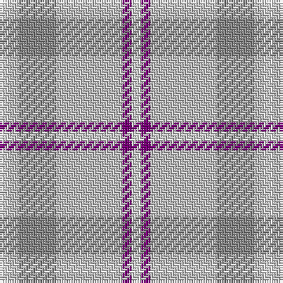

This page is one **sett** — a single exact thread-count. It belongs to the [tartan](/tartans/ln1p1na7n4na1ln1/)
(the same proportion at any scale), whose colour order is pattern [WBWRWW](/stripes/wbwrww/).

Sourced from house-of-tartan.  It is a [6 stripe tartan](/stripes/stripes6/).

Original link http://www.house-of-tartan.scotland.net/house/TartanViewjs.asp?colr=Def&tnam=1771

## Also known as

This cloth is also recorded under:

- Lochnagar Plaid

## Thread count
LN/4 P4 Na28 N16 Na4 LN/4

## Palette
Each colour and the base-6 reference it is a variant of.

| Colour | Shade | Base |
|---|---|---|
| LN | <code style="background-color:#E0E0E0;">#E0E0E0</code> `oklch(90.7% 0.000 89.9)` <small>#E0E0E0</small> | W <code style="background-color:#F7F7F7;">#F7F7F7</code> |
| N | <code style="background-color:#888888;">#888888</code> `oklch(62.7% 0.000 89.9)` <small>#888888</small> | R <code style="background-color:#CC0000;">#CC0000</code> |
| Na | <code style="background-color:#C0C0C0;">#C0C0C0</code> `oklch(80.8% 0.000 89.9)` <small>#C0C0C0</small> | W <code style="background-color:#F7F7F7;">#F7F7F7</code> |
| P | <code style="background-color:#780078;">#780078</code> `oklch(40.2% 0.185 328.4)` <small>#780078</small> | B <code style="background-color:#2A418A;">#2A418A</code> |

# Sample pattern

## Nearest tartans

The nearest existing variants by ΔTartan distance, with this tartan at the top so the swatches line up against it.

ΔTartan

Tartan

Sett

—

<a href="/ttd/edit/#slug=w1dp1lb7o4lb1w1~x4">Lochnagar Trade Tartan Tartan Number: 1771. Earliest known date: pre 2003 Colours represents the Scottish hills, the water, and the heather. See products available Copyright © Blair Urquhart, Comrie, 2015</a> <a class="nn-out" href="/setts/s6/w1dp1lb7o4lb1w1~x4/" title="open its dictionary page">↗</a>

1.29

<a href="/ttd/edit/#slug=w1dp1o7n4o1w1~x4">Lochnagar Plaid (District)</a> <a class="nn-out" href="/setts/s6/w1dp1o7n4o1w1~x4/" title="open its dictionary page">↗</a>

1.40

<a href="/ttd/edit/#slug=n2w2ly7lb14n2w2~x2">Cairngorm</a> <a class="nn-out" href="/setts/s6/n2w2ly7lb14n2w2~x2/" title="open its dictionary page">↗</a>

1.46

<a href="/ttd/edit/#slug=lr30w3lr3w3lr12n30o3n5~x2">Dama Classic (Fashion)</a> <a class="nn-out" href="/setts/s8/lr30w3lr3w3lr12n30o3n5~x2/" title="open its dictionary page">↗</a>

1.62

<a href="/ttd/edit/#slug=n2w2ly7o14n2w2~x2">Cairngorm</a> <a class="nn-out" href="/setts/s6/n2w2ly7o14n2w2~x2/" title="open its dictionary page">↗</a>

1.65

<a href="/ttd/edit/#slug=g2t15lr5g2t2g7w2~x4">Chambers Bay</a> <a class="nn-out" href="/setts/s7/g2t15lr5g2t2g7w2~x4/" title="open its dictionary page">↗</a>

1.77

<a href="/ttd/edit/#slug=r1lg9lr9k1lr1w1~x6">Irving of Glentulchan (Personal)</a> <a class="nn-out" href="/setts/s6/r1lg9lr9k1lr1w1~x6/" title="open its dictionary page">↗</a>

1.84

<a href="/ttd/edit/#slug=m3o2m6o21lr2o4lr3o3lr4o2lr13w2~x2">Qatar Airways</a> <a class="nn-out" href="/setts/s12/m3o2m6o21lr2o4lr3o3lr4o2lr13w2~x2/" title="open its dictionary page">↗</a>

1.85

<a href="/ttd/edit/#slug=lb4n2lb18r2n5o16r2o2r2o2~x2">Clyde Trade Tartan Tartan Number: 1296. Earliest known date: pre 1992 See Strathclyde District See products available Copyright © Blair Urquhart, Comrie, 2015</a> <a class="nn-out" href="/setts/s10/lb4n2lb18r2n5o16r2o2r2o2~x2/" title="open its dictionary page">↗</a>

1.87

<a href="/ttd/edit/#slug=y25p3y8p13ly8lr2ly11y2p3~x2">Organic</a> <a class="nn-out" href="/setts/s9/y25p3y8p13ly8lr2ly11y2p3~x2/" title="open its dictionary page">↗</a>

1.95

<a href="/ttd/edit/#slug=lb1o12r1dt1r1dt2r5lb1~x4">Tenmaya Check</a> <a class="nn-out" href="/setts/s8/lb1o12r1dt1r1dt2r5lb1~x4/" title="open its dictionary page">↗</a>

## Neighbour map

Every grey dot is one of 14299 variants placed by the first two principal components of the ΔTartan feature space (44% of its variance). Red is this tartan; blue dots are its nearest — click one to open its page.

<svg viewBox="0 0 640 380" role="img" style="max-width:100%;height:auto;border:1px solid #e0e0e0;border-radius:4px;display:block" xmlns="http://www.w3.org/2000/svg"><image href="/nn/cloud.v1.png" width="640" height="380"/><a href="/setts/s6/w1dp1o7n4o1w1~x4/"><circle cx="311.1" cy="230.7" r="4" fill="#3465a4"><title>Lochnagar Plaid (District)</title></circle></a><a href="/setts/s6/n2w2ly7lb14n2w2~x2/"><circle cx="262.9" cy="213.8" r="4" fill="#3465a4"><title>Cairngorm</title></circle></a><a href="/setts/s8/lr30w3lr3w3lr12n30o3n5~x2/"><circle cx="344.0" cy="207.7" r="4" fill="#3465a4"><title>Dama Classic (Fashion)</title></circle></a><a href="/setts/s6/n2w2ly7o14n2w2~x2/"><circle cx="251.6" cy="211.6" r="4" fill="#3465a4"><title>Cairngorm</title></circle></a><a href="/setts/s7/g2t15lr5g2t2g7w2~x4/"><circle cx="305.7" cy="243.2" r="4" fill="#3465a4"><title>Chambers Bay</title></circle></a><a href="/setts/s6/r1lg9lr9k1lr1w1~x6/"><circle cx="299.5" cy="213.9" r="4" fill="#3465a4"><title>Irving of Glentulchan (Personal)</title></circle></a><a href="/setts/s12/m3o2m6o21lr2o4lr3o3lr4o2lr13w2~x2/"><circle cx="307.4" cy="176.9" r="4" fill="#3465a4"><title>Qatar Airways</title></circle></a><a href="/setts/s10/lb4n2lb18r2n5o16r2o2r2o2~x2/"><circle cx="263.5" cy="186.9" r="4" fill="#3465a4"><title>Clyde Trade Tartan Tartan Number: 1296. Earliest known date: pre 1992 See Strathclyde District See products available Copyright © Blair Urquhart, Comrie, 2015</title></circle></a><a href="/setts/s9/y25p3y8p13ly8lr2ly11y2p3~x2/"><circle cx="269.8" cy="190.4" r="4" fill="#3465a4"><title>Organic</title></circle></a><a href="/setts/s8/lb1o12r1dt1r1dt2r5lb1~x4/"><circle cx="341.6" cy="181.8" r="4" fill="#3465a4"><title>Tenmaya Check</title></circle></a><circle cx="318.5" cy="229.7" r="5" fill="#c00000"/></svg>

ID: /setts/s6/w1dp1lb7o4lb1w1~x4/
