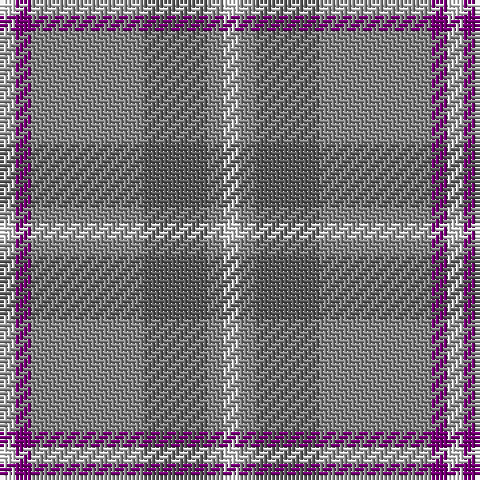

In pattern [WBRBRW](/stripes/wbrbrw/).

This was sourced from tartans-authority.  It is a [6 stripe tartan](/stripes/stripes6/).

Original link http://www.tartansauthority.com/tartan-ferret/display/1771/

## Also known as

This cloth is also recorded under:

- Lochnagar Plaid

## Attestations

This cloth appears in 2 source records; the oldest owns this page.

- pre 1974 — Lochnagar Plaid (District) (tartans-authority, [record](http://www.tartansauthority.com/tartan-ferret/display/1771/))
- 01/01/2002 — Lochnagar (register-of-tartans, [record](https://www.tartanregister.gov.uk/tartanDetails.aspx?ref=2176))

## Register references

External register numbers recorded for this tartan.

- Scottish Register of Tartans: [2176](https://www.tartanregister.gov.uk/tartanDetails.aspx?ref=2176)
- Scottish Tartans Authority (ITI): 1771
- Scottish Tartans World Register: 1771

## Thread count
LN/4 P4 Na28 N16 Na4 LN/4

## Palette
Each colour and its ΔE from the base-6 reference it is a variant of.

| Colour | Shade | Base | ΔE (OKLab) |
|---|---|---|---|
| LN | <code style="background-color:#E0E0E0;">#E0E0E0</code> `#E0E0E0` | W <code style="background-color:#F7F7F7;">#F7F7F7</code> | 0.07 |
| N | <code style="background-color:#5C5C5C;">#5C5C5C</code> `#5C5C5C` | B <code style="background-color:#2A418A;">#2A418A</code> | 0.15 |
| Na | <code style="background-color:#888888;">#888888</code> `#888888` | R <code style="background-color:#CC0000;">#CC0000</code> | 0.24 |
| P | <code style="background-color:#780078;">#780078</code> `#780078` | B <code style="background-color:#2A418A;">#2A418A</code> | 0.17 |

# Sample pattern

## Nearest tartans

The nearest existing variants by ΔTartan distance.

1. [Dama Classic (Fashion)](/setts/s8/lr30w3lr3w3lr12n30o3n5~x2/) — ΔT 1.11
1. [Balfour blue & brown](/setts/s6/db18ly2o6ly2o19r3~x2/) — ΔT 1.17
1. [Lochnagar Trade Tartan Tartan Number: 1771. Earliest known date: pre 2003 Colours represents the Scottish hills, the water, and the heather. See products available Copyright © Blair Urquhart, Comrie, 2015](/setts/s6/w1dp1lb7o4lb1w1~x4/) — ΔT 1.29
1. [Dundhuin Dress (Personal)](/setts/s5/o62t17ly12g8dg8~x2/) — ΔT 1.31
1. [Cairngorm](/setts/s6/n2w2ly7o14n2w2~x2/) — ΔT 1.46
1. [Chambers Bay](/setts/s7/g2t15lr5g2t2g7w2~x4/) — ΔT 1.50
1. [Gammell (Personal)](/setts/s8/t32r3t3r3t3r10g24r3~x2/) — ΔT 1.54
1. [Tenmaya Check](/setts/s8/lb1o12r1dt1r1dt2r5lb1~x4/) — ΔT 1.54
1. [Devlin, Craig (Personal)](/setts/s6/g8w3n6db11n30db5~x2/) — ΔT 1.60
1. [Brodie Silver Clan Tartan Tartan Number: 1630. Earliest known date: c.1940-50 Probably a trade design based on Hunting Brodie, that has appeared in the last forty years. It is sometimes referred to as muted Brodie. (P.E. MacDonald, STS 1984) See products available Copyright © Blair Urquhart, Comrie, 2015](/setts/s7/r3n20ly2n20o20lb20r3~x2/) — ΔT 1.63

## Neighbour map

Every grey dot is one of 14299 variants placed by the first two principal components of the ΔTartan feature space (44% of its variance). Red is this tartan; blue dots are its nearest — click one to open its page.

<svg viewBox="0 0 640 380" role="img" style="max-width:100%;height:auto;border:1px solid #e0e0e0;border-radius:4px;display:block" xmlns="http://www.w3.org/2000/svg"><image href="/nn/cloud.v1.png" width="640" height="380"/><a href="/setts/s8/lr30w3lr3w3lr12n30o3n5~x2/"><circle cx="344.0" cy="207.7" r="4" fill="#3465a4"><title>Dama Classic (Fashion)</title></circle></a><a href="/setts/s6/db18ly2o6ly2o19r3~x2/"><circle cx="317.3" cy="226.5" r="4" fill="#3465a4"><title>Balfour blue &amp; brown</title></circle></a><a href="/setts/s6/w1dp1lb7o4lb1w1~x4/"><circle cx="318.5" cy="229.7" r="4" fill="#3465a4"><title>Lochnagar Trade Tartan Tartan Number: 1771. Earliest known date: pre 2003 Colours represents the Scottish hills, the water, and the heather. See products available Copyright © Blair Urquhart, Comrie, 2015</title></circle></a><a href="/setts/s5/o62t17ly12g8dg8~x2/"><circle cx="315.4" cy="209.5" r="4" fill="#3465a4"><title>Dundhuin Dress (Personal)</title></circle></a><a href="/setts/s6/n2w2ly7o14n2w2~x2/"><circle cx="251.6" cy="211.6" r="4" fill="#3465a4"><title>Cairngorm</title></circle></a><a href="/setts/s7/g2t15lr5g2t2g7w2~x4/"><circle cx="305.7" cy="243.2" r="4" fill="#3465a4"><title>Chambers Bay</title></circle></a><a href="/setts/s8/t32r3t3r3t3r10g24r3~x2/"><circle cx="303.8" cy="201.7" r="4" fill="#3465a4"><title>Gammell (Personal)</title></circle></a><a href="/setts/s8/lb1o12r1dt1r1dt2r5lb1~x4/"><circle cx="341.6" cy="181.8" r="4" fill="#3465a4"><title>Tenmaya Check</title></circle></a><a href="/setts/s6/g8w3n6db11n30db5~x2/"><circle cx="357.6" cy="242.2" r="4" fill="#3465a4"><title>Devlin, Craig (Personal)</title></circle></a><a href="/setts/s7/r3n20ly2n20o20lb20r3~x2/"><circle cx="236.6" cy="214.8" r="4" fill="#3465a4"><title>Brodie Silver Clan Tartan Tartan Number: 1630. Earliest known date: c.1940-50 Probably a trade design based on Hunting Brodie, that has appeared in the last forty years. It is sometimes referred to as muted Brodie. (P.E. MacDonald, STS 1984) See products available Copyright © Blair Urquhart, Comrie, 2015</title></circle></a><circle cx="311.1" cy="230.7" r="5" fill="#c00000"/></svg>

ID: /setts/s6/w1dp1o7n4o1w1~x4/
