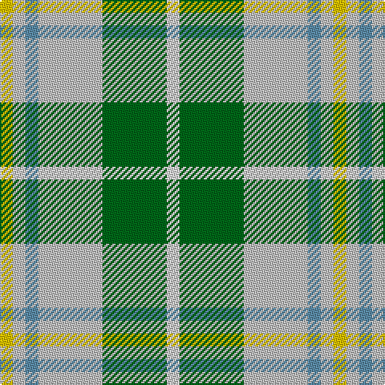

In pattern [WGWBWY](/stripes/wgwbwy/).

This was sourced from tartans-authority.  It is a [6 stripe tartan](/stripes/stripes6/).

Original link http://www.tartansauthority.com/tartan-ferret/display/3839/

## Thread count
Y/8 N8 B8 N40 G40 LN/8

## Palette
Each colour and the base-6 reference it is a variant of.

| Colour | Shade | Base |
|---|---|---|
| B | <code style="background-color:#5C8CA8;">#5C8CA8</code> `oklch(61.7% 0.067 235.0)` <small>#5C8CA8</small> | B <code style="background-color:#2A418A;">#2A418A</code> |
| G | <code style="background-color:#006818;">#006818</code> `oklch(45.0% 0.142 145.0)` <small>#006818</small> | G <code style="background-color:#006100;">#006100</code> |
| LN | <code style="background-color:#E0E0E0;">#E0E0E0</code> `oklch(90.7% 0.000 89.9)` <small>#E0E0E0</small> | W <code style="background-color:#F7F7F7;">#F7F7F7</code> |
| N | <code style="background-color:#C0C0C0;">#C0C0C0</code> `oklch(80.8% 0.000 89.9)` <small>#C0C0C0</small> | W <code style="background-color:#F7F7F7;">#F7F7F7</code> |
| Y | <code style="background-color:#E8C000;">#E8C000</code> `oklch(81.9% 0.168 93.7)` <small>#E8C000</small> | Y <code style="background-color:#F2BF00;">#F2BF00</code> |

# Sample pattern

## Nearest tartans

The nearest existing variants by ΔTartan distance, with this tartan at the top so the swatches line up against it.

ΔTartan

Tartan

Sett

—

<a href="/ttd/edit/#slug=w1g5lb5t1lb1ly1~x8">MacGibboney (Name)</a> <a class="nn-out" href="/setts/s6/w1g5lb5t1lb1ly1~x8/" title="open its dictionary page">↗</a>

1.17

<a href="/ttd/edit/#slug=g5lb5t1lb1ly1lb1t1lb5g5w1~x8">MacGiboney Dress</a> <a class="nn-out" href="/setts/s10/g5lb5t1lb1ly1lb1t1lb5g5w1~x8/" title="open its dictionary page">↗</a>

1.17

<a href="/ttd/edit/#slug=g5lb5t1lb1ly1lb1t1lb5g5w1~x4">MacGiboney Clan Tartan Tartan Number: 3839. Earliest known date: 1999 Designed by Greg McGibonney from Fremont, California. The sett shown here was submitted as a woven sample by Greg McGibboney. Colours here are from the woven sample. See products available Copyright © Blair Urquhart, Comrie, 2015</a> <a class="nn-out" href="/setts/s10/g5lb5t1lb1ly1lb1t1lb5g5w1~x4/" title="open its dictionary page">↗</a>

1.45

<a href="/ttd/edit/#slug=g3r10lb2g3lb13g2lb2g3~x2">Manitoba Dress (Dance)</a> <a class="nn-out" href="/setts/s8/g3r10lb2g3lb13g2lb2g3~x2/" title="open its dictionary page">↗</a>

1.52

<a href="/ttd/edit/#slug=w1y1p2y7g1g5ly1~x4">Deeside</a> <a class="nn-out" href="/setts/s7/w1y1p2y7g1g5ly1~x4/" title="open its dictionary page">↗</a>

1.54

<a href="/ttd/edit/#slug=k4ly12n3ly3n3ly4lr17ly15dy4~x2">Cotswolds Distillery</a> <a class="nn-out" href="/setts/s9/k4ly12n3ly3n3ly4lr17ly15dy4~x2/" title="open its dictionary page">↗</a>

1.55

<a href="/ttd/edit/#slug=t60g9r7ly12g33ly33t26">Supporter.com</a> <a class="nn-out" href="/setts/s7/t60g9r7ly12g33ly33t26/" title="open its dictionary page">↗</a>

1.55

<a href="/ttd/edit/#slug=k3w25g16w3n25w3~x2">Birnham, Blue (Dance)</a> <a class="nn-out" href="/setts/s6/k3w25g16w3n25w3~x2/" title="open its dictionary page">↗</a>

1.57

<a href="/ttd/edit/#slug=dg4g3dg24w15lo21g3lo4~x2">Bannockbane Dark Green</a> <a class="nn-out" href="/setts/s7/dg4g3dg24w15lo21g3lo4~x2/" title="open its dictionary page">↗</a>

1.58

<a href="/ttd/edit/#slug=r1dg1lp1lb7dg7lp1dg1lp1~x6">Beck-McSorley</a> <a class="nn-out" href="/setts/s8/r1dg1lp1lb7dg7lp1dg1lp1~x6/" title="open its dictionary page">↗</a>

1.60

<a href="/ttd/edit/#slug=db9w4g36t36r4">Alvis of Lee (Personal)</a> <a class="nn-out" href="/setts/s5/db9w4g36t36r4/" title="open its dictionary page">↗</a>

## Neighbour map

Every grey dot is one of 14299 variants placed by the first two principal components of the ΔTartan feature space (44% of its variance). Red is this tartan; blue dots are its nearest — click one to open its page.

<svg viewBox="0 0 640 380" role="img" style="max-width:100%;height:auto;border:1px solid #e0e0e0;border-radius:4px;display:block" xmlns="http://www.w3.org/2000/svg"><image href="/nn/cloud.v1.png" width="640" height="380"/><a href="/setts/s10/g5lb5t1lb1ly1lb1t1lb5g5w1~x8/"><circle cx="183.2" cy="199.8" r="4" fill="#3465a4"><title>MacGiboney Dress</title></circle></a><a href="/setts/s10/g5lb5t1lb1ly1lb1t1lb5g5w1~x4/"><circle cx="183.2" cy="199.8" r="4" fill="#3465a4"><title>MacGiboney Clan Tartan Tartan Number: 3839. Earliest known date: 1999 Designed by Greg McGibonney from Fremont, California. The sett shown here was submitted as a woven sample by Greg McGibboney. Colours here are from the woven sample. See products available Copyright © Blair Urquhart, Comrie, 2015</title></circle></a><a href="/setts/s8/g3r10lb2g3lb13g2lb2g3~x2/"><circle cx="173.6" cy="181.0" r="4" fill="#3465a4"><title>Manitoba Dress (Dance)</title></circle></a><a href="/setts/s7/w1y1p2y7g1g5ly1~x4/"><circle cx="190.1" cy="188.0" r="4" fill="#3465a4"><title>Deeside</title></circle></a><a href="/setts/s9/k4ly12n3ly3n3ly4lr17ly15dy4~x2/"><circle cx="202.6" cy="190.7" r="4" fill="#3465a4"><title>Cotswolds Distillery</title></circle></a><a href="/setts/s7/t60g9r7ly12g33ly33t26/"><circle cx="208.7" cy="216.5" r="4" fill="#3465a4"><title>Supporter.com</title></circle></a><a href="/setts/s6/k3w25g16w3n25w3~x2/"><circle cx="180.6" cy="199.4" r="4" fill="#3465a4"><title>Birnham, Blue (Dance)</title></circle></a><a href="/setts/s7/dg4g3dg24w15lo21g3lo4~x2/"><circle cx="144.8" cy="184.5" r="4" fill="#3465a4"><title>Bannockbane Dark Green</title></circle></a><a href="/setts/s8/r1dg1lp1lb7dg7lp1dg1lp1~x6/"><circle cx="224.2" cy="184.8" r="4" fill="#3465a4"><title>Beck-McSorley</title></circle></a><a href="/setts/s5/db9w4g36t36r4/"><circle cx="213.7" cy="215.9" r="4" fill="#3465a4"><title>Alvis of Lee (Personal)</title></circle></a><circle cx="171.1" cy="213.4" r="5" fill="#c00000"/></svg>

ID: /setts/s6/w1g5lb5t1lb1ly1~x8/
