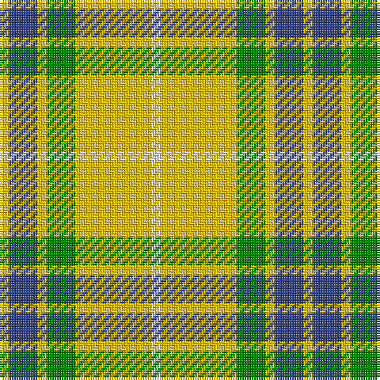

In pattern [WYGYBY](/stripes/wygyby/).

This was sourced from weddslist.  It is a [6 stripe tartan](/stripes/stripes6/).

Original link http://www.weddslist.com/cgi-bin/tartans/pg.pl?source=sts

## Also known as

This cloth is also recorded under:

- Fraser, Yellow

## Thread count
Y/4 B12 Y4 G12 Y32 LN/4

## Palette
Each colour and the base-6 reference it is a variant of.

| Colour | Shade | Base |
|---|---|---|
| B | <code style="background-color:#304080;">#304080</code> `oklch(39.4% 0.109 270.2)` <small>#304080</small> | B <code style="background-color:#2A418A;">#2A418A</code> |
| G | <code style="background-color:#008000;">#008000</code> `oklch(52.0% 0.177 142.5)` <small>#008000</small> | G <code style="background-color:#006100;">#006100</code> |
| LN | <code style="background-color:#E0E0E0;">#E0E0E0</code> `oklch(90.7% 0.000 89.9)` <small>#E0E0E0</small> | W <code style="background-color:#F7F7F7;">#F7F7F7</code> |
| Y | <code style="background-color:#F0C000;">#F0C000</code> `oklch(82.7% 0.169 90.5)` <small>#F0C000</small> | Y <code style="background-color:#F2BF00;">#F2BF00</code> |

# Sample pattern

## Nearest tartans

The nearest existing variants by ΔTartan distance.

1. [Fraser Yellow #2](/setts/s6/w1ly8dg3ly1db3ly1~x4/) — ΔT 0.46
1. [Hogan (2014)](/setts/s4/g10w7ly41k7~x2/) — ΔT 1.41
1. [MacPherson Dress Green (Dance)](/setts/s7/w5r3w26g20w3g8ly3~x2/) — ΔT 1.42
1. [Unidentfied (Ligioner Highland Games](/setts/s6/do4g25lo10g3lo18r4~x2/) — ΔT 1.50
1. [MacDuck (Corporate)](/setts/s6/k4r5k2ly21g8k2~x2/) — ΔT 1.64
1. [Fraser, Yellow](/setts/s7/r2w2ly27g14ly2db14ly2~x2/) — ΔT 1.67
1. [Wilson's, No 195](/setts/s4/lo5g7k1t1~x4/) — ΔT 1.67
1. [Shepherd, Derek (Piping)](/setts/s6/k5ly2dy7ly18dy2w2~x4/) — ΔT 1.76
1. [Tennessee Volunteer](/setts/s8/w12lo12w12k5lo45k5lb5lo10~x2/) — ΔT 1.78
1. [Billy Apple® Yellow](/setts/s4/r1ly13k8g1~x6/) — ΔT 1.78

## Neighbour map

Every grey dot is one of 14299 variants placed by the first two principal components of the ΔTartan feature space (44% of its variance). Red is this tartan; blue dots are its nearest — click one to open its page.

<svg viewBox="0 0 640 380" role="img" style="max-width:100%;height:auto;border:1px solid #e0e0e0;border-radius:4px;display:block" xmlns="http://www.w3.org/2000/svg"><image href="/nn/cloud.v1.png" width="640" height="380"/><a href="/setts/s6/w1ly8dg3ly1db3ly1~x4/"><circle cx="272.3" cy="191.6" r="4" fill="#3465a4"><title>Fraser Yellow #2</title></circle></a><a href="/setts/s4/g10w7ly41k7~x2/"><circle cx="292.6" cy="213.0" r="4" fill="#3465a4"><title>Hogan (2014)</title></circle></a><a href="/setts/s7/w5r3w26g20w3g8ly3~x2/"><circle cx="245.8" cy="183.0" r="4" fill="#3465a4"><title>MacPherson Dress Green (Dance)</title></circle></a><a href="/setts/s6/do4g25lo10g3lo18r4~x2/"><circle cx="222.4" cy="205.2" r="4" fill="#3465a4"><title>Unidentfied (Ligioner Highland Games</title></circle></a><a href="/setts/s6/k4r5k2ly21g8k2~x2/"><circle cx="227.9" cy="171.9" r="4" fill="#3465a4"><title>MacDuck (Corporate)</title></circle></a><a href="/setts/s7/r2w2ly27g14ly2db14ly2~x2/"><circle cx="228.8" cy="143.4" r="4" fill="#3465a4"><title>Fraser, Yellow</title></circle></a><a href="/setts/s4/lo5g7k1t1~x4/"><circle cx="236.9" cy="234.8" r="4" fill="#3465a4"><title>Wilson's, No 195</title></circle></a><a href="/setts/s6/k5ly2dy7ly18dy2w2~x4/"><circle cx="192.6" cy="150.7" r="4" fill="#3465a4"><title>Shepherd, Derek (Piping)</title></circle></a><a href="/setts/s8/w12lo12w12k5lo45k5lb5lo10~x2/"><circle cx="321.1" cy="165.1" r="4" fill="#3465a4"><title>Tennessee Volunteer</title></circle></a><a href="/setts/s4/r1ly13k8g1~x6/"><circle cx="283.4" cy="182.3" r="4" fill="#3465a4"><title>Billy Apple® Yellow</title></circle></a><circle cx="279.4" cy="193.8" r="5" fill="#c00000"/></svg>

ID: /setts/s6/w1ly8g3ly1db3ly1~x4/
