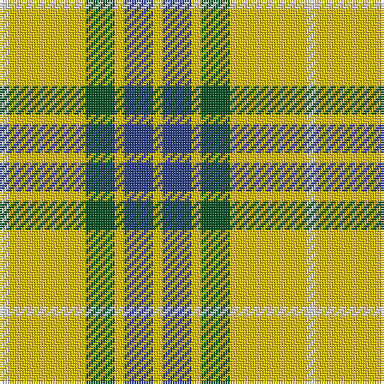

In pattern [WYGYBY](/patterns/wygyby/).

This was sourced from register-of-tartans.  It is a [6 stripes tartan](/stripes/stripes6/).

Original link https://www.tartanregister.gov.uk/tartanDetails.aspx?ref=1269

## Register references

External register numbers recorded for this tartan.

- Scottish Register of Tartans: [1269](https://www.tartanregister.gov.uk/tartanDetails.aspx?ref=1269)
- Scottish Tartans World Register: 1878

## Thread count
LN/4 Y32 G12 Y4 B12 Y/4

## Palette
Each colour and its ΔE from the base-6 reference it is a variant of.

| Colour | Shade | Base | ΔE (OKLab) |
|---|---|---|---|
| B | <code style="background-color:#2C4084;">#2C4084</code> `#2C4084` | B <code style="background-color:#2A418A;">#2A418A</code> | 0.01 |
| G | <code style="background-color:#005020;">#005020</code> `#005020` | G <code style="background-color:#006100;">#006100</code> | 0.07 |
| LN | <code style="background-color:#E0E0E0;">#E0E0E0</code> `#E0E0E0` | W <code style="background-color:#F7F7F7;">#F7F7F7</code> | 0.07 |
| Y | <code style="background-color:#E8C000;">#E8C000</code> `#E8C000` | Y <code style="background-color:#F2BF00;">#F2BF00</code> | 0.02 |

# Sample pattern

## Nearest tartans

The nearest existing variants by ΔTartan distance.

1. [Fraser, Yellow](/setts/s6/w1y8g3y1b3y1~b304080-g008000-we0e0e0-yf0c000~x4/) — ΔT 0.46
1. [Hogan](/setts/s4/g10w7y41k7~g006818-k101010-wfcfcfc-yc4bc68~x2/) — ΔT 1.11
1. [MacPherson Dress Green (Dance)](/setts/s7/w5r3w26g20w3g8y3~g006818-rc80000-we0e0e0-ye8c000~x2/) — ΔT 1.24
1. [MacPherson, dress green](/setts/s7/w5r3w26g20w3g8y3~g008000-rc00000-we0e0e0-yf0c000~x2/) — ΔT 1.29
1. [Unidentfied (Ligioner Highland Games](/setts/s6/b4g25y10g3y18r4~b441800-g006818-rc80000-yfcb464~x2/) — ΔT 1.42
1. [MacDuck (Corporate)](/setts/s6/k4r5k2y21g8k2~g006818-k101010-rc80000-ye8c000~x2/) — ΔT 1.46
1. [Shepherd Piping (Personal)](/setts/s6/k5y2g7ya18g2w2~g604000-k101010-we0e0e0-yf0e490-yad8bc0c~x4/) — ΔT 1.49
1. [Hogan (2014)](/setts/s4/g10w7y41k7~g649848-k1c1714-wf8f8f8-yf8e38c~x2/) — ΔT 1.52
1. [Wilson's, No 195](/setts/s4/y5g7k1b1~b5480b0-g008000-k000000-yff8500~x4/) — ΔT 1.56
1. [Shepherd, Derek (Piping)](/setts/s6/k5y2g7ya18g2w2~g603311-k101010-wffffff-yfee885-yaffec8b~x4/) — ΔT 1.58

## Neighbour map

Every grey dot is one of 15726 variants placed by the first two principal components of the ΔTartan feature space (44% of its variance). Red is this tartan; blue dots are its nearest — click one to open its page.

<svg viewBox="0 0 640 380" role="img" style="max-width:100%;height:auto;border:1px solid #e0e0e0;border-radius:4px;display:block" xmlns="http://www.w3.org/2000/svg"><image href="/nn/cloud.v1.png" width="640" height="380"/><a href="/setts/s6/w1y8g3y1b3y1~b304080-g008000-we0e0e0-yf0c000~x4/"><circle cx="278.4" cy="198.3" r="4" fill="#3465a4"><title>Fraser, Yellow</title></circle></a><a href="/setts/s4/g10w7y41k7~g006818-k101010-wfcfcfc-yc4bc68~x2/"><circle cx="293.3" cy="227.2" r="4" fill="#3465a4"><title>Hogan</title></circle></a><a href="/setts/s7/w5r3w26g20w3g8y3~g006818-rc80000-we0e0e0-ye8c000~x2/"><circle cx="243.7" cy="186.9" r="4" fill="#3465a4"><title>MacPherson Dress Green (Dance)</title></circle></a><a href="/setts/s7/w5r3w26g20w3g8y3~g008000-rc00000-we0e0e0-yf0c000~x2/"><circle cx="250.8" cy="189.5" r="4" fill="#3465a4"><title>MacPherson, dress green</title></circle></a><a href="/setts/s6/b4g25y10g3y18r4~b441800-g006818-rc80000-yfcb464~x2/"><circle cx="220.9" cy="208.4" r="4" fill="#3465a4"><title>Unidentfied (Ligioner Highland Games</title></circle></a><a href="/setts/s6/k4r5k2y21g8k2~g006818-k101010-rc80000-ye8c000~x2/"><circle cx="226.5" cy="177.1" r="4" fill="#3465a4"><title>MacDuck (Corporate)</title></circle></a><a href="/setts/s6/k5y2g7ya18g2w2~g604000-k101010-we0e0e0-yf0e490-yad8bc0c~x4/"><circle cx="206.7" cy="166.2" r="4" fill="#3465a4"><title>Shepherd Piping (Personal)</title></circle></a><a href="/setts/s4/g10w7y41k7~g649848-k1c1714-wf8f8f8-yf8e38c~x2/"><circle cx="291.9" cy="219.7" r="4" fill="#3465a4"><title>Hogan (2014)</title></circle></a><a href="/setts/s4/y5g7k1b1~b5480b0-g008000-k000000-yff8500~x4/"><circle cx="235.2" cy="238.5" r="4" fill="#3465a4"><title>Wilson's, No 195</title></circle></a><a href="/setts/s6/k5y2g7ya18g2w2~g603311-k101010-wffffff-yfee885-yaffec8b~x4/"><circle cx="191.2" cy="156.6" r="4" fill="#3465a4"><title>Shepherd, Derek (Piping)</title></circle></a><circle cx="271.0" cy="196.9" r="5" fill="#c00000"/></svg>

ID: /setts/s6/w1y8g3y1b3y1~b2c4084-g005020-we0e0e0-ye8c000~x4/
