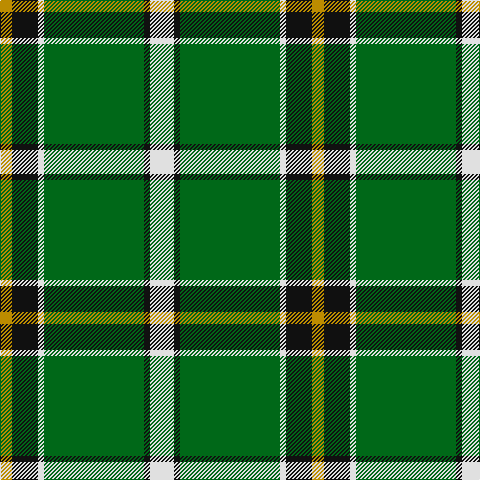

In pattern [WKGWKY](/patterns/wkgwky/).

This was sourced from tartans-authority.  It is a [6 stripes tartan](/stripes/stripes6/).

Original link http://www.tartansauthority.com/tartan-ferret/display/7407/

## Attestations

This cloth appears in 2 source records; the oldest owns this page.

- 2004 — Limerick County Crest (Fashion) (tartans-authority, [record](http://www.tartansauthority.com/tartan-ferret/display/7407/))
- 01/05/2005 — Limerick County, Crest Range (register-of-tartans, [record](https://www.tartanregister.gov.uk/tartanDetails.aspx?ref=5362))

## Thread count
DY/12 K26 LN6 G100 K6 LN/24

## Palette
Each colour and its ΔE from the base-6 reference it is a variant of.

| Colour | Shade | Base | ΔE (OKLab) |
|---|---|---|---|
| DY | <code style="background-color:#BC8C00;">#BC8C00</code> `#BC8C00` | Y <code style="background-color:#E8C000;">#E8C000</code> | 0.16 |
| G | <code style="background-color:#006818;">#006818</code> `#006818` | G <code style="background-color:#006400;">#006400</code> | 0.02 |
| K | <code style="background-color:#101010;">#101010</code> `#101010` | K <code style="background-color:#000000;">#000000</code> | 0.17 |
| LN | <code style="background-color:#E0E0E0;">#E0E0E0</code> `#E0E0E0` | W <code style="background-color:#F4F4F0;">#F4F4F0</code> | 0.06 |

# Sample pattern

## Nearest tartans

The nearest existing variants by ΔTartan distance.

1. [Shaw](/setts/s6/g48k4b6k4b16r4-b304080-g008000-k000000-rc00000/) — ΔT 1.03
1. [Herbage](/setts/s5/g100k32ga40r4ga12-g008000-ga808080-k000000-rc00000/) — ΔT 1.10
1. [Keppoch](/setts/s7/k10g4k10g4b16g50w8-b2c2c80-g006818-k101010-wf8f8f8/) — ΔT 1.12
1. [Alberta (Province)](/setts/s7/g104k8r8k8b16k8y32-b2474e8-g006818-k101010-re87878-yd8b000/) — ΔT 1.15
1. [New York Jets](/setts/s8/g60w3k12r5g9r6k4w10-g005020-k101010-r888888-wffffff/) — ΔT 1.18
1. [Alberta (District)](/setts/s7/g96k8r8k8b16k8y32-b2474e8-g006818-k101010-re87878-yd8b000/) — ΔT 1.21
1. [Longniddry Green District Tartan Tartan Number: 764. Earliest known date: pre 1992 A dancers tartan from D.C. Dalgleish weavers of Selkirk See products available Copyright © Blair Urquhart, Comrie, 2015](/setts/s8/g84ga4w4ga4g10gb24w64g8-g006818-ga289c18-gb003820-we0e0e0/) — ΔT 1.23
1. [Carrick, hunting](/setts/s8/g26b2g2b2g6ba10k8y4-b800080-ba304080-g008000-k000000-yf0c000/) — ΔT 1.25
1. [MacAuliffe (Name)](/setts/s8/g74w4g12b46y12b4y6b4-b2c2c80-g006818-wf8f8f8-ye8c000/) — ΔT 1.25
1. [Alberta District Tartan Tartan Number: 2055. Earliest known date: 1961 Designed for the Edmonton Rehabilitation Society as a project for handloom weaving by disabled students. The Provincial Legislative of Alberta gave formal approval for the Alberta tartan in 1961. See products available Copyright © Blair Urquhart, Comrie, 2015](/setts/s7/g24k2r2k2b4k2y8-b5c8ca8-g006818-k101010-rd05054-ye8c000/) — ΔT 1.25

## Neighbour map

Every grey dot is one of 15726 variants placed by the first two principal components of the ΔTartan feature space (44% of its variance). Red is this tartan; blue dots are its nearest — click one to open its page.

<svg viewBox="0 0 640 380" role="img" style="max-width:100%;height:auto;border:1px solid #e0e0e0;border-radius:4px;display:block" xmlns="http://www.w3.org/2000/svg"><image href="/nn/cloud.v1.png" width="640" height="380"/><a href="/setts/s6/g48k4b6k4b16r4-b304080-g008000-k000000-rc00000/"><circle cx="329.1" cy="188.2" r="4" fill="#3465a4"><title>Shaw</title></circle></a><a href="/setts/s5/g100k32ga40r4ga12-g008000-ga808080-k000000-rc00000/"><circle cx="299.2" cy="180.4" r="4" fill="#3465a4"><title>Herbage</title></circle></a><a href="/setts/s7/k10g4k10g4b16g50w8-b2c2c80-g006818-k101010-wf8f8f8/"><circle cx="294.3" cy="185.1" r="4" fill="#3465a4"><title>Keppoch</title></circle></a><a href="/setts/s7/g104k8r8k8b16k8y32-b2474e8-g006818-k101010-re87878-yd8b000/"><circle cx="287.4" cy="151.1" r="4" fill="#3465a4"><title>Alberta (Province)</title></circle></a><a href="/setts/s8/g60w3k12r5g9r6k4w10-g005020-k101010-r888888-wffffff/"><circle cx="357.3" cy="142.0" r="4" fill="#3465a4"><title>New York Jets</title></circle></a><a href="/setts/s7/g96k8r8k8b16k8y32-b2474e8-g006818-k101010-re87878-yd8b000/"><circle cx="267.4" cy="155.1" r="4" fill="#3465a4"><title>Alberta (District)</title></circle></a><a href="/setts/s8/g84ga4w4ga4g10gb24w64g8-g006818-ga289c18-gb003820-we0e0e0/"><circle cx="277.1" cy="138.2" r="4" fill="#3465a4"><title>Longniddry Green District Tartan Tartan Number: 764. Earliest known date: pre 1992 A dancers tartan from D.C. Dalgleish weavers of Selkirk See products available Copyright © Blair Urquhart, Comrie, 2015</title></circle></a><a href="/setts/s8/g26b2g2b2g6ba10k8y4-b800080-ba304080-g008000-k000000-yf0c000/"><circle cx="256.7" cy="158.1" r="4" fill="#3465a4"><title>Carrick, hunting</title></circle></a><a href="/setts/s8/g74w4g12b46y12b4y6b4-b2c2c80-g006818-wf8f8f8-ye8c000/"><circle cx="313.8" cy="154.8" r="4" fill="#3465a4"><title>MacAuliffe (Name)</title></circle></a><a href="/setts/s7/g24k2r2k2b4k2y8-b5c8ca8-g006818-k101010-rd05054-ye8c000/"><circle cx="267.3" cy="154.1" r="4" fill="#3465a4"><title>Alberta District Tartan Tartan Number: 2055. Earliest known date: 1961 Designed for the Edmonton Rehabilitation Society as a project for handloom weaving by disabled students. The Provincial Legislative of Alberta gave formal approval for the Alberta tartan in 1961. See products available Copyright © Blair Urquhart, Comrie, 2015</title></circle></a><circle cx="307.0" cy="166.0" r="5" fill="#c00000"/></svg>

ID: /setts/s6/w24k6g100w6k26y12-g006818-k101010-we0e0e0-ybc8c00/
