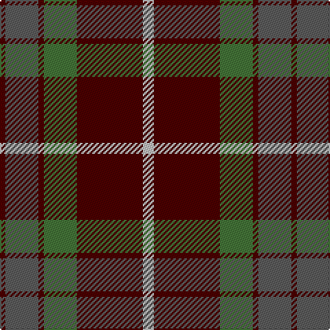

In pattern [BBBGBW](/patterns/bbbgbw/).

This was sourced from register-of-tartans.  It is a [6 stripes tartan](/stripes/stripes6/).

Original link https://www.tartanregister.gov.uk/tartanDetails.aspx?ref=1257

## Thread count
DR/4 Na24 DR4 G24 DR48 N/8

## Palette
Each colour and its ΔE from the base-6 reference it is a variant of.

| Colour | Shade | Base | ΔE (OKLab) |
|---|---|---|---|
| DR | <code style="background-color:#4C0000;">#4C0000</code> `#4C0000` | B <code style="background-color:#2A418A;">#2A418A</code> | 0.25 |
| G | <code style="background-color:#447438;">#447438</code> `#447438` | G <code style="background-color:#006100;">#006100</code> | 0.09 |
| N | <code style="background-color:#C0C0C0;">#C0C0C0</code> `#C0C0C0` | W <code style="background-color:#F7F7F7;">#F7F7F7</code> | 0.17 |
| Na | <code style="background-color:#5C5C5C;">#5C5C5C</code> `#5C5C5C` | B <code style="background-color:#2A418A;">#2A418A</code> | 0.15 |

# Sample pattern

## Nearest tartans

The nearest existing variants by ΔTartan distance.

1. [Canadian Autumn](/setts/s6/g4r28b6g10k10g3~b1c0070-g006818-k101010-r880000~x2/) — ΔT 0.70
1. [Ikelman #2 (Personal)](/setts/s5/b11k4r4y4b1~b5c5c5c-k101010-r880000-yd09800~x4/) — ΔT 0.81
1. [Balfour #2](/setts/s6/b18y2g6y2g19r3~b2c2c80-g604000-rc80000-ye8c000~x2/) — ΔT 0.86
1. [Balfour (Clan)](/setts/s6/b18y2g6y2g19r3~b2c2c80-g604000-rc80000-ye8c000~x4/) — ΔT 0.86
1. [Strathspey (Fashion)](/setts/s6/g3r22b5g10k10g2~b48748c-g006818-k101010-r880000~x2/) — ΔT 0.89
1. [Christmas](/setts/s5/y2g17ga4r15g1~g0e3923-ga207449-rbb001a-ye3b235~x2/) — ΔT 0.91
1. [Swedish Para Whisky Club (Corporate](/setts/s6/b2g14w3b13y1b2~b680028-g003820-w98c8e8-yc4bc68~x4/) — ΔT 0.91
1. [Cook (Name)](/setts/s7/g12ga6g6r15k1r1k2~g003820-ga048888-k101010-rc80000~x2/) — ΔT 0.91
1. [Plummer Family Personal Tartan Tartan Number: 2778. Earliest known date: 2001 From a D C Dalgliesh swatch in 2001 via Phil Smith June 2004. See products available Copyright © Blair Urquhart, Comrie, 2015](/setts/s6/r30k8g30b4r3b2~b1860a8-g005028-k101010-rc80000~x2/) — ΔT 0.93
1. [MacQuarrie LO](/setts/s7/r6g16r4b12r16ba1r2~b000052-ba4367ae-g11450d-raa0000~x2/) — ΔT 0.97

## Neighbour map

Every grey dot is one of 15726 variants placed by the first two principal components of the ΔTartan feature space (44% of its variance). Red is this tartan; blue dots are its nearest — click one to open its page.

<svg viewBox="0 0 640 380" role="img" style="max-width:100%;height:auto;border:1px solid #e0e0e0;border-radius:4px;display:block" xmlns="http://www.w3.org/2000/svg"><image href="/nn/cloud.v1.png" width="640" height="380"/><a href="/setts/s6/g4r28b6g10k10g3~b1c0070-g006818-k101010-r880000~x2/"><circle cx="266.4" cy="223.9" r="4" fill="#3465a4"><title>Canadian Autumn</title></circle></a><a href="/setts/s5/b11k4r4y4b1~b5c5c5c-k101010-r880000-yd09800~x4/"><circle cx="265.3" cy="230.9" r="4" fill="#3465a4"><title>Ikelman #2 (Personal)</title></circle></a><a href="/setts/s6/b18y2g6y2g19r3~b2c2c80-g604000-rc80000-ye8c000~x2/"><circle cx="295.9" cy="217.3" r="4" fill="#3465a4"><title>Balfour #2</title></circle></a><a href="/setts/s6/b18y2g6y2g19r3~b2c2c80-g604000-rc80000-ye8c000~x4/"><circle cx="295.9" cy="217.3" r="4" fill="#3465a4"><title>Balfour (Clan)</title></circle></a><a href="/setts/s6/g3r22b5g10k10g2~b48748c-g006818-k101010-r880000~x2/"><circle cx="250.4" cy="222.5" r="4" fill="#3465a4"><title>Strathspey (Fashion)</title></circle></a><a href="/setts/s5/y2g17ga4r15g1~g0e3923-ga207449-rbb001a-ye3b235~x2/"><circle cx="300.9" cy="200.2" r="4" fill="#3465a4"><title>Christmas</title></circle></a><a href="/setts/s6/b2g14w3b13y1b2~b680028-g003820-w98c8e8-yc4bc68~x4/"><circle cx="311.1" cy="198.8" r="4" fill="#3465a4"><title>Swedish Para Whisky Club (Corporate</title></circle></a><a href="/setts/s7/g12ga6g6r15k1r1k2~g003820-ga048888-k101010-rc80000~x2/"><circle cx="251.6" cy="190.4" r="4" fill="#3465a4"><title>Cook (Name)</title></circle></a><a href="/setts/s6/r30k8g30b4r3b2~b1860a8-g005028-k101010-rc80000~x2/"><circle cx="279.4" cy="187.3" r="4" fill="#3465a4"><title>Plummer Family Personal Tartan Tartan Number: 2778. Earliest known date: 2001 From a D C Dalgliesh swatch in 2001 via Phil Smith June 2004. See products available Copyright © Blair Urquhart, Comrie, 2015</title></circle></a><a href="/setts/s7/r6g16r4b12r16ba1r2~b000052-ba4367ae-g11450d-raa0000~x2/"><circle cx="288.6" cy="200.4" r="4" fill="#3465a4"><title>MacQuarrie LO</title></circle></a><circle cx="287.1" cy="210.8" r="5" fill="#c00000"/></svg>

ID: /setts/s6/w2b12g6b1ba6b1~b4c0000-ba5c5c5c-g447438-wc0c0c0~x4/
