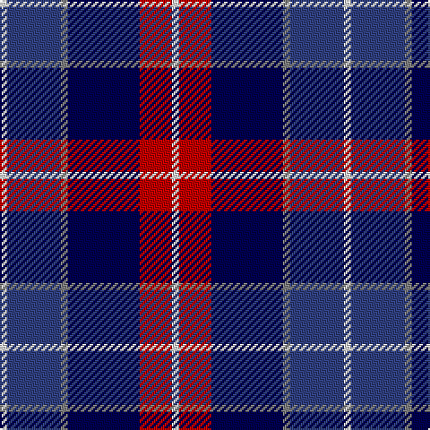

In pattern [WBGBRW](/patterns/wbgbrw/).

This was sourced from weddslist.  It is a [6 stripes tartan](/stripes/stripes6/).

Original link http://www.weddslist.com/cgi-bin/tartans/pg.pl?source=sts

## Thread count
LN/4 B30 N4 DB40 R18 LN/4

## Palette
Each colour and its ΔE from the base-6 reference it is a variant of.

| Colour | Shade | Base | ΔE (OKLab) |
|---|---|---|---|
| B | <code style="background-color:#304080;">#304080</code> `#304080` | B <code style="background-color:#2A418A;">#2A418A</code> | 0.02 |
| DB | <code style="background-color:#000050;">#000050</code> `#000050` | B <code style="background-color:#2A418A;">#2A418A</code> | 0.21 |
| LN | <code style="background-color:#E0E0E0;">#E0E0E0</code> `#E0E0E0` | W <code style="background-color:#F7F7F7;">#F7F7F7</code> | 0.07 |
| N | <code style="background-color:#808080;">#808080</code> `#808080` | G <code style="background-color:#006100;">#006100</code> | 0.23 |
| R | <code style="background-color:#C00000;">#C00000</code> `#C00000` | R <code style="background-color:#CC0000;">#CC0000</code> | 0.03 |

# Sample pattern

## Nearest tartans

The nearest existing variants by ΔTartan distance.

1. [Soroptimist International Corporate Tartan Tartan Number: 3097. Earliest known date: 2002 Non-repeating sett. Launched at the Federation of Great Britain & Ireland Conference in 2002 during the Presidency of Lynn Dunning. The design and the colours have been chosen carefully to symbolise the purple heather of the mountains and hills of Scotland together with the blue and gold of Soroptimist International woven together with the white hand of Peace. See products available Copyright © Blair Urquhart, Comrie, 2015](/setts/s6/w2k1b10k6ba12y2x2~b780078-ba2c2c80-k101010-we0e0e0-ye8c000/) — ΔT 0.80
1. [Lovell (2014)](/setts/s8/y2k2b14ba4k5r2y5r1x4~b00008c-ba202060-k101010-rc82828-ye0a126/) — ΔT 0.95
1. [Cala Homes (Corporate)](/setts/s6/y5b24k8ba18y6g3~b202060-ba2c2c80-g604000-k101010-ye8c000/) — ΔT 0.96
1. [Mina Perhonen Japanese Corporate Tartan Tartan Number: 5797. Earliest known date: pre 2003 Designed by Fiona Hall of Lochcarron as a corporate tartan for the Mina Company of Tokyo whose logo is a butterfly. The blues are from the company's colours and represent the sky, the yellow represents the butterfly and the white is for the clouds.'Perhonen' is Finnish for butterfly and chosen because the Japanese design world has a great affinity with some Scandinavian countries. See products available Copyright © Blair Urquhart, Comrie, 2015](/setts/s7/w4b24y2ba24bb5b4y4x2~b202060-ba2c2c80-bb5c8ca8-we0e0e0-ye8c000/) — ΔT 1.04
1. [Open Championship (1998)](/setts/s6/w2b20ba2bb15r9w2x2~b1c0070-ba5c5c5c-bb1c1c1c-r880000-wc0c0c0/) — ΔT 1.08
1. [CALA Homes](/setts/s6/y5b24k8ba18y6r3~b000050-ba304080-k000000-r806050-yf0c000/) — ΔT 1.17
1. [American Express](/setts/s6/b2ba9r1b9g9w2x4~b000050-ba8080d0-g003000-r802040-we0e0e0/) — ΔT 1.18
1. [Fife (McGill)](/setts/s6/b31ba4b6k19r20y4x2~b2c2c80-ba5c8ca8-k101010-rc80000-ye8c000/) — ΔT 1.19
1. [Clinton (Personal)](/setts/s8/w5b6r18k8ba5k4b27w3x2~b2c2c80-ba7878a8-k101010-rd40000-we0e0e0/) — ΔT 1.20
1. [Ballantyne (Personal) STWR](/setts/s8/b34g9y3g9ga30r3ga11r5~b000064-g503c14-ga808080-r960028-yfadc00/) — ΔT 1.22

## Neighbour map

Every grey dot is one of 15726 variants placed by the first two principal components of the ΔTartan feature space (44% of its variance). Red is this tartan; blue dots are its nearest — click one to open its page.

<svg viewBox="0 0 640 380" role="img" style="max-width:100%;height:auto;border:1px solid #e0e0e0;border-radius:4px;display:block" xmlns="http://www.w3.org/2000/svg"><image href="/nn/cloud.v1.png" width="640" height="380"/><a href="/setts/s6/w2k1b10k6ba12y2x2~b780078-ba2c2c80-k101010-we0e0e0-ye8c000/"><circle cx="167.4" cy="187.6" r="4" fill="#3465a4"><title>Soroptimist International Corporate Tartan Tartan Number: 3097. Earliest known date: 2002 Non-repeating sett. Launched at the Federation of Great Britain &amp; Ireland Conference in 2002 during the Presidency of Lynn Dunning. The design and the colours have been chosen carefully to symbolise the purple heather of the mountains and hills of Scotland together with the blue and gold of Soroptimist International woven together with the white hand of Peace. See products available Copyright © Blair Urquhart, Comrie, 2015</title></circle></a><a href="/setts/s8/y2k2b14ba4k5r2y5r1x4~b00008c-ba202060-k101010-rc82828-ye0a126/"><circle cx="163.3" cy="157.0" r="4" fill="#3465a4"><title>Lovell (2014)</title></circle></a><a href="/setts/s6/y5b24k8ba18y6g3~b202060-ba2c2c80-g604000-k101010-ye8c000/"><circle cx="139.5" cy="209.7" r="4" fill="#3465a4"><title>Cala Homes (Corporate)</title></circle></a><a href="/setts/s7/w4b24y2ba24bb5b4y4x2~b202060-ba2c2c80-bb5c8ca8-we0e0e0-ye8c000/"><circle cx="209.5" cy="173.7" r="4" fill="#3465a4"><title>Mina Perhonen Japanese Corporate Tartan Tartan Number: 5797. Earliest known date: pre 2003 Designed by Fiona Hall of Lochcarron as a corporate tartan for the Mina Company of Tokyo whose logo is a butterfly. The blues are from the company's colours and represent the sky, the yellow represents the butterfly and the white is for the clouds.'Perhonen' is Finnish for butterfly and chosen because the Japanese design world has a great affinity with some Scandinavian countries. See products available Copyright © Blair Urquhart, Comrie, 2015</title></circle></a><a href="/setts/s6/w2b20ba2bb15r9w2x2~b1c0070-ba5c5c5c-bb1c1c1c-r880000-wc0c0c0/"><circle cx="202.5" cy="200.1" r="4" fill="#3465a4"><title>Open Championship (1998)</title></circle></a><a href="/setts/s6/y5b24k8ba18y6r3~b000050-ba304080-k000000-r806050-yf0c000/"><circle cx="119.2" cy="204.6" r="4" fill="#3465a4"><title>CALA Homes</title></circle></a><a href="/setts/s6/b2ba9r1b9g9w2x4~b000050-ba8080d0-g003000-r802040-we0e0e0/"><circle cx="122.8" cy="206.4" r="4" fill="#3465a4"><title>American Express</title></circle></a><a href="/setts/s6/b31ba4b6k19r20y4x2~b2c2c80-ba5c8ca8-k101010-rc80000-ye8c000/"><circle cx="186.3" cy="208.9" r="4" fill="#3465a4"><title>Fife (McGill)</title></circle></a><a href="/setts/s8/w5b6r18k8ba5k4b27w3x2~b2c2c80-ba7878a8-k101010-rd40000-we0e0e0/"><circle cx="170.3" cy="171.0" r="4" fill="#3465a4"><title>Clinton (Personal)</title></circle></a><a href="/setts/s8/b34g9y3g9ga30r3ga11r5~b000064-g503c14-ga808080-r960028-yfadc00/"><circle cx="184.2" cy="172.0" r="4" fill="#3465a4"><title>Ballantyne (Personal) STWR</title></circle></a><circle cx="173.9" cy="187.6" r="5" fill="#c00000"/></svg>

ID: /setts/s6/w2b15g2ba20r9w2x2~b304080-ba000050-g808080-rc00000-we0e0e0/
