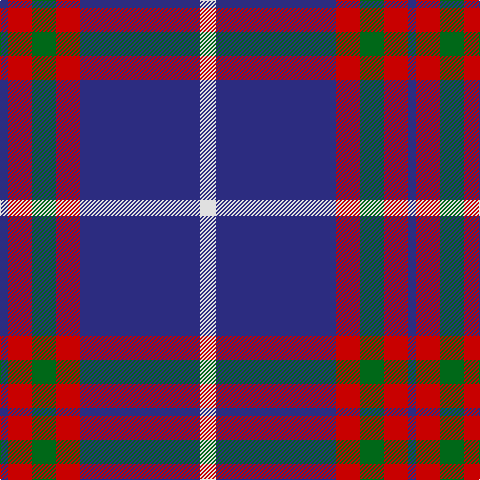

In pattern [BRGRBW](/patterns/brgrbw/).

This was sourced from tartans-authority.  It is a [6 stripes tartan](/stripes/stripes6/).

Original link http://www.tartansauthority.com/tartan-ferret/display/7779/

## Attestations

This cloth appears in 2 source records; the oldest owns this page.

- pre 2008 — Lothian Buses (Corporate?) (tartans-authority, [record](http://www.tartansauthority.com/tartan-ferret/display/7779/))
- undated — Lothian Buses (register-of-tartans, [record](https://www.tartanregister.gov.uk/tartanDetails.aspx?ref=5749))

## Thread count
DB/8 R24 G24 R24 DB120 LN/16

## Palette
Each colour and its ΔE from the base-6 reference it is a variant of.

| Colour | Shade | Base | ΔE (OKLab) |
|---|---|---|---|
| DB | <code style="background-color:#2C2C80;">#2C2C80</code> `#2C2C80` | B <code style="background-color:#2A418A;">#2A418A</code> | 0.06 |
| G | <code style="background-color:#006818;">#006818</code> `#006818` | G <code style="background-color:#006100;">#006100</code> | 0.02 |
| LN | <code style="background-color:#E0E0E0;">#E0E0E0</code> `#E0E0E0` | W <code style="background-color:#F7F7F7;">#F7F7F7</code> | 0.07 |
| R | <code style="background-color:#C80000;">#C80000</code> `#C80000` | R <code style="background-color:#CC0000;">#CC0000</code> | 0.01 |

# Sample pattern

## Nearest tartans

The nearest existing variants by ΔTartan distance.

1. [Heritage of Wales (Fashion)](/setts/s7/r10b4r6b30k10b5w2x2~b2c2c80-k101010-rc80000-we0e0e0/) — ΔT 0.87
1. [Ikelman #4 (Personal)](/setts/s7/r10b15g2b2w1b1w1x4~b1c0070-g006818-r880000-we0e0e0/) — ΔT 0.91
1. [Unnamed C20th - USA](/setts/s7/b2y1b18g7r7b1g1x2~b2c2c80-g006818-rc80000-ye8c000/) — ΔT 0.92
1. [Wolverines (Corporate)](/setts/s6/y8w3b40k12w3y3x2~b2c2c80-k101010-we0e0e0-yfcb464/) — ΔT 0.97
1. [Lytley Hunting (Personal)](/setts/s5/b10r1y1ba3y2x5~b2c2c80-ba202060-rc80000-yfccc00/) — ΔT 0.98
1. [Perkins (2015)](/setts/s7/k3b10y5b29k10r6k2x2~b5f749c-k101010-rc80000-ye0a126/) — ΔT 1.01
1. [Katsushika Corporate Tartan Tartan Number: 2343. Earliest known date: 1997 Designed for Katsushika Scottish country dancers from Hiroshima. See products available Copyright © Blair Urquhart, Comrie, 2015](/setts/s8/b22y2b1y2b10r2g11r6x2~b2c2c80-g006818-rc80000-ye8c000/) — ΔT 1.08
1. [Doten (2013)](/setts/s5/r14y6b38k3g2x2~b202060-g006818-k101010-rc80000-yb8b8b8/) — ΔT 1.12
1. [Dege, of Saville Row](/setts/s6/r11b1r3ba1b9ra1x4~b000050-ba304080-r806050-rac00000/) — ΔT 1.12
1. [Hannah (Personal)](/setts/s6/w2b35k9w3k9y2x2~b30308c-k101010-we0e0e0-ye8c000/) — ΔT 1.17

## Neighbour map

Every grey dot is one of 15726 variants placed by the first two principal components of the ΔTartan feature space (44% of its variance). Red is this tartan; blue dots are its nearest — click one to open its page.

<svg viewBox="0 0 640 380" role="img" style="max-width:100%;height:auto;border:1px solid #e0e0e0;border-radius:4px;display:block" xmlns="http://www.w3.org/2000/svg"><image href="/nn/cloud.v1.png" width="640" height="380"/><a href="/setts/s7/r10b4r6b30k10b5w2x2~b2c2c80-k101010-rc80000-we0e0e0/"><circle cx="338.3" cy="188.2" r="4" fill="#3465a4"><title>Heritage of Wales (Fashion)</title></circle></a><a href="/setts/s7/r10b15g2b2w1b1w1x4~b1c0070-g006818-r880000-we0e0e0/"><circle cx="338.0" cy="171.5" r="4" fill="#3465a4"><title>Ikelman #4 (Personal)</title></circle></a><a href="/setts/s7/b2y1b18g7r7b1g1x2~b2c2c80-g006818-rc80000-ye8c000/"><circle cx="348.4" cy="172.5" r="4" fill="#3465a4"><title>Unnamed C20th - USA</title></circle></a><a href="/setts/s6/y8w3b40k12w3y3x2~b2c2c80-k101010-we0e0e0-yfcb464/"><circle cx="304.2" cy="170.4" r="4" fill="#3465a4"><title>Wolverines (Corporate)</title></circle></a><a href="/setts/s5/b10r1y1ba3y2x5~b2c2c80-ba202060-rc80000-yfccc00/"><circle cx="305.5" cy="202.8" r="4" fill="#3465a4"><title>Lytley Hunting (Personal)</title></circle></a><a href="/setts/s7/k3b10y5b29k10r6k2x2~b5f749c-k101010-rc80000-ye0a126/"><circle cx="331.9" cy="184.4" r="4" fill="#3465a4"><title>Perkins (2015)</title></circle></a><a href="/setts/s8/b22y2b1y2b10r2g11r6x2~b2c2c80-g006818-rc80000-ye8c000/"><circle cx="341.7" cy="165.2" r="4" fill="#3465a4"><title>Katsushika Corporate Tartan Tartan Number: 2343. Earliest known date: 1997 Designed for Katsushika Scottish country dancers from Hiroshima. See products available Copyright © Blair Urquhart, Comrie, 2015</title></circle></a><a href="/setts/s5/r14y6b38k3g2x2~b202060-g006818-k101010-rc80000-yb8b8b8/"><circle cx="346.4" cy="165.2" r="4" fill="#3465a4"><title>Doten (2013)</title></circle></a><a href="/setts/s6/r11b1r3ba1b9ra1x4~b000050-ba304080-r806050-rac00000/"><circle cx="327.0" cy="208.5" r="4" fill="#3465a4"><title>Dege, of Saville Row</title></circle></a><a href="/setts/s6/w2b35k9w3k9y2x2~b30308c-k101010-we0e0e0-ye8c000/"><circle cx="346.8" cy="173.4" r="4" fill="#3465a4"><title>Hannah (Personal)</title></circle></a><circle cx="340.0" cy="179.0" r="5" fill="#c00000"/></svg>

ID: /setts/s6/w2b15r3g3r3b1x8~b2c2c80-g006818-rc80000-we0e0e0/
