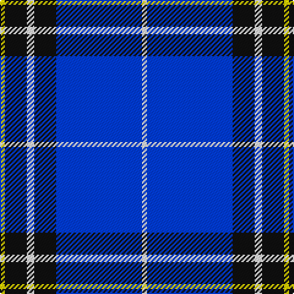

This page is one **sett** — a single exact thread-count. It belongs to the [tartan](/tartans/w2b35k9w3k9ly2/)
(the same proportion at any scale), whose colour order is pattern [WBKWKY](/stripes/wbkwky/).

Sourced from register-of-tartans.  It is a [6 stripe tartan](/stripes/stripes6/).

Original link https://www.tartanregister.gov.uk/tartanDetails.aspx?ref=5976

## Register references

External register numbers recorded for this tartan.

- Scottish Register of Tartans: [5976](https://www.tartanregister.gov.uk/tartanDetails.aspx?ref=5976)
- Scottish Tartans World Register: 3257

## Thread count
Y/4 K18 W6 K18 B70 W/4

## Palette

Palette: <strong>Tartan Register</strong> <small style="color:#888">(3 of 4 colours)</small>
<table><thead><tr><th>Colour</th><th>Threads</th><th>Shade</th><th>Base</th><th>OKLCh</th></tr></thead><tbody><tr><td>Y/</td><td style="text-align:right;font-variant-numeric:tabular-nums">4</td><td><code style="background-color:#FFE600;">#FFE600</code> <small style="color:#888">#FFE600</small></td><td>Y <code style="background-color:#F2BF00;">#F2BF00</code></td><td><small style="color:#888">oklch(91.7% 0.192 101.4)</small></td></tr><tr><td>K</td><td style="text-align:right;font-variant-numeric:tabular-nums">18</td><td><code style="background-color:#101010;">#101010</code> <small style="color:#888">#101010</small></td><td>K <code style="background-color:#000000;">#000000</code></td><td><small style="color:#888">oklch(17.3% 0.000 89.9)</small></td></tr><tr><td>W</td><td style="text-align:right;font-variant-numeric:tabular-nums">6</td><td><code style="background-color:#FFFFFF;">#FFFFFF</code> <small style="color:#888">#FFFFFF</small></td><td>W <code style="background-color:#F7F7F7;">#F7F7F7</code></td><td><small style="color:#888">oklch(100.0% 0.000 89.9)</small></td></tr><tr><td>K</td><td style="text-align:right;font-variant-numeric:tabular-nums">18</td><td><code style="background-color:#101010;">#101010</code> <small style="color:#888">#101010</small></td><td>K <code style="background-color:#000000;">#000000</code></td><td><small style="color:#888">oklch(17.3% 0.000 89.9)</small></td></tr><tr><td>B</td><td style="text-align:right;font-variant-numeric:tabular-nums">70</td><td><code style="background-color:#003DF5;">#003DF5</code> <small style="color:#888">#003DF5</small></td><td>B <code style="background-color:#2A418A;">#2A418A</code></td><td><small style="color:#888">oklch(48.6% 0.272 263.8)</small></td></tr><tr><td>W/</td><td style="text-align:right;font-variant-numeric:tabular-nums">4</td><td><code style="background-color:#FFFFFF;">#FFFFFF</code> <small style="color:#888">#FFFFFF</small></td><td>W <code style="background-color:#F7F7F7;">#F7F7F7</code></td><td><small style="color:#888">oklch(100.0% 0.000 89.9)</small></td></tr></tbody></table>

# Sample pattern

## Nearest tartans

The nearest existing variants by ΔTartan distance, with this tartan at the top so the swatches line up against it.

ΔTartan

Tartan

Sett

—

<a href="/ttd/edit/#slug=w2b35k9w3k9ly2~x2">Hannah (Personal)</a> <a class="nn-out" href="/setts/s6/w2b35k9w3k9ly2~x2/" title="open its dictionary page">↗</a>

1.08

<a href="/ttd/edit/#slug=dbi10r1ly1db3ly2~x5">Lytley alias Parsons Hunting (Personal)</a> <a class="nn-out" href="/setts/s5/dbi10r1ly1db3ly2~x5/" title="open its dictionary page">↗</a>

1.25

<a href="/ttd/edit/#slug=k10db30g3db3g3db3r6~x2">Kinding</a> <a class="nn-out" href="/setts/s7/k10db30g3db3g3db3r6~x2/" title="open its dictionary page">↗</a>

1.40

<a href="/ttd/edit/#slug=db30dbi2k9w3db6w4k3dbi6~x2">Auto Docs</a> <a class="nn-out" href="/setts/s8/db30dbi2k9w3db6w4k3dbi6~x2/" title="open its dictionary page">↗</a>

1.50

<a href="/ttd/edit/#slug=db14r6db52lt4db4lt51ly8">International Police Association (IPA 2010)</a> <a class="nn-out" href="/setts/s7/db14r6db52lt4db4lt51ly8/" title="open its dictionary page">↗</a>

1.53

<a href="/ttd/edit/#slug=w4db25b25db2b5w2~x2">Douglas Variation</a> <a class="nn-out" href="/setts/s6/w4db25b25db2b5w2~x2/" title="open its dictionary page">↗</a>

1.53

<a href="/ttd/edit/#slug=db5k1lb2k1w6k1lb2db25lb2~x2">Christopher Newport University</a> <a class="nn-out" href="/setts/s9/db5k1lb2k1w6k1lb2db25lb2~x2/" title="open its dictionary page">↗</a>

1.54

<a href="/ttd/edit/#slug=r14w6db38k3g2~x2">Doten (2013)</a> <a class="nn-out" href="/setts/s5/r14w6db38k3g2~x2/" title="open its dictionary page">↗</a>

1.69

<a href="/ttd/edit/#slug=dbi42lbi2lb2lbi2dbi5db12lb32dbi4~x2">Eildon (1980)</a> <a class="nn-out" href="/setts/s8/dbi42lbi2lb2lbi2dbi5db12lb32dbi4~x2/" title="open its dictionary page">↗</a>

1.69

<a href="/ttd/edit/#slug=b15db65ly7b4ly3db30b15w3~x2">Hoosier (Fashion)</a> <a class="nn-out" href="/setts/s8/b15db65ly7b4ly3db30b15w3~x2/" title="open its dictionary page">↗</a>

1.71

<a href="/ttd/edit/#slug=b8w4b50k12b4k15r5~x2">Instakilt, Blue (Fashion)</a> <a class="nn-out" href="/setts/s7/b8w4b50k12b4k15r5~x2/" title="open its dictionary page">↗</a>

## Neighbour map

Every grey dot is one of 14359 variants placed by the first two principal components of the ΔTartan feature space (44% of its variance). Red is this tartan; blue dots are its nearest — click one to open its page.

<svg viewBox="0 0 640 380" role="img" style="max-width:100%;height:auto;border:1px solid #e0e0e0;border-radius:4px;display:block" xmlns="http://www.w3.org/2000/svg"><image href="/nn/cloud.v1.png" width="640" height="380"/><a href="/setts/s5/dbi10r1ly1db3ly2~x5/"><circle cx="283.3" cy="197.9" r="4" fill="#3465a4"><title>Lytley alias Parsons Hunting (Personal)</title></circle></a><a href="/setts/s7/k10db30g3db3g3db3r6~x2/"><circle cx="326.6" cy="191.4" r="4" fill="#3465a4"><title>Kinding</title></circle></a><a href="/setts/s8/db30dbi2k9w3db6w4k3dbi6~x2/"><circle cx="301.0" cy="170.0" r="4" fill="#3465a4"><title>Auto Docs</title></circle></a><a href="/setts/s7/db14r6db52lt4db4lt51ly8/"><circle cx="271.6" cy="180.0" r="4" fill="#3465a4"><title>International Police Association (IPA 2010)</title></circle></a><a href="/setts/s6/w4db25b25db2b5w2~x2/"><circle cx="274.2" cy="201.7" r="4" fill="#3465a4"><title>Douglas Variation</title></circle></a><a href="/setts/s9/db5k1lb2k1w6k1lb2db25lb2~x2/"><circle cx="381.3" cy="116.4" r="4" fill="#3465a4"><title>Christopher Newport University</title></circle></a><a href="/setts/s5/r14w6db38k3g2~x2/"><circle cx="309.6" cy="148.5" r="4" fill="#3465a4"><title>Doten (2013)</title></circle></a><a href="/setts/s8/dbi42lbi2lb2lbi2dbi5db12lb32dbi4~x2/"><circle cx="274.7" cy="137.9" r="4" fill="#3465a4"><title>Eildon (1980)</title></circle></a><a href="/setts/s8/b15db65ly7b4ly3db30b15w3~x2/"><circle cx="405.6" cy="162.4" r="4" fill="#3465a4"><title>Hoosier (Fashion)</title></circle></a><a href="/setts/s7/b8w4b50k12b4k15r5~x2/"><circle cx="350.9" cy="170.7" r="4" fill="#3465a4"><title>Instakilt, Blue (Fashion)</title></circle></a><circle cx="320.8" cy="163.6" r="5" fill="#c00000"/></svg>

ID: /setts/s6/w2b35k9w3k9ly2~x2/
