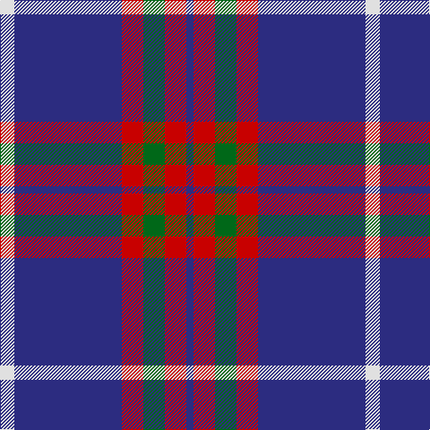

This page is one **sett** — a single exact thread-count. It belongs to the [tartan](/tartans/w2db15r3g3r3db1/)
(the same proportion at any scale), whose colour order is pattern [BRGRBW](/stripes/brgrbw/).

Sourced from tartans-authority.  It is a [6 stripe tartan](/stripes/stripes6/).

Original link http://www.tartansauthority.com/tartan-ferret/display/7779/

2 attestations — the source records this cloth was collapsed from (oldest owns this page)

<ul>
<li>pre 2008 — Lothian Buses (Corporate?) (tartans-authority, <a href="http://www.tartansauthority.com/tartan-ferret/display/7779/">record</a>)</li>
<li>undated — Lothian Buses (register-of-tartans, <a href="https://www.tartanregister.gov.uk/tartanDetails.aspx?ref=5749">record</a>)</li>
</ul>

## Register references

External register numbers recorded for this tartan.

- Scottish Register of Tartans: [5749](https://www.tartanregister.gov.uk/tartanDetails.aspx?ref=5749)
- Scottish Tartans Authority (ITI): 7779

## Thread count
LN/16 DB120 R24 G24 R24 DB/8

## Palette

Palette: <strong>Tartan Register</strong>
<table><thead><tr><th>Colour</th><th>Threads</th><th>Shade</th><th>Base</th><th>OKLCh</th></tr></thead><tbody><tr><td>LN/</td><td style="text-align:right;font-variant-numeric:tabular-nums">16</td><td><code style="background-color:#E0E0E0;">#E0E0E0</code> <small style="color:#888">#E0E0E0</small></td><td>W <code style="background-color:#F7F7F7;">#F7F7F7</code></td><td><small style="color:#888">oklch(90.7% 0.000 89.9)</small></td></tr><tr><td>DB</td><td style="text-align:right;font-variant-numeric:tabular-nums">120</td><td><code style="background-color:#2C2C80;">#2C2C80</code> <small style="color:#888">#2C2C80</small></td><td>B <code style="background-color:#2A418A;">#2A418A</code></td><td><small style="color:#888">oklch(35.0% 0.138 276.6)</small></td></tr><tr><td>R</td><td style="text-align:right;font-variant-numeric:tabular-nums">24</td><td><code style="background-color:#C80000;">#C80000</code> <small style="color:#888">#C80000</small></td><td>R <code style="background-color:#CC0000;">#CC0000</code></td><td><small style="color:#888">oklch(52.3% 0.215 29.2)</small></td></tr><tr><td>G</td><td style="text-align:right;font-variant-numeric:tabular-nums">24</td><td><code style="background-color:#006818;">#006818</code> <small style="color:#888">#006818</small></td><td>G <code style="background-color:#006100;">#006100</code></td><td><small style="color:#888">oklch(45.0% 0.142 145.0)</small></td></tr><tr><td>R</td><td style="text-align:right;font-variant-numeric:tabular-nums">24</td><td><code style="background-color:#C80000;">#C80000</code> <small style="color:#888">#C80000</small></td><td>R <code style="background-color:#CC0000;">#CC0000</code></td><td><small style="color:#888">oklch(52.3% 0.215 29.2)</small></td></tr><tr><td>DB/</td><td style="text-align:right;font-variant-numeric:tabular-nums">8</td><td><code style="background-color:#2C2C80;">#2C2C80</code> <small style="color:#888">#2C2C80</small></td><td>B <code style="background-color:#2A418A;">#2A418A</code></td><td><small style="color:#888">oklch(35.0% 0.138 276.6)</small></td></tr></tbody></table>

# Sample pattern

## Nearest tartans

The nearest existing variants by ΔTartan distance, with this tartan at the top so the swatches line up against it.

ΔTartan

Tartan

Sett

—

<a href="/ttd/edit/#slug=w2db15r3g3r3db1~x8">Lothian Buses (Corporate?)</a> <a class="nn-out" href="/setts/s6/w2db15r3g3r3db1~x8/" title="open its dictionary page">↗</a>

0.87

<a href="/ttd/edit/#slug=r10db4r6db30k10db5w2~x2">Heritage of Wales (Fashion)</a> <a class="nn-out" href="/setts/s7/r10db4r6db30k10db5w2~x2/" title="open its dictionary page">↗</a>

0.91

<a href="/ttd/edit/#slug=r10db15g2db2w1db1w1~x4">Ikelman #4 (Personal)</a> <a class="nn-out" href="/setts/s7/r10db15g2db2w1db1w1~x4/" title="open its dictionary page">↗</a>

0.92

<a href="/ttd/edit/#slug=db2ly1db18g7r7db1g1~x2">Unnamed C20th - USA</a> <a class="nn-out" href="/setts/s7/db2ly1db18g7r7db1g1~x2/" title="open its dictionary page">↗</a>

0.97

<a href="/ttd/edit/#slug=lo8w3db40k12w3lo3~x2">Wolverines (Corporate)</a> <a class="nn-out" href="/setts/s6/lo8w3db40k12w3lo3~x2/" title="open its dictionary page">↗</a>

1.01

<a href="/ttd/edit/#slug=k3t10lo5t29k10r6k2~x2">Perkins (2015)</a> <a class="nn-out" href="/setts/s7/k3t10lo5t29k10r6k2~x2/" title="open its dictionary page">↗</a>

1.12

<a href="/ttd/edit/#slug=r14lr6db38k3g2~x2">Doten (2013)</a> <a class="nn-out" href="/setts/s5/r14lr6db38k3g2~x2/" title="open its dictionary page">↗</a>

1.12

<a href="/ttd/edit/#slug=o11dbi1o3db1dbi9r1~x4">Dege, of Saville Row</a> <a class="nn-out" href="/setts/s6/o11dbi1o3db1dbi9r1~x4/" title="open its dictionary page">↗</a>

1.18

<a href="/ttd/edit/#slug=w2db35k9w3k9ly2~x2">Hannah (Personal)</a> <a class="nn-out" href="/setts/s6/w2db35k9w3k9ly2~x2/" title="open its dictionary page">↗</a>

1.23

<a href="/ttd/edit/#slug=w4y15db8k4db28k2db4w2">Kelvinside Academy (School)</a> <a class="nn-out" href="/setts/s8/w4y15db8k4db28k2db4w2/" title="open its dictionary page">↗</a>

1.23

<a href="/ttd/edit/#slug=lb12g12k12g24dp75ly4">Widows Sons Scotland Dress</a> <a class="nn-out" href="/setts/s6/lb12g12k12g24dp75ly4/" title="open its dictionary page">↗</a>

## Neighbour map

Every grey dot is one of 14359 variants placed by the first two principal components of the ΔTartan feature space (44% of its variance). Red is this tartan; blue dots are its nearest — click one to open its page.

<svg viewBox="0 0 640 380" role="img" style="max-width:100%;height:auto;border:1px solid #e0e0e0;border-radius:4px;display:block" xmlns="http://www.w3.org/2000/svg"><image href="/nn/cloud.v1.png" width="640" height="380"/><a href="/setts/s7/r10db4r6db30k10db5w2~x2/"><circle cx="339.5" cy="188.1" r="4" fill="#3465a4"><title>Heritage of Wales (Fashion)</title></circle></a><a href="/setts/s7/r10db15g2db2w1db1w1~x4/"><circle cx="339.6" cy="170.7" r="4" fill="#3465a4"><title>Ikelman #4 (Personal)</title></circle></a><a href="/setts/s7/db2ly1db18g7r7db1g1~x2/"><circle cx="349.9" cy="173.6" r="4" fill="#3465a4"><title>Unnamed C20th - USA</title></circle></a><a href="/setts/s6/lo8w3db40k12w3lo3~x2/"><circle cx="306.2" cy="167.5" r="4" fill="#3465a4"><title>Wolverines (Corporate)</title></circle></a><a href="/setts/s7/k3t10lo5t29k10r6k2~x2/"><circle cx="333.0" cy="183.2" r="4" fill="#3465a4"><title>Perkins (2015)</title></circle></a><a href="/setts/s5/r14lr6db38k3g2~x2/"><circle cx="347.5" cy="163.9" r="4" fill="#3465a4"><title>Doten (2013)</title></circle></a><a href="/setts/s6/o11dbi1o3db1dbi9r1~x4/"><circle cx="328.7" cy="209.2" r="4" fill="#3465a4"><title>Dege, of Saville Row</title></circle></a><a href="/setts/s6/w2db35k9w3k9ly2~x2/"><circle cx="349.3" cy="172.4" r="4" fill="#3465a4"><title>Hannah (Personal)</title></circle></a><a href="/setts/s8/w4y15db8k4db28k2db4w2/"><circle cx="351.5" cy="187.3" r="4" fill="#3465a4"><title>Kelvinside Academy (School)</title></circle></a><a href="/setts/s6/lb12g12k12g24dp75ly4/"><circle cx="297.8" cy="150.4" r="4" fill="#3465a4"><title>Widows Sons Scotland Dress</title></circle></a><circle cx="341.2" cy="177.4" r="5" fill="#c00000"/></svg>

ID: /setts/s6/w2db15r3g3r3db1~x8/
