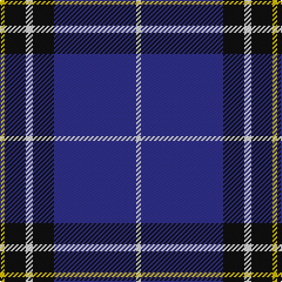

In pattern [WBKWKY](/stripes/wbkwky/).

This was sourced from tartans-authority.  It is a [6 stripe tartan](/stripes/stripes6/).

Original link http://www.tartansauthority.com/tartan-ferret/display/7910/

## Thread count
Y/4 K18 LN6 K18 DB70 LN/4

## Palette
Each colour and the base-6 reference it is a variant of.

| Colour | Shade | Base |
|---|---|---|
| DB | <code style="background-color:#30308C;">#30308C</code> `oklch(37.2% 0.148 276.4)` <small>#30308C</small> | B <code style="background-color:#2A418A;">#2A418A</code> |
| K | <code style="background-color:#101010;">#101010</code> `oklch(17.3% 0.000 89.9)` <small>#101010</small> | K <code style="background-color:#000000;">#000000</code> |
| LN | <code style="background-color:#E0E0E0;">#E0E0E0</code> `oklch(90.7% 0.000 89.9)` <small>#E0E0E0</small> | W <code style="background-color:#F7F7F7;">#F7F7F7</code> |
| Y | <code style="background-color:#E8C000;">#E8C000</code> `oklch(81.9% 0.168 93.7)` <small>#E8C000</small> | Y <code style="background-color:#F2BF00;">#F2BF00</code> |

# Sample pattern

## Nearest tartans

The nearest existing variants by ΔTartan distance, with this tartan at the top so the swatches line up against it.

ΔTartan

Tartan

Sett

—

<a href="/ttd/edit/#slug=w2db35k9w3k9ly2~x2">Hannah (Personal)</a> <a class="nn-out" href="/setts/s6/w2db35k9w3k9ly2~x2/" title="open its dictionary page">↗</a>

0.69

<a href="/ttd/edit/#slug=k1ly2k3n12k18w1~x2">Jon's Theme</a> <a class="nn-out" href="/setts/s6/k1ly2k3n12k18w1~x2/" title="open its dictionary page">↗</a>

0.77

<a href="/ttd/edit/#slug=db42r2y16r2db6r2y8lo3~x2">Prince George's Police Pipe Band</a> <a class="nn-out" href="/setts/s8/db42r2y16r2db6r2y8lo3~x2/" title="open its dictionary page">↗</a>

0.97

<a href="/ttd/edit/#slug=ly8k3b40k12k3ly3~x2">Wolverine Corporate Tartan Tartan Number: 10748. Earliest known date: 03/12/2012 Created by the designer to celebrate an exclusive group of work colleagues known affectionately as the 'Wolverines'. Many within this close group share a proud Scottish heritage and wished to acknowledge this strong affiliation by commissioning a tartan. Yes. The Wolverine tartan has been created for the exclusive use of the 'Wolverines'. No commercial use of this tartan is permitted without expressed permission from the designer, and any party wishing to use or reproduce this tartan should first seek permission by email from the designer. See products available Copyright © Blair Urquhart, Comrie, 2015</a> <a class="nn-out" href="/setts/s6/ly8k3b40k12k3ly3~x2/" title="open its dictionary page">↗</a>

1.05

<a href="/ttd/edit/#slug=lo8w3db40k12w3lo3~x2">Wolverines (Corporate)</a> <a class="nn-out" href="/setts/s6/lo8w3db40k12w3lo3~x2/" title="open its dictionary page">↗</a>

1.07

<a href="/ttd/edit/#slug=k3db30k8w8k2r3~x2">Hydro-Electric</a> <a class="nn-out" href="/setts/s6/k3db30k8w8k2r3~x2/" title="open its dictionary page">↗</a>

1.07

<a href="/ttd/edit/#slug=r10db15g2db2w1db1w1~x4">Ikelman #4 (Personal)</a> <a class="nn-out" href="/setts/s7/r10db15g2db2w1db1w1~x4/" title="open its dictionary page">↗</a>

1.16

<a href="/ttd/edit/#slug=db7r3db26t2db2t26ly4~x2">Int. Police Association (Official)</a> <a class="nn-out" href="/setts/s7/db7r3db26t2db2t26ly4~x2/" title="open its dictionary page">↗</a>

1.18

<a href="/ttd/edit/#slug=w2db15r3g3r3db1~x8">Lothian Buses (Corporate?)</a> <a class="nn-out" href="/setts/s6/w2db15r3g3r3db1~x8/" title="open its dictionary page">↗</a>

1.18

<a href="/ttd/edit/#slug=k1lo2k3db12k18w1~x2">Jon's Theme (Fashion)</a> <a class="nn-out" href="/setts/s6/k1lo2k3db12k18w1~x2/" title="open its dictionary page">↗</a>

1.22

<a href="/ttd/edit/#slug=k30b40ly3b5w2b6~x2">Micron</a> <a class="nn-out" href="/setts/s6/k30b40ly3b5w2b6~x2/" title="open its dictionary page">↗</a>

## Neighbour map

Every grey dot is one of 14299 variants placed by the first two principal components of the ΔTartan feature space (44% of its variance). Red is this tartan; blue dots are its nearest — click one to open its page.

<svg viewBox="0 0 640 380" role="img" style="max-width:100%;height:auto;border:1px solid #e0e0e0;border-radius:4px;display:block" xmlns="http://www.w3.org/2000/svg"><image href="/nn/cloud.v1.png" width="640" height="380"/><a href="/setts/s6/k1ly2k3n12k18w1~x2/"><circle cx="366.4" cy="186.6" r="4" fill="#3465a4"><title>Jon's Theme</title></circle></a><a href="/setts/s8/db42r2y16r2db6r2y8lo3~x2/"><circle cx="365.8" cy="146.2" r="4" fill="#3465a4"><title>Prince George's Police Pipe Band</title></circle></a><a href="/setts/s6/ly8k3b40k12k3ly3~x2/"><circle cx="314.5" cy="180.5" r="4" fill="#3465a4"><title>Wolverine Corporate Tartan Tartan Number: 10748. Earliest known date: 03/12/2012 Created by the designer to celebrate an exclusive group of work colleagues known affectionately as the 'Wolverines'. Many within this close group share a proud Scottish heritage and wished to acknowledge this strong affiliation by commissioning a tartan. Yes. The Wolverine tartan has been created for the exclusive use of the 'Wolverines'. No commercial use of this tartan is permitted without expressed permission from the designer, and any party wishing to use or reproduce this tartan should first seek permission by email from the designer. See products available Copyright © Blair Urquhart, Comrie, 2015</title></circle></a><a href="/setts/s6/lo8w3db40k12w3lo3~x2/"><circle cx="306.9" cy="166.6" r="4" fill="#3465a4"><title>Wolverines (Corporate)</title></circle></a><a href="/setts/s6/k3db30k8w8k2r3~x2/"><circle cx="291.8" cy="167.8" r="4" fill="#3465a4"><title>Hydro-Electric</title></circle></a><a href="/setts/s7/r10db15g2db2w1db1w1~x4/"><circle cx="340.3" cy="169.8" r="4" fill="#3465a4"><title>Ikelman #4 (Personal)</title></circle></a><a href="/setts/s7/db7r3db26t2db2t26ly4~x2/"><circle cx="288.6" cy="179.7" r="4" fill="#3465a4"><title>Int. Police Association (Official)</title></circle></a><a href="/setts/s6/w2db15r3g3r3db1~x8/"><circle cx="342.0" cy="176.6" r="4" fill="#3465a4"><title>Lothian Buses (Corporate?)</title></circle></a><a href="/setts/s6/k1lo2k3db12k18w1~x2/"><circle cx="374.2" cy="194.0" r="4" fill="#3465a4"><title>Jon's Theme (Fashion)</title></circle></a><a href="/setts/s6/k30b40ly3b5w2b6~x2/"><circle cx="355.6" cy="175.0" r="4" fill="#3465a4"><title>Micron</title></circle></a><circle cx="349.8" cy="171.5" r="5" fill="#c00000"/></svg>

ID: /setts/s6/w2db35k9w3k9ly2~x2/
