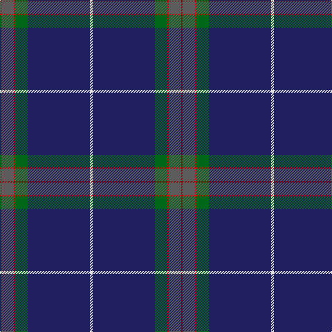

In pattern [RBRGBW](/stripes/rbrgbw/).

This was sourced from tartans-authority.  It is a [6 stripe tartan](/stripes/stripes6/).

Original link http://www.tartansauthority.com/tartan-ferret/display/4069/

## Thread count
LN/4 DB90 G18 R2 N18 DR/2

## Palette
Each colour and the base-6 reference it is a variant of.

| Colour | Shade | Base |
|---|---|---|
| DB | <code style="background-color:#202060;">#202060</code> `oklch(28.9% 0.111 276.9)` <small>#202060</small> | B <code style="background-color:#2A418A;">#2A418A</code> |
| DR | <code style="background-color:#880000;">#880000</code> `oklch(39.4% 0.162 29.2)` <small>#880000</small> | R <code style="background-color:#CC0000;">#CC0000</code> |
| G | <code style="background-color:#006818;">#006818</code> `oklch(45.0% 0.142 145.0)` <small>#006818</small> | G <code style="background-color:#006100;">#006100</code> |
| LN | <code style="background-color:#E0E0E0;">#E0E0E0</code> `oklch(90.7% 0.000 89.9)` <small>#E0E0E0</small> | W <code style="background-color:#F7F7F7;">#F7F7F7</code> |
| N | <code style="background-color:#5C5C5C;">#5C5C5C</code> `oklch(47.5% 0.000 89.9)` <small>#5C5C5C</small> | B <code style="background-color:#2A418A;">#2A418A</code> |
| R | <code style="background-color:#C80000;">#C80000</code> `oklch(52.3% 0.215 29.2)` <small>#C80000</small> | R <code style="background-color:#CC0000;">#CC0000</code> |

# Sample pattern

## Nearest tartans

The nearest existing variants by ΔTartan distance.

1. [Ravetta (Name)](/setts/s6/g20r10ly2db100w1y10/) — ΔT 0.63
1. [Guide Dogs (Corporate)](/setts/s7/db67w1lo6r5dg25db3k5~x2/) — ΔT 0.72
1. [Venters (Edinburgh)](/setts/s6/n15k55w1dp5r2ly1~x2/) — ΔT 1.08
1. [Michael (John) (Personal)](/setts/s6/g5w1r5k5db43r1~x2/) — ΔT 1.27
1. [Lloyd of Astargus](/setts/s6/r2db61k13w2o20lo2~x2/) — ΔT 1.35
1. [Victorian Highland Pipe Band Assoc](/setts/s8/db46ly1ly3dg13ly1r7g3ly1~x2/) — ΔT 1.35
1. [St. Andrew Quebec City (Corporate)](/setts/s8/r2w1r5g5lo1g10db40ly2~x2/) — ΔT 1.42
1. [MacLaurin of Brioch](/setts/s7/db36k10dg3r3dg6k1ly2~x2/) — ΔT 1.43
1. [HMS Neptune (Military)](/setts/s11/g4k1dt9k1g3k1db27r1db27w1r3~x2/) — ΔT 1.50
1. [Cumnock (District)](/setts/s8/g3db16k3dp2k45r1k2lo3~x2/) — ΔT 1.52

## Neighbour map

Every grey dot is one of 14299 variants placed by the first two principal components of the ΔTartan feature space (44% of its variance). Red is this tartan; blue dots are its nearest — click one to open its page.

<svg viewBox="0 0 640 380" role="img" style="max-width:100%;height:auto;border:1px solid #e0e0e0;border-radius:4px;display:block" xmlns="http://www.w3.org/2000/svg"><image href="/nn/cloud.v1.png" width="640" height="380"/><a href="/setts/s6/g20r10ly2db100w1y10/"><circle cx="470.5" cy="109.1" r="4" fill="#3465a4"><title>Ravetta (Name)</title></circle></a><a href="/setts/s7/db67w1lo6r5dg25db3k5~x2/"><circle cx="430.9" cy="113.4" r="4" fill="#3465a4"><title>Guide Dogs (Corporate)</title></circle></a><a href="/setts/s6/n15k55w1dp5r2ly1~x2/"><circle cx="503.4" cy="129.6" r="4" fill="#3465a4"><title>Venters (Edinburgh)</title></circle></a><a href="/setts/s6/g5w1r5k5db43r1~x2/"><circle cx="504.7" cy="129.6" r="4" fill="#3465a4"><title>Michael (John) (Personal)</title></circle></a><a href="/setts/s6/r2db61k13w2o20lo2~x2/"><circle cx="371.5" cy="125.4" r="4" fill="#3465a4"><title>Lloyd of Astargus</title></circle></a><a href="/setts/s8/db46ly1ly3dg13ly1r7g3ly1~x2/"><circle cx="391.4" cy="88.3" r="4" fill="#3465a4"><title>Victorian Highland Pipe Band Assoc</title></circle></a><a href="/setts/s8/r2w1r5g5lo1g10db40ly2~x2/"><circle cx="381.3" cy="89.0" r="4" fill="#3465a4"><title>St. Andrew Quebec City (Corporate)</title></circle></a><a href="/setts/s7/db36k10dg3r3dg6k1ly2~x2/"><circle cx="393.9" cy="136.1" r="4" fill="#3465a4"><title>MacLaurin of Brioch</title></circle></a><a href="/setts/s11/g4k1dt9k1g3k1db27r1db27w1r3~x2/"><circle cx="431.2" cy="115.8" r="4" fill="#3465a4"><title>HMS Neptune (Military)</title></circle></a><a href="/setts/s8/g3db16k3dp2k45r1k2lo3~x2/"><circle cx="439.0" cy="96.1" r="4" fill="#3465a4"><title>Cumnock (District)</title></circle></a><circle cx="454.5" cy="121.6" r="5" fill="#c00000"/></svg>

ID: /setts/s6/w2db45g9r1n9r1~x2/
